# 2023 年 CSS 新特性盘点

> 笔记来源：https://www.51cto.com/article/776131.html


## ▲ 基础功能

首先来了解一下核心 CSS 语言和功能的更新。

### 三角函数

Chrome 111 增加了对三角函数 sin()、cos()、tan()、asin()、acos()、atan() 和 atan2() 的支持，使其适用于所有主流引擎。这些函数对于动画和布局来说非常有用。例如，现在可以更轻松地在以所选中心为中心的圆圈上布置元素。

浏览器支持：


### 复杂的nth-*选择器

借助:nth-child()伪类选择器，可以按索引选择 DOM 中的元素。可以使用 An+B 微语法精确控制要选择哪些元素。

默认情况下，:nth-*()伪类会考虑所有子元素。从 Chrome 111 开始，可以选择将选择器列表传递给:nth-child()和:nth-last-child()。这样就可以在 An+B 执行操作之前预先过滤子项列表。

在下面的演示中，通过使用 of .small 对小玩偶进行预过滤，3n+1 逻辑仅应用于它们。使用下拉菜单可动态更改所使用的选择器。

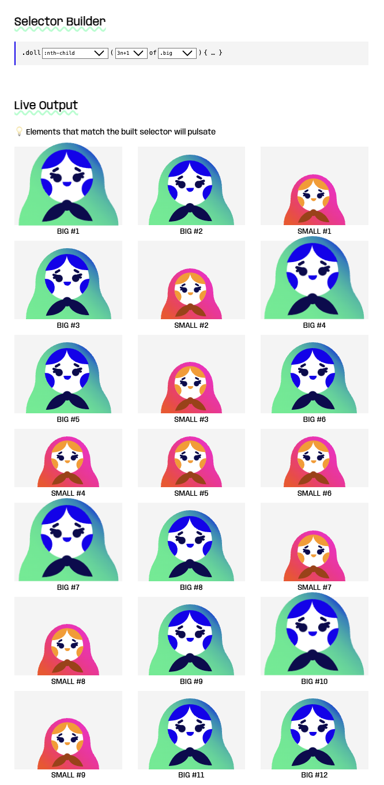

浏览器支持：

### @scope

Chrome 118 增加了对 @scope 的支持，它可以将选择器的范围限定为文档的特定子树。借助作用域样式，可以非常具体地选择元素，而无需编写过于具体的选择器或将它们与 DOM 结构紧密耦合。

限定作用域的子树由作用域根和可选的作用域限制定义。

复制

```plain
@scope (.card) { … } /* scoping root */
@scope (.card) to (.card__content) { … } /* scoping root + scoping limit*/
```

放置在作用域块内的样式规则仅针对划分出的子树中的元素。例如，以下作用域样式规则仅针对位于.card元素和由[data-component]选择器匹配的任何嵌套组件之间的元素。

复制

```plain
@scope (.card) to ([data-component]) {
  img { … }
}
```

浏览器支持：

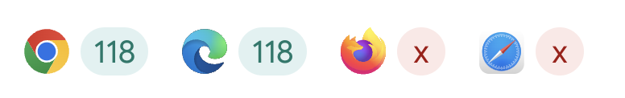

### 嵌套

在 CSS 原生支持嵌套之前，每个选择器都需要单独显式地声明。这会导致重复、样式表庞大和分散的作者体验。现在，选择器可以继续并将相关的样式规则分组在一起。

复制

```plain
dl {
  /* dt */
  
  dt {
    /* dl dt */
  }

  dd {
    /* dl dd */
  }
}

dt {
  /* dt */
}

dl dt {
  /* dl dt */
}

dl dd {
  /* dl dd */
}
```

嵌套可以减少样式表的大小，减少重复选择器的开销，并集中组件样式。最初发布的语法有一个限制，需要在各个地方使用 `&`，但自那时起，随着嵌套语法的放宽更新，这一限制已经被解除。

浏览器支持：

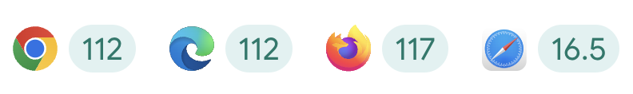

### 子网格

借助 CSS subgrid 可以创建更复杂的网格，并在子布局之间实现更好的对齐。它允许内部网格采用外部网格的行和列作为自己的行和列，通过在网格行或列中使用subgrid作为值。

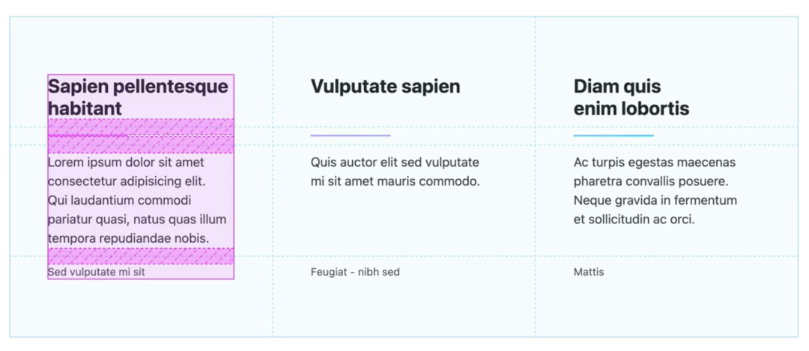

子网格特别适用于将兄弟元素对齐到彼此的动态内容。

浏览器支持：

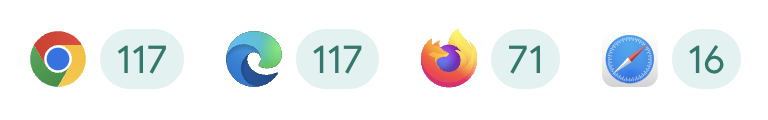

## ▲ 排版

2023 年，网页排版取得了一些重要更新。其中一个特别好的渐进增强是text-wrap属性，该属性可以在浏览器中进行排版布局调整，而无需额外的脚本。告别尴尬的行长度，体验更具可预测性的排版！

### Initial-letter

在 2023 年初的 Chrome 110 中引入的initial-letter属性是一个小而强大的CSS功能，它用于设置首字母的排版样式。可以将字母放置在下沉或抬高的状态下。该属性接受两个参数：第一个参数用于控制字母下沉到相应段落的深度，第二个参数用于将字母抬高多少，可以同时使用这两个参数。

复制

```css
p {
  font-size: 2rem;
  max-width: 36ch;
  color: var(--tangerine);
  background: white;

  &::first-letter {
    initial-letter: 3 2;
    font-weight: 800;
    padding-right: 1rem;
    background: linear-gradient(
      to right,
      var(--razzmatazz),
      var(--goldenyellow)
    );
    color: transparent;
    -webkit-background-clip: text;
  }
}
```

效果如下：

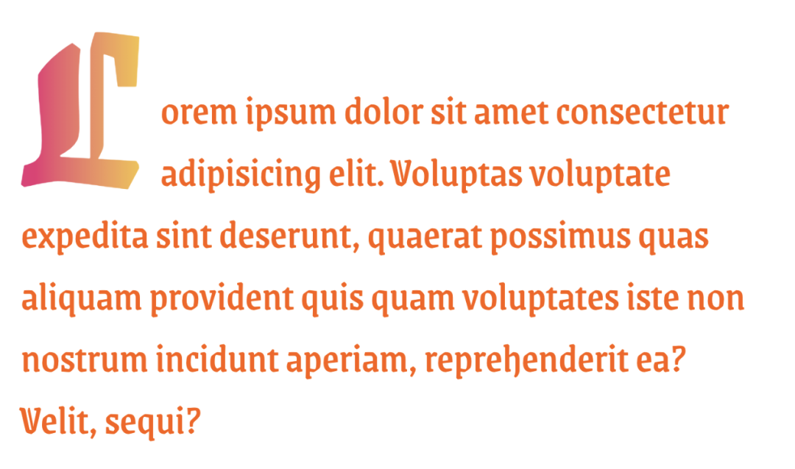

浏览器支持：

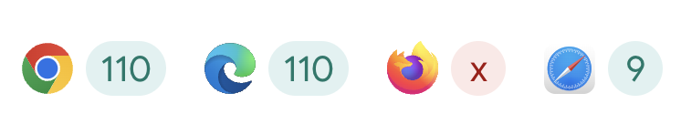

### text-wrap

作为开发人员，我们可能无法确定标题或段落的最终大小、字体大小，甚至语言。浏览器提供了所有文本换行所需的变量，这些变量对于有效和美观的文本处理非常重要。由于浏览器了解所有因素，比如字体大小、语言和分配的区域，它成为处理高级和高质量文本布局的绝佳选择。

这就是两种全新的文本换行技术发挥作用的时刻，它们被命名为balance和pretty。balance值的目的是创建和谐的文本块，而pretty则致力于防止孤立的字符并确保连字符的健康使用。在过去，这两项任务通常需要手动完成，但现在可以将它们交给浏览器来处理，并使其适应任何翻译语言。

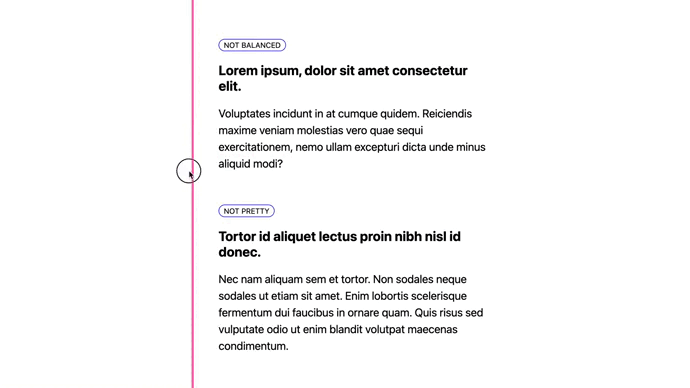

## ▲ 颜色

2023 年是 Web 平台的色彩革新之年。借助全新的色彩空间和功能，实现了动态色彩主题，可以为用户打造更生动、丰富的主题，并且还可以实现个性化定制！

### 高级色彩空间

在 2023 年，我们拥有了全新的颜色、更多的颜色、新的色彩空间、色彩函数和新的功能。

现在，CSS 和颜色可以做到以下事情：

- 检查用户屏幕硬件是否支持广色域HDR颜色。
- 检查用户的浏览器是否理解如Oklch或Display P3等颜色语法。
- 在Oklab、Oklch、HWB、Display P3、Rec.2020、XYZ等多种格式中指定HDR颜色。
- 创建具有HDR颜色的渐变。
- 在可选颜色空间中插值渐变。
- 使用color-mix()混合颜色。
- 利用相对颜色语法创建颜色变体。

### color-mix 函数

通过 color-mix 函数仅可以混合白色或黑色到一种颜色，还可以混合透明度，并且可以在选择的任何颜色空间中完成所有这些操作，它同时具有基本颜色特性和高级颜色特性。


可以将color-mix()视为渐变过程中的一个时间点，该渐变展示了从蓝色到白色的所有中间步骤，而color-mix()仅展示了其中的一个步骤。

浏览器支持：

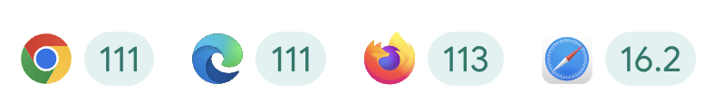

### 相对颜色语法

相对颜色语法是与color-mix()相辅相成的一种方法，用于创建颜色变体。它比color-mix()更强大，但也是一种不同于传统颜色处理的策略。color-mix()可以混入白色以减轻颜色的深浅程度，而相对颜色语法则提供了对亮度通道的精确访问，并可以利用calc()函数以编程方式降低或增加亮度。

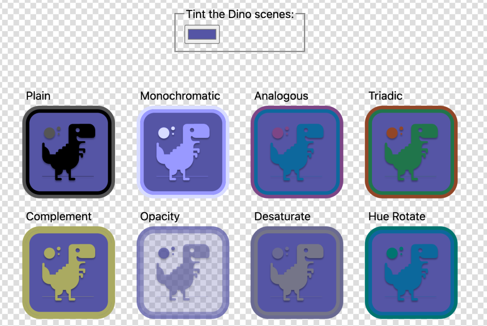

相对颜色语法允许对颜色进行相对和绝对的操作。相对变化是指使用calc()函数对饱和度或亮度的当前值进行修改。绝对变化是指将通道值替换为全新的值，例如将不透明度设置为50%。这种语法为各种主题和实时变体提供了实用的工具。

## ▲ 响应式设计

2023 年，响应式设计迈向了新的高度。这一具有里程碑意义的年份带来了创新的功能，颠覆了传统的构建响应式网页体验的方式，并引领了基于组件的响应式设计模型的新潮流。容器查询和:has()的完美结合，使得组件能够根据其父元素的大小以及任何子元素的存在或状态，灵活地适应并展现出相应的样式。这意味着我们现在可以将页面级的布局与组件级的布局分离开来，并且只需编写一次逻辑，便可以在任何地方重复使用组件！

### 容器大小查询

与使用视口的全局大小信息来应用CSS样式不同，容器查询支持在页面内查询父元素。这意味着组件可以以动态方式在多个布局和多个视图中进行样式设置。2月14日，所有现代浏览器都稳定支持了容器大小查询。

要使用此功能，首先在要查询的元素上设置容器，然后类似于媒体查询，使用@container和大小参数来应用样式。除了容器查询，还可以获得容器查询的大小。在以下示例中，容器查询大小cqi（表示内联容器的大小）用于调整卡片标题的大小。

浏览器支持：


### 容器样式查询

在 Chrome 111 中，样式查询以部分实现的形式出现。借助样式查询功能，可以在使用`@container style()`时查询父元素上自定义属性的值。例如，检查自定义属性是否存在，或者是否被设置为特定值，如`@container style(--rain: true)`。

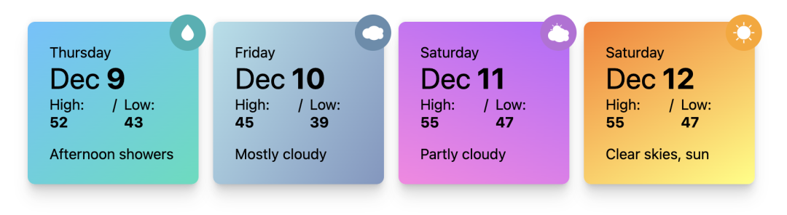

尽管样式查询在某种程度上与在CSS中使用类名相似，但样式查询具有其独特的优势。首先，使用样式查询，可以在CSS中根据需要更新伪状态的值。此外，未来的版本将支持查询数值范围来确定应用的样式，例如style(60 <= --weather <= 70)，并且可以基于属性-值对设置样式，例如style(font-style: italic)。

浏览器支持：

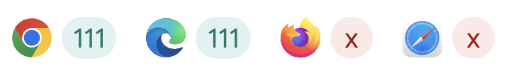

### :has() 选择器

在过去的20年里，开发者们一直期待在CSS中加入“父选择器”。随着在 Chrome 105 中引入:has()选择器，这一愿望终于得以实现。例如，使用.card:has(img.hero)将选择那些包含英雄图像子元素的.card元素。

复制

```plain
.card:has(.card__media) {
  grid-template-areas:
    "title"
    "blurb"
    "author"
    "media";
  padding-bottom: 0;
  --color: #6300ff;
}
```

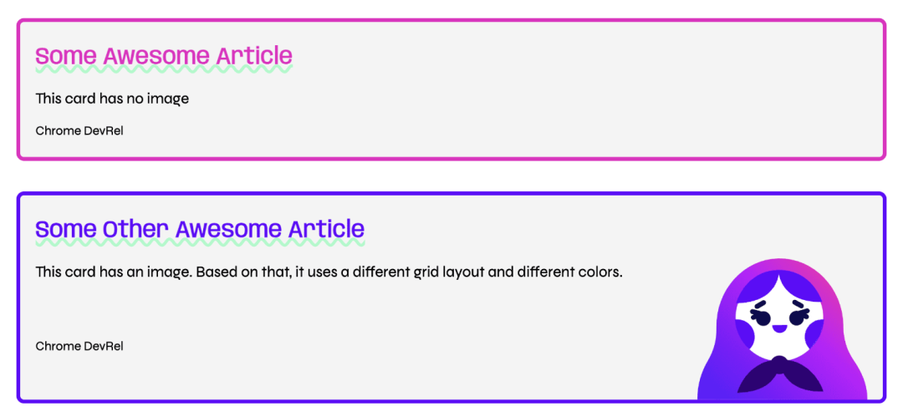

由于:has()接受一个相对选择器列表作为参数，因此可以选择多个元素，不仅可以沿着DOM树向上选择，还可以进行横向选择。例如，li:has(+ li:hover)将选择当前鼠标悬停的<li>元素之前的<li>元素。

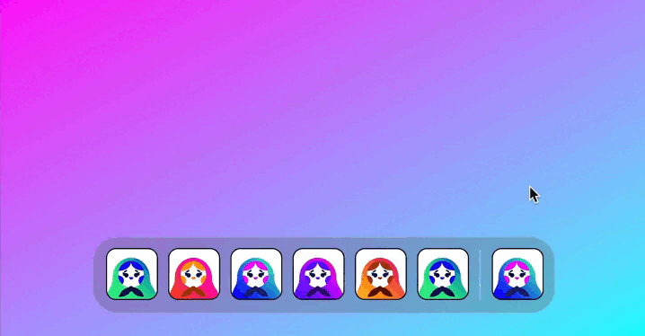

浏览器支持：

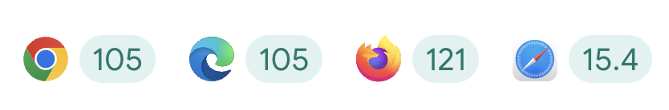

### 更新媒体查询

更新媒体查询提供了一种根据设备刷新率来调整用户界面的方法。这个功能可以报告设备的刷新率是快速、慢速还是根本没有刷新率，这与不同设备的能力密切相关。

大部分设备可能都具备较快的刷新率，包括台式机和大多数的移动设备。然而，一些设备如电子阅读器和低功耗支付系统等可能具备较慢的刷新率。了解到设备无法处理动画或频繁更新的情况，意味着可以更加合理地使用电池，或者避免因为频繁的视图更新而导致的故障。

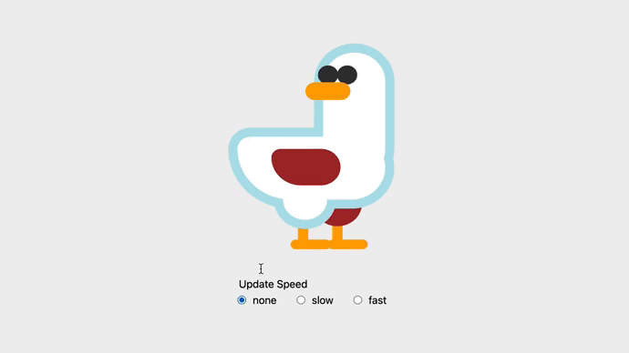

### 脚本媒体查询

媒体查询脚本可以用于检查JavaScript是否可用，这对渐进增强非常有用。在引入这个媒体查询之前，检测JavaScript是否可用的策略是在HTML中放置一个nojs类，并使用JavaScript将其移除。现在，由于CSS有了一种检测JavaScript并相应调整的方式，因此可以移除这些脚本。

通过使用脚本媒体查询，可以在没有JavaScript可用的情况下，根据系统偏好进行网站主题的切换。此外，还可以考虑一个切换组件，当JavaScript可用时，该组件可以使用手势滑动进行切换，而不仅仅是简单地切换开关的状态。这样，在脚本可用的情况下，可以提供更优化的用户体验；而在脚本禁用的情况下，仍然能够提供基本而有意义的体验。

## ▲ 交互

今年，有许多令人振奋的交互功能陆续问世，这些功能使得交互的构建和实施变得更加简单，从而促进了流畅的用户体验和更加精致的网络体验。

### 视图转换

通过使用视图转换API，可以在单页应用的两个页面状态之间创建视觉转换。这些转换可以是全页面转换，也可以是页面上的小元素，例如添加或删除列表中的新项目。

视图转换API的核心是document.startViewTranstion函数。只需传递一个更新DOM到新状态的函数，API就会处理所有细节。它通过获取先前和后续快照，然后在两者之间进行过渡来实现这一点。可以使用CSS来控制要捕获的内容，并可选择自定义这些快照的动画方式。


浏览器支持：

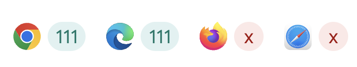

### 线性缓动函数

线性缓动函数是用于动画效果的一种函数，它并非真正的“线性”（linear）函数，而是一种简化的缓动函数，可以模拟更复杂的动画效果。尽管这种函数的精度可能略有降低，但它的实现方式简单直观，可以方便地应用于各种动画效果。

在 Chrome 113 版本之前，CSS中确实无法直接创建反弹或弹簧等复杂的动画效果。然而，通过使用linear()函数，开发者可以将这些复杂的缓动效果简化为一系列的点，然后在这这些点之间进行线性插值，从而得到一种近似的缓动效果。

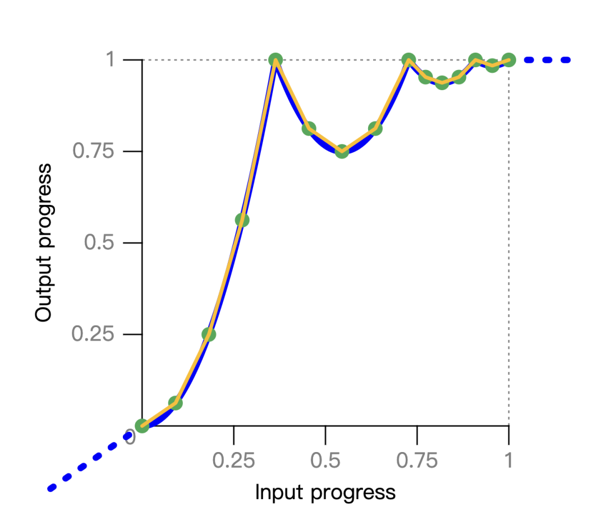

原始的蓝色反弹曲线被简化为一组绿色关键点，linear()函数使用这些关键点，并在它们之间进行线性插值。

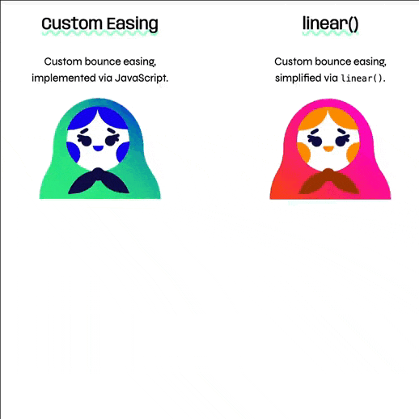

浏览器支持：

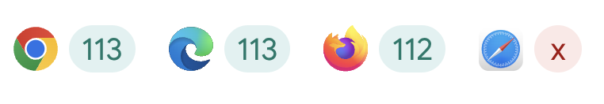


### 滚动结束

许多界面都包含滚动交互，有时界面需要同步与当前滚动位置相关的信息，或者根据当前状态获取数据。在scrollend事件之前，开发者们通常采用设置超时的方式来尝试捕捉滚动动作的结束。这种做法并不准确，因为超时可能会在用户手指仍然触摸屏幕时被触发。这可能导致用户体验的不连贯，或者获取到不准确的数据。

现在，有了scrollend事件，开发者可以获得一个更加精准定时的方式。scrollend事件能够在用户滚动动作结束时立即触发，从而判断用户是否仍处于手势的中间状态。

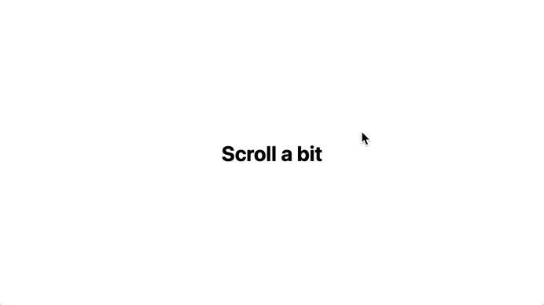

浏览器支持：

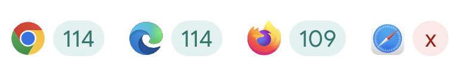

### 滚动驱动动画

从 Chrome 115 版本开始，滚动驱动的动画成为了一项令人振奋的功能。这项功能可以将现有的CSS动画或使用Web动画API构建的动画与滚动容器的滚动偏移量相结合。当上下滚动（或在水平滚动容器中左右滚动）时，链接的动画会直接响应地前后播放。

通过使用ScrollTimeline，可以跟踪滚动容器的总体进度。例如，下面的演示显示了当滚动到页面末尾时，文本逐个字符地显示出来。这一优化确保了流畅、连贯的用户体验，同时允许开发者利用浏览器的内置功能来实现复杂的效果。

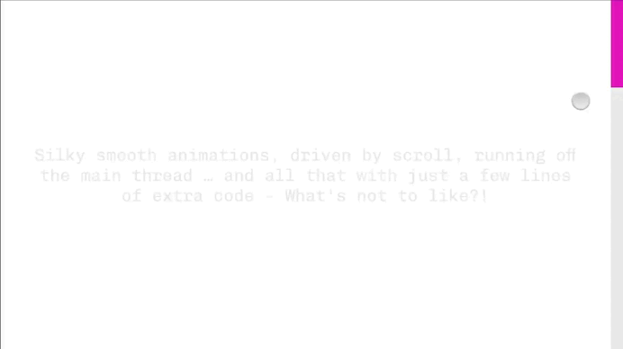

使用 ViewTimeline 可以跟踪一个元素在滚动视口中的位置。这类似于IntersectionObserver跟踪一个元素的方式。在下面的演示中，每个图像从进入滚动视口开始逐渐显示，直到位于中心位置。

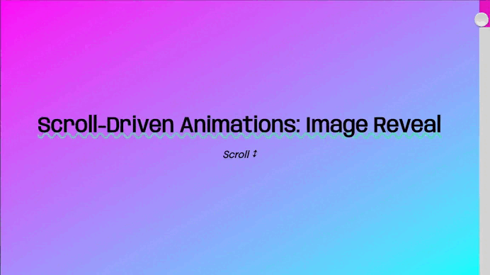

滚动驱动的动画与CSS动画和Web动画API的结合，可以使开发者受益于这些API带来的所有优势。其中最显著的优势之一是能够在主线程之外运行动画。通过添加几行额外的代码，开发者可以让由滚动驱动的动画在主线程之外顺畅运行，从而避免阻塞主线程，提高应用的响应性和性能。

浏览器支持：

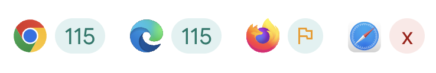

### timeline-scope

在通过CSS应用滚动驱动的动画时，查找控制滚动的机制总是沿着DOM树向上查找，这使得它仅限于滚动祖先。然而，很多时候，需要动画的元素并不是滚动容器的子元素，而是位于完全不同的子树中的元素。

为了使动画元素能够找到非祖先元素的命名滚动时间线，可以在共享父元素上使用timeline-scope属性。这将允许具有该名称的定义的scroll-timeline 或 view-timeline附加到该元素，使其具有更广泛的范围。有了这个功能，任何共享父元素的子元素都可以使用具有该名称的时间线。

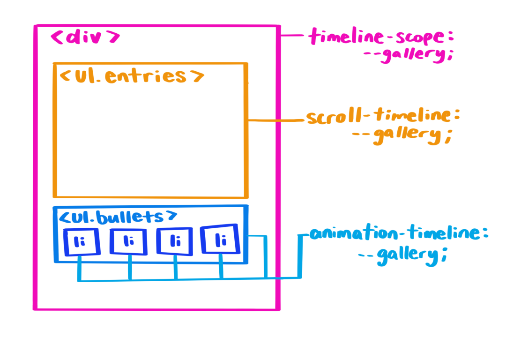

在共享父元素上声明timeline-scope后，滚动容器上声明的滚动时间线可以被使用它作为其动画时间线的元素找到。

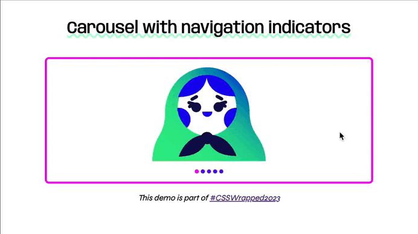

浏览器支持：

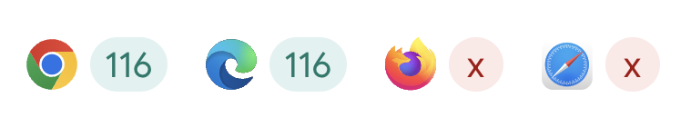

### 离散属性动画

2023年的另一个新功能是对离散动画进行动画处理的能力。离散动画是指属性值在两个或更多离散值之间变化的动画，例如从display: none到可见状态的动画。从Chrome 116开始，可以在关键帧规则中使用display和content-visibility属性，并在动画的50%位置而不是0%位置过渡任何离散属性。

这个优化方法通过使用transition-behavior属性中的allow-discrete关键字或在transition属性中作为简写来实现。这使得开发者可以更灵活地控制离散属性的动画过渡，并在需要时实现更平滑的过渡效果。

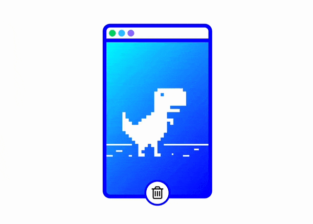

浏览器支持：

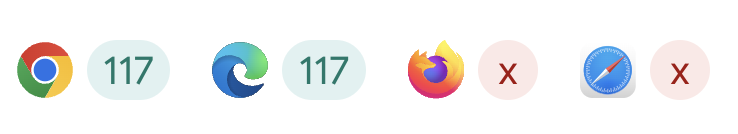

### @starting-style

通过使用@starting-style CSS规则，可以对display: none进行动画处理。该规则提供了一种在元素打开之前，浏览器可以查找的“打开前”样式的方式。这对于创建入场动画以及显示诸如弹出框或对话框等元素非常有用。同时，它还可以用于在创建新元素并希望为其添加动画效果时。

下面的例子将一个弹出框平滑地从视口外部动画显示到顶层：

复制

```plain
@starting-style {
  dialog[open] {
    translate: 0 100vh;
  }
}
```


浏览器支持：

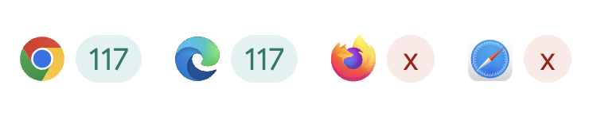

### overlay

通过使用新的 CSS overlay 属性，可以添加过渡效果，使具有顶层样式的元素（例如弹出框、对话框等）能够平滑地从顶层动画移出。如果没有使用过渡到overlay，元素将立即回到被裁剪、变形和覆盖的状态，导致看不到转换发生的过程。类似地，当在顶层元素上添加overlay属性时，它可以使得::backdrop元素能够平滑地动画移出。

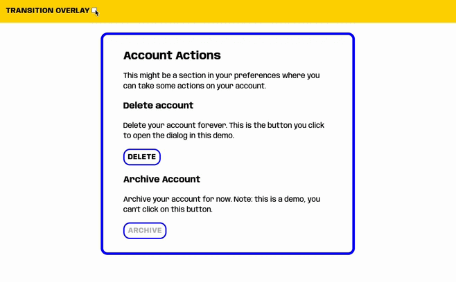

浏览器支持：

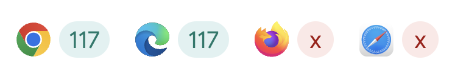

## ▲ 组件

2023年对于样式和HTML组件来说是重要的一年，其中引入了弹出框功能，并对锚点定位和下拉菜单样式进行了大量的改进。这些组件使得构建常见的UI模式更加容易，无需依赖额外的库或每次都从头开始构建自己的状态管理系统。

### Popover

Popover API 可以帮助开发者构建覆盖在页面上方的元素，这些元素可能包括菜单、选择和工具提示。通过为弹出的元素添加popover属性和id，并将其id属性与触发按钮连接起来，使用popovertarget="my-popover"可以创建一个简单的弹出框。Popover API 具有以下优点：

- 提升到顶层：弹出框将显示在页面其余部分的上方，因此无需修改z-index。
- 轻松关闭功能：单击弹出框区域之外会关闭弹出框并返回焦点。
- 默认焦点管理：打开弹出框会使下一个tab停留在弹出框内。
- 可访问的键绑定：按下esc键或双倍切换将关闭弹出框并返回焦点。
- 可访问的组件绑定：将弹出框元素与弹出框触发器语义化地连接。

复制

```css
<div popover role="menu" id="menu">
  <button class="close-btn" popovertarget="menu" popovertargetaction="hide">
    <span>❌</span>
    <span class="sr-only">Close</span>
  </button>
  <ul>
    <li><a href="#">Typography</a></li>
    <li><a href="#">Foundations</a></li>
    <li><a href="#">Color</a></li>
    <li><a href="#">Interactions</a></li>
    <li><a href="#">Components</a></li>
    <li><a href="#">Responsive</a></li>
  </ul>
</div>1.2.3.4.5.6.7.8.9.10.11.12.13.14.
```

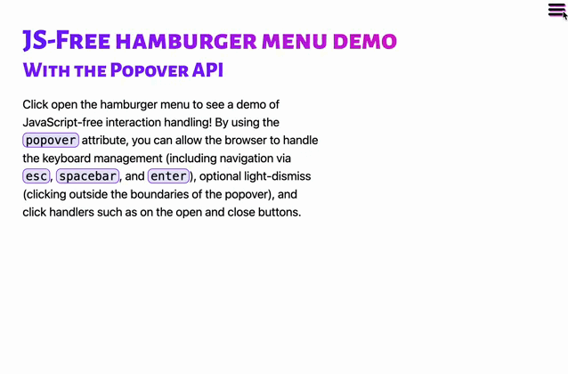

浏览器支持：

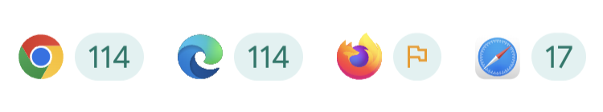

### 选择框中的分隔线

今年在Chrome和Safari中引入的另一个HTML的小改变是，现在可以在<select>元素中添加水平线元素（<hr>标签），以帮助视觉上分隔内容。以前，在<select>中放置<hr>标签不会被渲染。但今年，Safari和Chrome都支持此功能，可以更好地在<select>元素中分隔内容。

复制

```css
<select name="majors" id="major-select">
  <option value="">Select a favorite feature</option>
  <hr>
  <optgroup label="Foundations">
    <option value="trig">Trigonometric functions</option>
    <option value="nth">Complex nth-* selection</option>
    <option value="nesting">Nesting</option>
    <option value="subgrid">Subgrid</option>
    <option value="mq-ranges">Media query range syntax</option>
  </optgroup>
  <optgroup label="Typography">
    <option value="initial-letter">Initial-letter</option>
    <option value="text-wrap-b-p">Text-wrap: balance / pretty</option>
  </optgroup>
  <optgroup label="Color">
    <option value="color-4">CSS Color level 4</option>
    <option value="color-mix">Color-mix function</option>
    <option value="rcs">Relative color syntax</option>
  </optgroup>
  <optgroup label="Responsive Design">
    <option value="cq">Size container queries</option>
    <option value="sq">Style container queries</option>
    <option value="has">:has() selector</option>
  </optgroup>
</select>1.2.3.4.5.6.7.8.9.10.11.12.13.14.15.16.17.18.19.20.21.22.23.24.25.
```

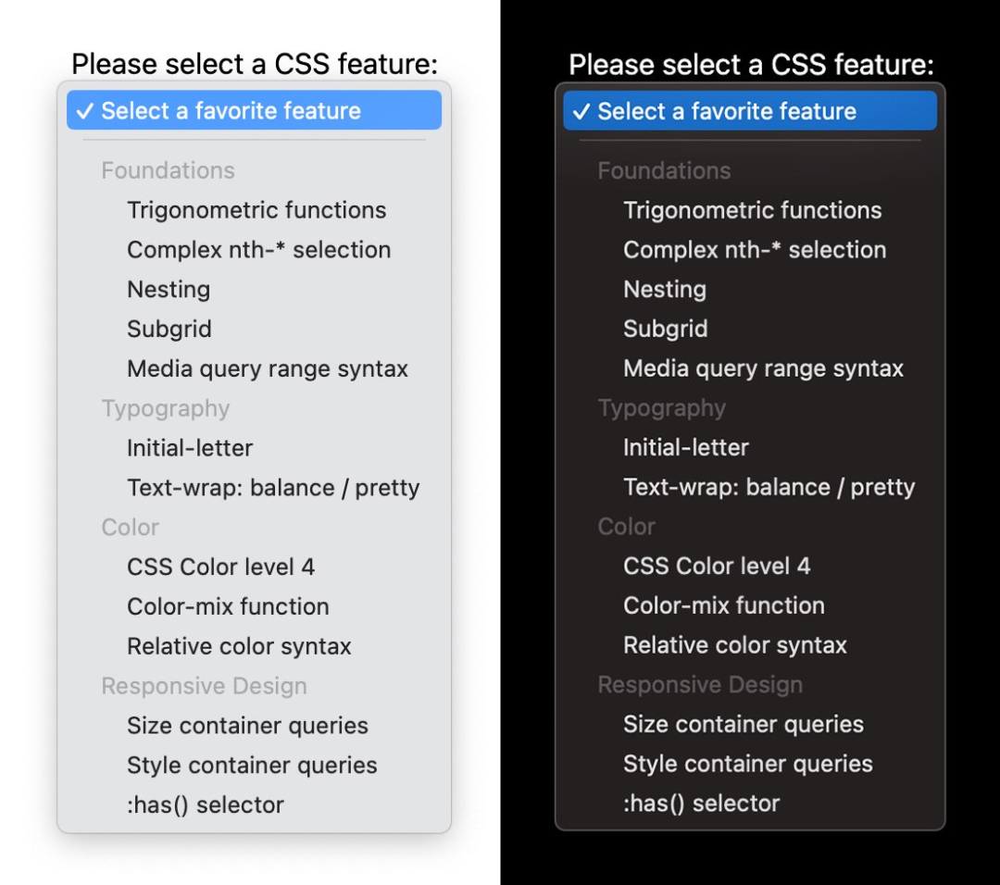

### :user-valid 和 :user-invalid

今年所有浏览器均稳定支持 :user-valid 和 :user-invalid 伪类，它们的行为类似于 :valid 和 :invalid 伪类，但只有在用户与输入进行了重要交互之后，才匹配表单控件。即使用户尚未开始与页面进行交互，必填但是空的表单控件将匹配 :invalid。只有当用户更改输入并将其保留在无效状态时，该控件才会匹配 :user-invalid。

有了这些新的选择器，就不再需要编写有状态的代码来跟踪用户已更改的输入。

复制

```css
input:user-valid,
select:user-valid,
textarea:user-valid {
  --state-color: green;
  --bg: linear-gradient(45deg in oklch, lime, #02c3ff);
}

input:user-invalid,
select:user-invalid,
textarea:user-invalid {
  --state-color: red;
  --bg: linear-gradient(15deg in oklch, #ea00ff, #ffb472);
}
```

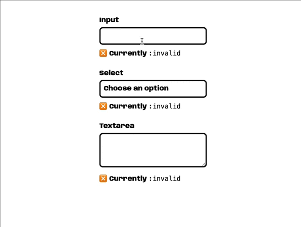

浏览器支持：

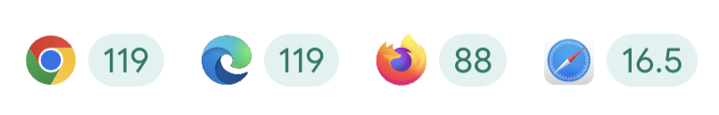

### 独占式手风琴

Web上常见的UI模式之一是手风琴组件。要实现此模式，通常需要将几个<details>元素组合在一起，通过视觉分组来表明它们之间的联系。

在 Chrome 120 中，引入了一项新功能，即在<details>元素上支持name属性。使用这个属性时，具有相同名称值的多个<details>元素会形成一个语义组合。该组合中最多只能打开一个元素：当打开该组合中的一个**<details>**元素时，之前打开的一个将自动关闭，这种手风琴称为独占式手风琴。

复制

```css
<details name="my-accordion">
  <summary>Summary 1</summary>
  <p>Lorem ipsum dolor sit amet, consectetur adipisicing elit. Voluptas delectus quibusdam, eum, aperiam sunt non dolorum pariatur molestias suscipit aut quia quas vero, illo quisquam nostrum sequi excepturi. Aliquam, obcaecati?</p>
</details>

<details name="my-accordion" open>
  <summary>Summary 2</summary>
  <p>Lorem ipsum dolor sit amet, consectetur adipisicing elit. Voluptas delectus quibusdam, eum, aperiam sunt non dolorum pariatur molestias suscipit aut quia quas vero, illo quisquam nostrum sequi excepturi. Aliquam, obcaecati?</p>
</details>

<details name="my-accordion">
  <summary>Summary 3</summary>
  <p>Lorem ipsum dolor sit amet, consectetur adipisicing elit. Voluptas delectus quibusdam, eum, aperiam sunt non dolorum pariatur molestias suscipit aut quia quas vero, illo quisquam nostrum sequi excepturi. Aliquam, obcaecati?</p>
</details>
```

作为独占式手风琴的一部分的<details>元素不一定需要是兄弟元素，它们可以散布在文档任意位置。