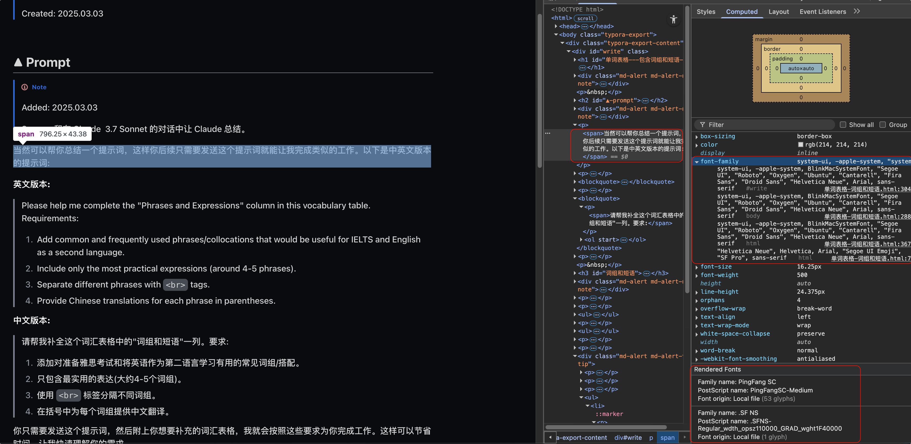

# CSS 2025

> [!note]
>
> Create: Fri Oct 17 16:53:51 CST 2025
>
> Source:  conversation - `Web 字体渲染与 CSS 详解`


## ▲ Font-family 相关



Morning Gemini ☕️，

作为一个前前端程序员，我从 chrome 控制台中是可以审查网页中 font-faimly 的设置，但是你从上面的截图中可以看到，font-family 下设置的字体一共有 4 个，分别在：304、288、367、7 行，这 4 个设置中，最后网页中到底使用的是哪个呐？ 我知道 css 层级嵌套原则，是根据层级的权限优先级来判断的对吗？ 

关于下面这个 font-family 的完整设置，我也不太明白，我当前是 macos 系统，system-ui, -apple-system, BlinkMacSystemFont,... 这些都是什么？请给我详细讲解一下，我记到笔记好吗？

```css
font-family: system-ui, -apple-system, BlinkMacSystemFont, "Segoe UI", "Roboto", "Oxygen", "Ubuntu", "Cantarell", "Fira Sans", "Droid Sans", "Helvetica Neue", Arial, sans-serif;
```

第二个问题：你看我选中的中文字体，我从截图的右下角可以看出来，使用的 Rendered Fonts 是 PingFang SC，但是这个 PingFang SC 是从哪里来的？ 而且下面这一块键值对的完整释义，可以给我讲解一下吗？谢谢

```css
Family name: PingFang SC
PostScript name: PingFangSC-Medium
Font origin: Local file(53 glyphs)

Family name: .SF NS
PostScript name: .SFNS-Regular_wdth_opsz110000_GRAD_wght1F40000
Font origin: Local file(1 glyph)
```

还有最后请也帮我随便找一段英文，帮我讲解一下英文的渲染字体是什么，谢谢啦。

**Gemini**

 Good morning! ☕️

Excellent questions! As a former front-end developer, you've hit on some of the most fundamental and interesting aspects of web typography. It's great that you're digging into the "why" behind what the browser shows you. Let's break this down systematically.

### 问题一：CSS 中哪个 `font-family` 规则生效？

你的直觉完全正确。网页最终使用哪个字体规则，是由 **CSS 层叠 (Cascade)、优先级 (Specificity) 和源码顺序 (Source Order)** 共同决定的。

Chrome 的开发者工具（DevTools）非常直观地向你展示了这个决策过程：

1. **生效的规则**：在 `Styles` 标签页中，你会看到多个 CSS 规则。对于同一个属性（比如 `font-family`），**没有被划掉横线且位置最靠上的那条规则，就是最终生效的规则**。
2. **被覆盖的规则**：所有被划上删除线 `font-family` 的规则，都表示它们虽然匹配到了当前元素，但因为优先级较低，被其他更高优先级的规则覆盖了。

从你的截图中看，`body` 元素上应用的 `font-family` 规则（第 304 行）是没有删除线的，这说明它就是最终生效的规则。其他几条带删除线的规则（例如第 288、367、7 行的规则）可能是从更通用的选择器（比如全局 `*` 选择器或浏览器默认样式）继承而来的，它们的优先级低于直接应用在 `body` 上的规则，因此被覆盖了。

**总结**：你只需要关注**没有被删除线划掉**的 `font-family` 规则即可，那就是当前元素正在使用的字体栈。

### 问题二：`font-family` 字体栈 (Font Stack) 详解

你提供的这段 CSS 代码是一个非常现代化且专业的 **字体栈 (font stack)**。它的核心思想不是 “选择一个字体”，而是 “提供一个**按优先级排列的字体列表**”。浏览器会从左到右依次检查这个列表：

- 如果用户的电脑上安装了第一个字体，就使用它。
- 如果没有，就检查第二个字体，以此类推。
- 如果列表中的所有具体字体都没有，就使用最后一个通用字体族 (`sans-serif`) 作为最终的备用方案。

下面是这个字体栈中每个值的详细解释，非常适合记在你的笔记里：

```css
font-family:
  /* --- 1. 优先使用系统 UI 字体 --- */
  system-ui,          /* 一个通用的关键字，会自动匹配当前操作系统的默认界面字体。这是最现代、最推荐的做法。*/
  -apple-system,      /* 专门针对 Safari (macOS 和 iOS)。它会匹配 Apple 的系统字体 San Francisco。在 system-ui 出现前，这是最佳实践。*/
  BlinkMacSystemFont, /* 专门针对 macOS 上的 Chrome 浏览器。同样会匹配 San Francisco 字体。*/

  /* --- 2. 针对其他主流操作系统的备用字体 --- */
  "Segoe UI",          /* Windows 系统的默认界面字体。*/
  "Roboto",             /* Android 系统的默认字体。*/
  "Oxygen",             /* Linux KDE 桌面环境的字体。*/
  "Ubuntu",             /* Ubuntu Linux 发行版的字体。*/
  "Cantarell", "Fira Sans", "Droid Sans", /* 其他常见的 Linux 字体。*/

  /* --- 3. 经典的、几乎所有系统都有的字体 --- */
  "Helvetica Neue",     /* 一款在 Mac 上非常经典的无衬线字体。*/
  Arial,                /* 一款在 Windows 上非常经典的无衬线字体，与 Helvetica 极为相似。*/

  /* --- 4. 最终的保险方案 --- */
  sans-serif;           /* 这是一个通用字体族 (Generic Font Family)。如果以上所有字体都找不到，浏览器会使用它自己默认的无衬线字体。这保证了页面内容最起码能以一种可读的无衬线样式显示出来。*/
```

**核心目的**：这个字体栈的目标是让网页在任何主流操作系统上，都能尽可能地使用该系统原生、最优美的 UI 字体进行渲染，从而给用户一种最熟悉、最清晰的阅读体验。这是一种典型的 “渐进增强” 策略。

### 问题三：`Rendered Fonts` 面板解析与 `PingFang SC` 的来源

这是个非常棒的观察！你发现 `PingFang SC` 并不在上面的 `font-family` 列表里，那它是从哪里来的呢？

答案在于**字符集覆盖 (Character Set Coverage)**。

`font-family` 列表里的所有字体（`system-ui`, `San Francisco`, `Segoe UI` 等）主要是为拉丁字母（即英文字母）设计的。它们内部**几乎不包含中文字符**。

当浏览器渲染到中文字符（比如 “当然可以帮你总结一个提示词”）时，它会：

1.  尝试使用 `system-ui` (在你的 Mac 上解析为 San Francisco 字体) 来显示 “当” 字。
2. 发现 San Francisco 字体文件中根本没有 “当” 这个字的字形 (glyph)。
3. 于是浏览器放弃 San Francisco，继续在你的操作系统中寻找一个**默认的、能够显示简体中文字符的字体**。
4. 在现代的 macOS 系统中，这个默认的中文字体就是 **`PingFang SC` (苹方 - 简体中文)**。

所以，`PingFang SC` 是 macOS 系统处理中文字符时的**系统级备用 (System-level Fallback)** 字体。

现在我们来详细解释 `Rendered Fonts` 面板里的信息：

```css
/* --- 针对中文字符的渲染信息 --- */
Family name: PingFang SC
/* 字体族名称：苹方-简体中文。*/

PostScript name: PingFangSC-Medium
/* PostScript 名称：这是一个更技术性的、独一无二的字体内部名称，通常包含了字重信息。这里的 "Medium" 表示中等粗细。*/

Font origin: Local file(53 glyphs)
/* 字体来源：本地文件（表示这个字体安装在你的电脑上）。(53 glyphs) 表示在你截图选中的那段中文文本中，浏览器从这个字体文件里调用了 53 个不同的字形（字形可以理解为每个字符的具体图形表现）。*/


/* --- 针对非中文字符（如空格、数字或拉丁字母）的渲染信息 --- */
Family name: .SF NS
/* 字体族名称：.SF NS 是 San Francisco (New York San Francisco) 的内部名称，也就是 Apple 的系统英文字体。*/

PostScript name: .SFNS-Regular_wdth_opsz...
/* PostScript 名称：一个非常复杂的内部技术名，包含了字重、宽度等详细信息。*/

Font origin: Local file(1 glyph)
/* 字体来源：本地文件。(1 glyph) 表示在你的选区中，有 1 个字形（很可能是一个空格或标点符号）是由 San Francisco 字体渲染的。*/
```

这个面板清晰地展示了浏览器是如何智能地混合使用不同字体来渲染一段包含多种语言文字的内容的。

### 问题四：英文渲染字体讲解

当然！我们就在你提供的 HTML 文件里找一段英文来分析。比如 `▲ Prompt` 标题下的这段英文：

> "Please help me complete the 'Phrases and Expressions' column in this vocabulary table."

如果我们在你的 Mac 上用 Chrome 开发者工具选中这段纯英文，`Rendered Fonts` 面板**几乎可以肯定**会显示如下内容：

```
Family name: .SF NS
PostScript name: .SFNS-Regular...
Font origin: Local file (X glyphs) 
```

*(这里的 X 是这段话包含的独立字符数量)*

**为什么是 `.SF NS` (San Francisco)？**

1. 浏览器开始解析这段英文，看到 `font-family` 列表的第一个是 `system-ui`。
2. 在你的 macOS 上，`system-ui` 直接被解析为 `.SF NS` (San Francisco) 字体。
3. 浏览器检查 San Francisco 字体文件，发现它**完整地包含了**这段话所需的所有拉丁字母、数字和标点符号的字形。
4. 任务完成！浏览器就直接使用 San Francisco 字体来渲染整段文本，不再需要向后查找列表中的其他字体（如 `Segoe UI`, `Roboto` 等）。

希望这个系统性的讲解能帮助你彻底理解 Web 字体渲染的这个过程，并方便地整理到你的笔记中！这是一个前端开发者必备的底层知识。
