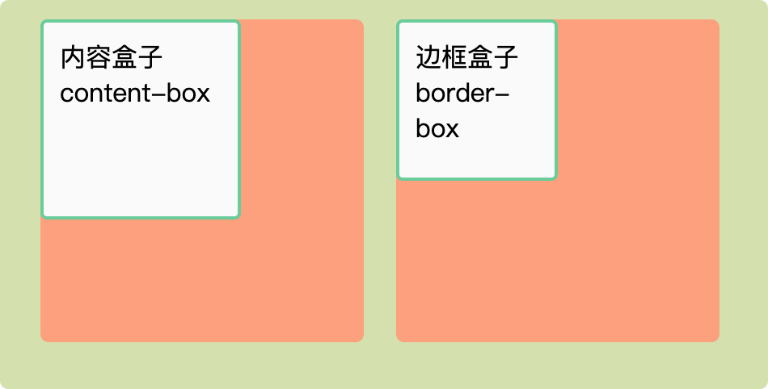
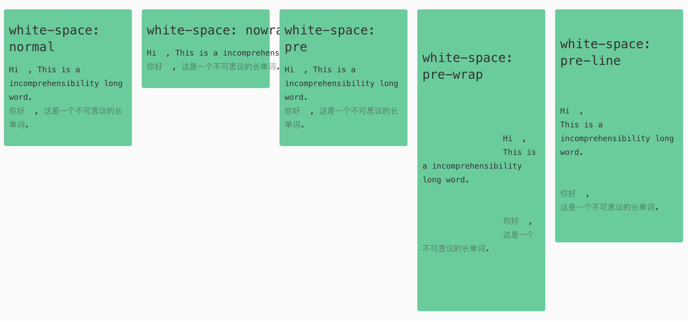

# CSS 知识集合


> CSS 在线参考手册：
> 
> 中文：https://techbrood.com/cssref#animation
> 
> 英文完整版: https://www.w3schools.com/cssref/index.php


## New Words

compatible `/kəm'pætɪb(ə)l/` --adj.兼容的, 共存的

incompatible `/ɪnkəm'pætɪb(ə)l/` --adj.不兼容的，互斥的。

wrap `/ræp/` --vt&vi.包，裹。 --n.外套，围巾。

collapse `/kə'læps/` --v.倒塌, 塌下。 --n.倒塌，倒闭。

preserve `/prɪ'zɝv/` --vt.保存，保存；保持. --n.保护。

incomprehensibility `/ɪnˌkɑːmprɪˈhensəbəl/`[US] --n.不可理解, 不可思议


## ▲ CSS 2021中新增的样式

| 样式                 | 描述                                                         | Chrome | Firefox | Safari | Edge |
| -------------------- | ------------------------------------------------------------ | ------ | ------- | ------ | ---- |
| gap                  | 用于设置网格和弹性布局中项目之间的间距。                     | 84+    | 63+     | 14.1+  | 79+  |
| scroll-margin-top    | 控制元素滚动到可见区域时顶部的边距。                         | 69+    | 68+     | 14.1+  | 79+  |
| scroll-margin-right  | 控制元素滚动到可见区域时右侧的边距。                         | 69+    | 68+     | 14.1+  | 79+  |
| scroll-margin-bottom | 控制元素滚动到可见区域时底部的边距。                         | 69+    | 68+     | 14.1+  | 79+  |
| scroll-margin-left   | 控制元素滚动到可见区域时左侧的边距。                         | 69+    | 68+     | 14.1+  | 79+  |
| aspect-ratio         | 用于设置元素的宽高比。                                       | 88+    | 87+     | 14.1+  | 93+  |
| backdrop-filter      | 用于在元素后面添加视觉效果，如模糊、颜色变化等。             | 76+    | 70+     | 14.1+  | 79+  |
| overscroll-behavior  | 用于控制元素在滚动到边缘时的行为。可选值为auto、contain、none、unset、x轴、y轴、x和y轴。 | 79+    | 59+     | 14.1+  | 79+  |
| clip-path            | 用于裁剪元素的形状。                                         | 88+    | 88+     | 14.1+  | 93+  |

希望这个表格能够帮助你更好地了解CSS 2021中新增样式的浏览器兼容性。请注意，以上版本信息可能会随着时间的推移而发生变化，因此请随时查阅最新的浏览器兼容性信息。


## ▲ CSS accent-color属性简介

> https://www.zhangxinxu.com/wordpress/2022/03/css-accent-color/


## ▲  <span id="id-attribute">ID 属性</span>

- (1) 在网页中我们一般这样给元素添加 ID 属性:
  ```html
    <div id="app">APP</div>
  ```
  相应的 ID 选择符可以这样书写 CSS 样式:
  ```css
    #app {
        color: #232323;
        width: 100%;
    }
  ```
- (2) 除了上面的 `(1)` 还有一种用于**页面内导航的 ID**. 例如, 下面这个链接,
  点击后会让页面滚动到当前页面的另一个位置.
  ```html
    <a href="#bio">Biography</a>
  ```
  `href` 属性值开头的 `#` 号, 它表示这个链接的目标在当前页面中, 因而不会触发浏览器加载页面(如果没有 `#`, 浏览器就会尝试加载 bio 目录下的默认页面.)
  使用与 CSS 选择符相同的 `#ID` 名语法, 可以把链接导航到同一个页面中的目标 ID.
  在这个页面的下方, 应该有对应的目标元素.
  
  ```html
    <h3 id="bio">Biography Content<h3>
    <p>I was born when I was very young...</p>
  ```
  同样要注意, 作为目标的的 ID 值前面是没有 `#` 的, 就是一个普通的 ID 值.

  用户点击前面的链接时, 页面会向下滚动到 ID 值为 bio 的 `h3` 元素的位置. 

  如果连接的 `href` 属性里只有一个 `#`, 那么点击该链接会返回页面顶部.
  ```html
    <a href="#">Back to Top</a>
  ```
  换句话说, 要写一个 "返回顶部" 链接, 根本不需要 ID 为 `#` 的目标元素.

  另外, 如果你暂时不知道某个 `href` 应该放什么 URL, 也可以用 `#` 作为占位符,
  但不能把该属性留空. 因为 `href` 属性值为空的链接的行为跟正常链接不一样.

  **Hint:** 实际上这个页面内导航的 ID, 在 CSS 语法中叫做 `:target` 伪类, 
  关于伪类的语法, 详见: `../《CSS设计指南》/chapter02-CSS工作原理` 的 `2.6` 节.

## css 的 `box-sizing` 属性

**Added:** 什么是盒模型? 

简单地说每个 html 标签都是一个方块，然后这个方块又包着几个小方块. 分别是: `margin`、`border`、`padding`、`content`. 它们的关系是 margin 包着 border 包着padding 包着 content. 就像盒子一层一层地包着一样，这就是我们所说的盒模型。
+ 注意: **盒子的大小为 content + padding + border 即(内容的(width) + 内边距的再加上边框)，而不加上margin.**

`box-sizing`(盒子大小) 属性, 包含 2 个值:
+ `content-box`(内容盒子): 是默认值. 元素的宽高不包含 `border` 和 `padding`.
+ `border-box`(边框盒子):  `border` 和 `padding` 包含在元素的宽高之内.
  ```css
  html {
    /* - 现在实践规定都是使用 border-box */
    box-sizing: border-box;
  }
  ```

示例:
```html
<!DOCTYPE html>
<html lang="en">
<head>
    <meta charset="UTF-8">
    <meta name="viewport" content="width=device-width, initial-scale=1.0">
    <meta http-equiv="X-UA-Compatible" content="ie=edge">
    <title>Document</title>
    <style>
        * {
            margin: 0;
            padding: 0;
            list-style: none;
            font-size: 16px;
        }
        .container {
            width: 76%;
            margin: 20px auto;
            min-height: 460px;
            padding: 2%;
            background:rgb(212, 226, 172);
            overflow: hidden;
        }
        .box-wrapper {
            width: 200px;
            height: 200px;
            border-radius: 5px;
            float: left;
            margin-left: 20px;
            background: lightsalmon;
        }
        .box {
            display: inline-block;
            width: 100px;
            height: 100px;
            padding: 10px;
            background: #fafafa;
            border: 2px solid #66cc99;
            border-radius: 4px;
        }
        .con-box {
            box-sizing: content-box;
        }
        .bor-box {
            box-sizing: border-box;
        }
    </style>
</head>
<body>
    <div class="container">
        <p class="box-wrapper">
            <span class="box con-box">内容盒子 content-box</span>
        </p>
        <p class="box-wrapper">
            <span class="box bor-box">边框盒子 border-box</span>
        </p>
    </div>
</body>
</html>
```


## ▲ `box-shadow` 属性:

```css
.box {
    /* - 横向阴影1px, 纵向阴影1px, 模糊半径3px, 阴影展开半径2px, 颜色值. */
    box-shadow: 1px 1px 3px 2px #cfcecf;
    box-shadow: 0 .05em .25em rgba(0, 0, 0, .5);
}
```


## ▲ CSS 像素`px`和相对单位`em`/`rem`/`%`/`vh|vw`
- [../布局-Layout/CSS单位/CSS-像素px详解和布局基础.md](File:///Users/WANG/Github-clone/CSS-grocery/布局-Layout/CSS单位/CSS-像素px详解和布局基础.md)
- [../布局-Layout/CSS单位/CSS-相对单位.md](File:///Users/WANG/Github-clone/CSS-grocery/布局-Layout/CSS单位/CSS-相对单位.md)


## ▲ css 强制换行和超出隐藏
> [参考文章](https://juejin.im/post/5b8905456fb9a01a105966b4)

### (1) `white-space(空白空间): normal / nowrap / pre / pre-wrap / pre-line.`

这个属性是**用来控制空白字符显示的**, 同时还能控制是否自动换行. 它有 5 个值: 
+ (1) `normal`(默认值): 只有空格换行, 单词不换行. [tip: 最常用]
+ (2) `nowrap`: 永不换行
+ (3) `pre`: 它其实是 `preserve` 的缩写. 即空格(`&nbsp;`)和换行(`<br/>`) 全部被保留.
+ (4) `pre-wrap`: 它其实是 `preserve` + `wrap`, 即保留空格和换行符, 且可以自动换行. (Tip: 从下图可以看出, 这种展示效果可能是你在网页中最不想看到的.)
+ (5) `pre-line`: 它其实是 `preserve new line` + `wrap`. 即合并空格, 但是换行符可以发挥作用.

测试文件见当前仓库: `./示例和集锦/white-space_word-break_word-wrap/white-space-demo.html`

```html
<!-- 默认样式如下 -->
<div class="white-space-normal">
    <h3>white-space: normal</h3>
    <p>
        Hi&nbsp;&nbsp;,
        This is a incomprehensibility long word.
        <br/>
        你好&nbsp;&nbsp;,
        这是一个不可思议的长单词.
    </p>
</div>   
```
样式效果如下:



添加一个表格作为总结:  

| 属性值 | 换行符 | 空格 | 自动换行 | `<br/>`, `&nbsp;` |
|:------|:------|:------|:------|:------|
|`normal`  | $\times$ | $\times$ (合并) | $\surd$| $\surd$ |
|`nowrap`  | $\times$ | $\times$ (合并) | $\surd$| $\surd$ |
|`pre`     | $\surd$ | $\surd$ | $\surd$| $\surd$ |
|`pre-wrap`| $\surd$ | $\surd$ | $\surd$| $\surd$ |
|`pre-line`| $\surd$ | $\times$ (合并) | $\surd$| $\surd$ |

### (2) `word-break: normal / break-all / keep-all;` 
word break (断字): 这个属性是控制单词如何被拆分换行的. 它有三个值:
+ (2.1) `normal`:  不拆分单词, 但是空格会换行.
+ (2.2) `break-all`(打破一切): **所有单词碰到边界一律拆分换行.** 不管你是 `incomprehensibility` 这样一行都显示不下的单词, 还是 `long` 这样很短的单词, 只要碰到边界, 都会被强制拆分换行. 所以使用 `word-break: break-all` 时要慎重.
+ (2.3) `keep-all`(保留全部): **所有单词一律不拆分换行**. 注意, 这里的 "单词" 包括连续的中文字符(还有日文, 韩文等), 或者可以理解为**只有空格可以触发自动换行**.

测试文件见: `./示例和集锦/white-space_word-break_word-wrap/word-break_overflow-wrap.html`

样式效果如下: 


### (3) `word-wrap(自动换行): normal / break-word`. 
又叫 `overflow-wrap(溢出包裹)`: 这个属性是**控制长度超过一行的单词如何被拆分换行**, 实际上是作为 `word-break` 的互补, 它有 2 个值: 
+ (3.1) `normal`: 不拆分单词
+ (3.2) `break-word`: **只有当一个单词一整行都显示不下时才会拆分换行该单词**. (Hint: 网页中完美的解决换行的方法.)
  

Tip: `word-wrap` 属性原本属于微软的一个私有属性, 在 CSS3 现在的文本规范草案中已经被重命名为 `overflow-wrap`. `word-wrap` 现在被当作 `overflow-wrap` 的别名. 稳定的 Chrome 版本支持这种新语法.

样式效果见: 上图的最后两个 div

使用示例: 
```css
/* 强制文本换行 */
.textwrap, .textwrap td, .textwrap th {
    word-wrap: break-word;
    word-break: break-all;
}
```


## ▲ 去掉表格(Table cell)的边距并让其边重合
```css
table {
    border-collapse: collapse;
    border-spacing: 0;
}
```


## ▲  响应式网页的头部:
```html
<!doctype html>
<html lang="en">
<head>
    <meta name="viewport" content="width=device-width,
            user-scalable=no, initial-scale=1.0,
            maximum-scale=1.0, minimum-scale=1.0">
    <meta http-equiv="X-UA-Compatible" content="ie=edge">
    <title>Document</title>
</head>
<body>
</body>
</html>
```
| 属性名 |  描述  |
|:------|:------|
| `viewport` | 视口 |
| `width = device-width` | 定义布局视口的宽度, 单位为像素. 宽度默认等于屏幕宽度(即: CSS 像素宽度); |
| `height` = 正整数 | 定义布局视口的高度, 单位为像素. 很少使用. |
| `initial-scale` = [0, 10] | 初始缩放比例, 1 表示不缩放. |
| `maximum-scale`= [0, 10] | 最大缩放比例|
| `minimum-scale`= [0, 10] | 最小缩放比例|
| `user-scalable` = yes/no | 允许用户是否可以手动缩放. |


## ▲ 各种平台样式兼容问题

### 忽略将页面中的数字识别为电话号码, 忽略 android 平台中对邮箱地址的识别
```html
<meta content="telephone=no, email=no" name="format-detection">
```
去除 Chrome `input` 和 `textarea` 的默认边框, 以及点击时的聚焦边框:
```css
input, button, select, textarea{ outline: none; }
input:focus, input:active, textarea:focus, textarea:active { outline:none;}
```

### 解决 ios 端 `button` 圆角和渐变的问题
```css
input[type=button], input[type=submit], input[type=file], button {
    cursor: pointer;
    -webkit-appearance: none;
}
```

### 解决 ios 端点击按钮会出现暗色背景的问题
```css
input{
    /* 去除系统默认的样式 */
    -webkit-appearance:none;
    /* 点击高亮的颜色 */
    -webkit-tap-highlight-color: rgba(0, 0, 0, 0);
}
```

### 去除 chrome 下 `textarea` 可拖动放大的问题:
```css
textarea{ resize: none; }
```


## ▲ Flex(弹性)布局语法
- 见当前仓库: [CSS-grocery/布局-Layout/Flexbox-布局/README-弹性布局语法.MD](File:///Users/WANG/Github-clone/CSS-grocery/布局-Layout/Flexbox-布局/README-弹性布局语法.MD)


## ▲ CSS3 过渡(transition), 转换(transform), 动画(animation)讲解
- 见当前仓库: [CSS3-过渡-转换-动画/transition-transform-animation.md](File:///Users/WANG/Github-clone/CSS-grocery/CSS3-过渡-转换-动画/transition-transform-animation.md)


## ▲ `list-style`
```css
.list-item {
    /* - MDN: 将这个元素的外部显示类型变为 block 盒, 并将内部显示类型变为多个
        *   list-item inline 盒.
        * - 上面 MDN 说的大致意思就是: 把 li 变成 block, 其内部元素显示为
        *   display: inline.
        */
    display: list-item;
    /* - list-style: list-style-type list-style-position list-style-image*/
    list-style: disc outside none;
}
```


## ▲ CSS Style Guides

> 来源 [CSS Style Guides](https://css-tricks.com/css-style-guides/)

(1) As a rule of thumbs, don't nest further than 3 levels deep. If you find yourself going further, think about reorganizing your rules(either the specificity needed, or the layout of the nesting). 

根据经验, 嵌套深度不得超过 3 层. 如果你发现自己的布局已经是这样了, 请考虑重新组织规则(所需的特殊性和嵌套的布局).

(2) Unit-less `line-height` is preferred because it does not inherit a percentage value of its parent element, but instead is based on a multiplier of the `font-size`.

无单位的 `line-height` 是优选的, 因为它不继承父元素的百分比值, 而是基于所述文字大小的乘数.
+ 详细示例见: `../《深入解析CSS》/chapter02_相对单位/` --> `2.5 无单位的数值和行高`

(3) Use ID and class names that are as short as possible but as long as(只要) necessary. 

使用尽可能短的 ID 和 class 名, 但前提是只要有必要.
+ 例如: `#nav` not `#navigation`, `.author` not `.atr`. 注意这里的 `author` 缩写成 `atr` 便不是必要的; 还有一点请注意, 一般不建议在 CSS 样式中使用 `id`.

(4) 

(5)

(6) 

...... 未写完, 有时间继续....


## ▲  @font-face
`@font-face` CSS at-rule 指定用于显示文本的自定义字体; 字体可以从 "远程服务器" 或 "用户本地安装的字体"" 加载. 如果提供了 `local()` 函数, 从用户本地查找指定的字体名称, 如果找到了匹配项, 本地字体就会被使用. 否则, 字体就会使用 `url()` 函数下载的资源.

通过允许作者提供他们自己的字体, `@font-face` 让设计内容成为了一种可能, 同时并不会被所谓的 "网络-安全字体" 所限制. 

示例:
```html
<html>
<head>
    <title>Web Font Sample</title>
    <style type="text/css" media="screen, print">
        @font-face {
            font-family: "Bitstream Vera Serif Bold";
            src: url("https://mdn.mozillademos.org/files/2468/VeraSeBd.ttf");
        }
        
        body { font-family: "Bitstream Vera Serif Bold", serif }
    </style>
</head>
<body>
    This is Bitstream Vera Serif Bold.
</body>
</html>
```


## ▲ background-position
`background-position` 属性，是所有背景属性中最复杂的. 属性有5个关键字值，分别是: `top`、`left`、`bottom`、`right` 和 `center`. 关键字中的任意两个组合起来都可以作为该属性的值. 比如，top right 表示把图片放在元素的右上角位置，center center 把图片放在元素的中心位置。


## ▲ JavaScript 动画和 CSS 动画该如果抉择
根据 Google Developer, 渲染线程分为 主线程(main thread)和合成线程(compositor thread). 如果 CSS 动画只是改变 transforms 和 opacity, 这时整个 CSS 动画得以在 合成线程 完成（而JS动画则会在 主线程 执行, 然后触发合成线程进行下一步操作）, 在 JS 执行一些昂贵的任务时, 主线程繁忙, CSS 动画由于使用了合成线程可以保持流畅

在许多情况下, 也可以由合成线程来处理 transforms 和 opacity 属性值的更改. 

对于帧速表现不好的低版本浏览器, CSS3可以做到自然降级, 而JS则需要撰写额外代码. 

CSS动画有天然事件支持(TransitionEnd、AnimationEnd, 但是它们都需要针对浏览器加前缀),JS则需要自己写事件. 

如果有任何动画触发绘画, 布局或两者, 则需要 “主线程” 才能完成工作. 这对于基于 CSS 和 JavaScript 的动画都是如此, 布局或绘制的开销可能会使与 CSS 或 JavaScript 执行相关的任何工作相形见绌, 这使得问题没有实际意义. 

CSS3有兼容性问题, 而JS大多时候没有兼容性问题.

**总结:**
如果动画只是简单的状态切换, 不需要中间过程控制, 在这种情况下, css 动画是优选方案. 它可以让你将动画逻辑放在样式文件里面, 而不会让你的页面充斥 Javascript 库. 然而如果你在设计很复杂的富客户端界面或者在开发一个有着复杂 UI 状态的 APP. 那么你应该使用 js 动画, 这样你的动画可以保持高效, 并且你的工作流也更可控. 所以, 在实现一些小的交互动效的时候, 就多考虑考虑 CSS 动画. 对于一些复杂控制的动画, 使用 javascript 比较可靠. 
