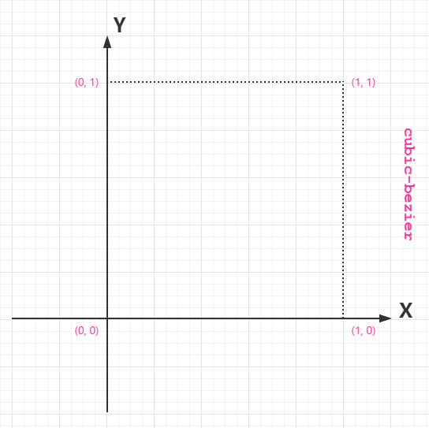
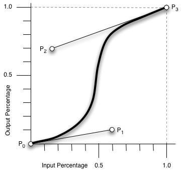
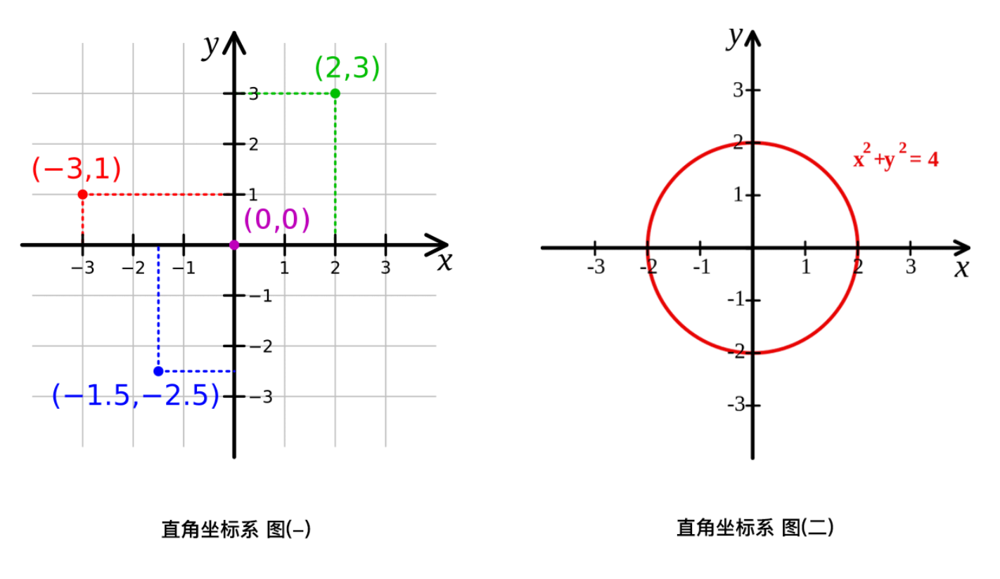
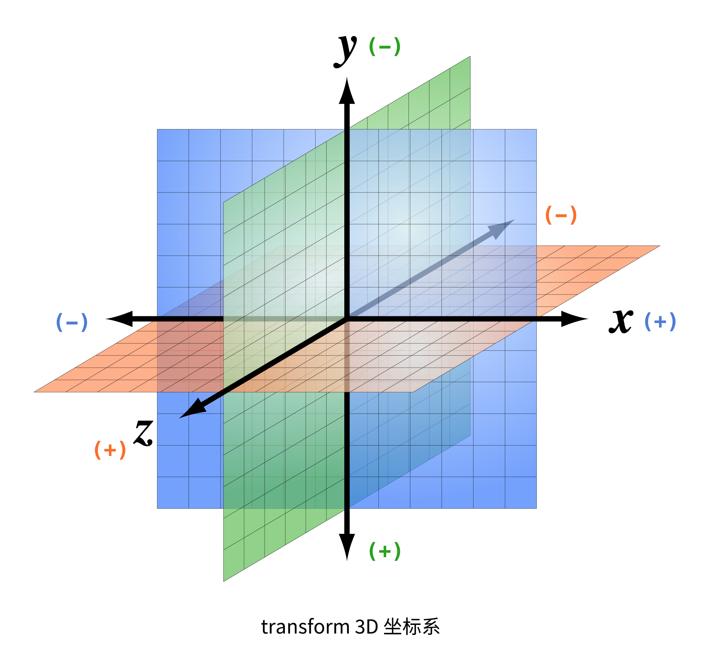
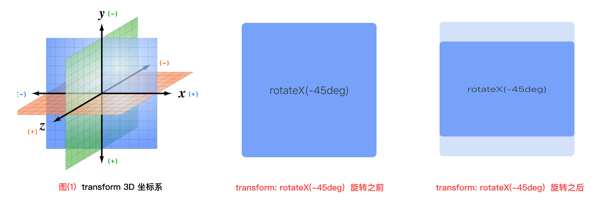
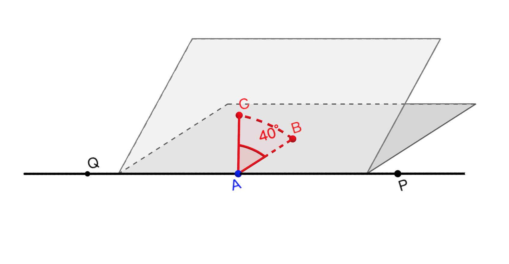
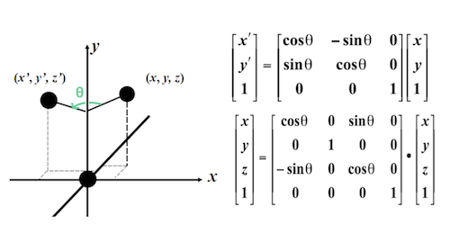

# CSS3 过渡(transition), 转换(transform)和动画(animation)

## 目录(Table Of Contents)

1. CSS3 transition(过渡)
    + 1.1 transition(过渡)介绍
    + 1.2 transition 的 4 个属性值
    + 1.3 transition 使用基本示例
    + 1.4 贝塞尔曲线讲解
        - 1.4.1 贝塞尔曲线简介
        - 1.4.2 使用示例
    + 1.5 使用 JS 控制 transition(过渡)效果
2. CSS3 transform(转换)
    + 2.1 transform 是什么?
    + 2.2 transform 转变(/变形)的前置知识
    + 2.3 通过 transform 实现 2D/3D 转换
3. CSS3 animation(动画)

## 生词(New Words)
- **transition [træn'zɪʃən] --n.过渡; 转换; 变迁**
    + transition animation. 过渡动画
    + a period of transition. 过渡时期
- **duration [djʊ'reɪʃ(ə)n]/[du'reʃən] --n.持续时间; 时长; 期间.**
    + a long[short] duration. 长期[短期]的
    + for the duration of. ...(在)...的期间
    + for a duration of ten minutes. 十分钟的时间
- **cubic ['kjuːbɪk] --adj.立方体的, 立方的**
    + cubic content. 容积; 体积.
    + a cubic equation. 三次方程
    + The volume of this container is 1000 cubic metres.
      这个集装箱的容量是 1000 立方米.
- **volume ['vɒljuːm] --n.体积; 卷; 音量.**
    + the volume of water in a lake. 湖内水的容积.
    + He turned up[down] the volume on the television. 
      他把电视机的音量调大[小]了.
    + Our school has a library of 100,000 volumes.
      我们学校有一所藏书十万册的图书馆
- **bezier  贝塞尔**
- **curve [kɜːv] --n.曲线; 弯曲. --vt.使弯曲. --vi.成曲形. --adj.弯曲的**
    + in a curve(n). 成曲线地
    + a curve in the road(n). 道路的弯曲处.
    + go round[take, turn] a curve. 转弯
- **transform [træns'fɔːm] --vt&vi.转换, 改造, 转变, 改变**
    + How do we transform one type of file to another?
        我们如何将一种文件类型转换为另一种类型？
    + The failure['feɪljə] transformed the young man's character.
        那次失败改变了这个年轻人的性格. 
- **rotate [rə(ʊ)'teɪt]/['rotet] --vi.旋转;循环. --vt.使旋转; 使转动.**
    + The seasons rotate(vi). 四季周而复始.
    + the discovery that the earth rotates(vi). 地球自转的发现.
    + Your can rotate(vt) the wheel with your hand.
      你可以用手转动轮子.
    + This large gear turns the small one to rotate(vt) the cylinder.
      这个大齿轮带动小齿轮使滚动旋转.
- **skew [skjuː] --n.斜交,歪曲. --adj.斜的,歪曲的.**
    + 我们把不同在任何一个平面内的两条直线叫做**异面直线 (skew lines)**
    + The picture is a bit skew(adj). 这幅画有点歪.
- **scale [skeɪl] --n.刻度, 规模, 比例.  --v.攀登**
    + How much does it read on the scale? 刻度显示的是多少？  
- **translate [træns'leɪt] --vt.翻译;转化;解释. --vi.翻译**
    + translate into. 翻译成
    + Can you translate(vt) an English sentence into Japanese?
      你能把把英文句子翻译成日文?
    + How would you translate(vt) his conduct? 你如何解释它的举动呢?
    + I translated(vt) his silence as a refusal.
      我把它的缄默解释为拒接.
    + I could hardly translate(vt) my thoughts into words.
      我几乎不能把我的想法用言语表达出来.
    + Her novels translate(vi) well. 她的小说容易翻译.
- **perspective [pə'spektɪv] --n.透视, 远景  --adj.透视**
    + a perspective of lakes and hills. 湖山远景
    + You can get a perspective of the whole city from here. 
      从这里你可以看到城市的全景. 
    + We are all different from different perspectives. 
      从不同的方面审视, 我们每个人都是不同的.     
- **coordinate [kəuˈɔ:dineit] --n.<数>坐标  --vt.协调, 配合**
    + 3D Cartesian Coordinate System. 三维直角坐标系
- **infinite ['ɪnfɪnɪt] --adj.无穷的, 无限的；无数的. --n.无限, 无穷大**
- **forward ['fɔrwɚd] --adv.向前; 在前; ...以后. --adj.向前的; 前面的; 早的.**
    + look forward(adv) 向前看.
    + step forward(adv) two paces [take two steps forward].
      向前走两步.
    + He drew his chair a little forward(adv) and sat down on it.
      他把椅子向前拉一些, 然后坐下去.
    + from this time forward(adv). 从今以后, 从此
    + from that day forward(adv). 从那天以后.
    + forward(adj) speed. 前进速度.
    + forward(adj) planning. 未来的计划.
- **iteration [ˌɪtə'reɪʃn] --n.迭代, 重复, 反复**
    + Let's listen to the next iteration of this theme. 我们来听下一段主题. 
    + So this process takes about four or five iterations.
        这个过程需要四到五此反复. 
    + Iterators are just objects with a specific interface designed for 
        iteration. 迭代器是一种特殊对象, 它具有一些专门为迭代过程设计的专有接口. 
- **alternate ['ɔːltəneɪt] --adj.轮流的; 交替的; 间隔的. vt&vi.轮流; 交替; 交流**
    + That was a week of alternate(adj) rain and sunshine.
      那是晴雨天交替的一周.
    + Alternate(adj) hop and fear. 时喜时忧.


## 内容(Content)
### 1. CSS3 transition(过渡)
#### 1.1 transition(过渡)介绍
- CSS3 的 transition(属性) 允许元素的 css 属性值在一定的时间内在不同状态之间平滑过渡
  (补间动画), 经常用来制作动画效果.
    + 补间动画: 自动完成从起始状态到终止状态的过渡. 不用管中间的状态.
    + 帧动画: 通过一帧一帧的画面按照固定顺序和速度播放. 如电影胶片.

#### 1.2 transition 的 4 个属性值
- transition 主要包含下面 4 个属性:
    + (1) `transition-property (过渡属性)`: 应用过渡效果的 css 属性名
    + (2) `transition-duration (过渡持续时间)`: 添加过渡持续的时间
    + (3) `transition-timing-function (过渡时间函数)`: 在过渡期间,
      过渡效果的速率变化曲线, 默认值是 `ease`. 取值范围如下:
        - (a) `linear`:  匀速(cubic-bezier(0.00, 0.0, 1.0, 1.0))
        - (b) `ease`:   匀加速-匀减速 (cubic-bezier(0.25, 0.1, 0.25, 1))
        - (c) `ease-in`:  匀加速 (cubic-bezier(0.42, 0, 1, 1))
        - (d) `ease-out`: 匀减速 (cubic-bezier(0, 0, 0.58, 1))
        - (e) `ease-in-out`: 加速-减速 (cubic-bezier(0.42, 0, 0.58, 1))
    + (4) `transition-delay (延迟过渡)`: 规定过渡效果何时开始
      (即:多长时间后执行过渡), 默认是 0.
- CSS3 为上面 4 个属性提供了一个复合属性 `transition`, 目的是简化书写:
    + `transition`: property duration timing-function delay;
- Hint: `transition` 也可以接受 `transform` 属性, `transform` 如
  `width/height/opacity/...` 一样是属性, 定义元素的 "旋转", "缩放",
  "移动", "倾斜". (`transform` 下面会详细讲解)

#### 1.3 transition 使用基本示例
- 示例 (1): 向宽度, 高度和转换(transform)添加过渡效果:
  ```css
  
  div {
        transition: width 2s, height 2s, transform 2s;
        transform: rotate(-45deg);
        /* 带有浏览器前缀的兼容写法省略 ... */
    }
  ```
- 示例 (2): 在一个示例中使用所有过渡属性:
  ```css
    div {
        transition: width 1s linear 2s;
        /*
         * - 简写属性等于下面的分开写法
         *   transition-property: width;
         *   transition-duration: 1s;
         *   transition-timing-function: linear;
         *   transition-delay: 2s;
         */
    }
  ```
- 示例 (3):
  ```css
    .box{
        width: 100px; 
        height: 100px;
        border-radius: 6px;
        margin: 100px auto;
        background:lightcoral;
        opacity: .4; 
        transition: .6s;
  
    }
    .box:hover{
        height: 260px;
        width: 260px;
        opacity: 1;
        /* - 缩写顺序为:
         *   transition-property,
         *   transition-duration,
         *   transition-timing-function,
         *   transition-delay;
         */
        transition: width .6s linear,
                    height .6s linear,
                    opacity .6s linear;
    }
  ```
  ```html
    <div class="box"></div>
  ```
- 示例 (4):
  ```css
     .box {
        width: 200px;
        height: 200px;
        background-color: #66cc99;
        border-radius: 20px;
        margin: 50px auto;
        font-size: 32px;
        text-align: center;
        line-height:200px;
        /* - transition(过渡) 效果要监控整个的动画的完成,
         *   所以是添加在默认样式上的, 如果添加在 .box:hover 上,
         *   你就会发现, 鼠标在元素上悬停时逆时针旋转效果是有的,
         *   但你移开鼠标之后, 过渡效果便会立即消失, 因为 hover
         *   伪类被移除,其内部的所有属性也被移除. 
         */
        transition: all 2s;
    }
    .box:hover {
        /* - 鼠标悬停时让元素逆时针旋转 405 deg */
        transform: rotate(-405deg);
    }
  ```
  

#### 1.4 贝塞尔曲线讲解
- 1.4.1 贝塞尔曲线简介
    + 贝塞尔曲线于 1962 年, 由法国工程师`皮埃尔·贝济埃(Pierre Bézier)`所广泛发表,
      他运用贝塞尔曲线来为汽车的主体进行设计.
      
      贝塞尔曲线主要用于二维图形应用程序中的数学曲线, 曲线由起始点,
      终止点(也称锚点)和控制点组成, 通过调整控制点,
      通过一定方式绘制的贝塞尔曲线形状会发生变化. 后面会具体介绍绘制的方法.
    
      在计算机图形学中贝赛尔曲线的运用很广泛, 例如 PhotoShop 中的钢笔效果, Flash5
      的贝塞尔曲线工具, 在软件 GUI 开发中一般也会提供对应的方法来实现贝赛尔曲线,
      我们熟知的 CSS 动画(animation)/过渡(transition)
      的时间函数(xxx-timing-function)也是通过贝塞尔曲线(三阶贝塞尔曲线)获取的.
    
      上面 `1.2 过渡属性` 的 `transition-timing-function(过渡时间函数)`
      属性中这个 `cubic-bezier` 就是 **三阶贝塞尔曲线**,
      主要是为 `transition`, `animation` 生成速度曲线的函数, 规定是:
      `cubic-bezier(<x1>, <y1>, <x2>, <y2>)`.

      我们可以从下图中简要理解一下 `cubic-bezier`:
    
      
      
      
    
      (Tip: Input percentage(输入百分比);  Output percentage(输出百分比))
    
      从上图我我们需要知道的是 `cubic-bezier` 的取值范围:
        + (1) P0: 默认值(0, 0)
        + (2) P1: 动态取值(x1, y1)
        + (3) P2: 动态取值(x2, y2)
    + (4) P3: 默认值(1, 1)
    
      我们需要关注的是 P1 和 P2 两点的取值, 而其中 `X 轴` 的取值范围是 0 到 1,
      当取值超出范围时 `cubic-bezier` 将失效; `Y 轴` 的取值没有规定,
      当然也不要过大. (Added:《CSS揭秘》作者写了一个在线调试贝塞尔曲线的网站
      : [cubic-bezier.com](cubic-bezier.com))
    + 关于贝塞尔曲线的更多讲解可以参考
      [此文](https://juejin.im/post/5b854e1451882542fe28a53d)
  
- 1.4.2 使用示例
  ```html
    <!DOCTYPE html>
    <html lang="zh-cn">
    <head>
        <meta charset="UTF-8">
        <title>Document</title>
        <style>
            .transform {
                width: 50px;
                height: 50px;
                background-color: #ed3;
                -webkit-transition:  all 2s;
                        transition:  all 2s;
            }
            .transform:hover {
                /* - transform (转换) 下面会讲 */
                -webkit-transform:  translateX(100px);
                        transform:  translateX(100px);
            }
        </style>
    </head>
    <body>
        <div class="transform"></div>
    </body>
    </html>
  ```
  我们可以在浏览器中看到, 当鼠标移到元素上时, 元素开始向右移动, 开始比较慢, 
  之后则比较快, 移开时按原曲线回到原点. 

  你也可以更该贝塞尔曲线的值, 例如:
  `transition:  all 2s cubic-bezier(.17, .86, .73, .14);`
  自行在浏览器中查看运行效果. 

#### 1.5 使用 JS 控制 transition(过渡)效果
- 示例见文件: `../../JS-book-learning/《JavaScript高级程序设计》/Chapter11-DOM扩展/JS添加和删除class方法总结.md`
  内的 `1.5 使用 JS 控制 transition(过渡)效果`


### 2. CSS3 transform(转换/变形)
#### 2.1 transform 是什么?
- transform(转换)是 CSS3 中具有颠覆性的一个特性, 它可以实现元素的
  `位移(translate)`, `旋转(rotate)`, `倾斜(skew)`, `缩放(scale)`,
  甚至支持矩阵方式.

  转换(transform) 可以单独使用, 但更多是配合 过渡(transition) 和
  动画(animation) 一起使用.

  transform 的属性包括: `rotate()`/`skew()`/`scale()`/`translate()`

  在 CSS3 中, 通过 transform(转换) 来实现 2D 转换 或 3D 转换(伪 3D).

#### 2.2 transform (转换/变形)的前置知识

- **(1) 笛卡尔坐标系(直角坐标系)**
  
    [笛卡尔坐标系](https://www.wikiwand.com/zh/%E7%AC%9B%E5%8D%A1%E5%B0%94%E5%9D%90%E6%A0%87%E7%B3%BB#/%E4%B8%89%E7%B6%AD%E7%A9%BA%E9%96%93)(Cartesian coordinates system, 也称直角坐标系) 在数学中是一种[正交坐标系](https://www.wikiwand.com/zh/%E6%AD%A3%E4%BA%A4%E5%BA%A7%E6%A8%99%E7%B3%BB),由法国数学家[勒内·笛卡尔](https://www.wikiwand.com/zh/%E5%8B%92%E5%86%85%C2%B7%E7%AC%9B%E5%8D%A1%E5%B0%94)引入而有此名.
    
    二维的直角坐标系是由两条相互垂直, 相交于原点的[数线](https://www.wikiwand.com/zh/%E6%95%B8%E7%B7%9A)构成的. 在平面内, 任何一点的坐标是根据数轴上对应的点的坐标设定的. 在平面内,任何一点与坐标的对应关系, 类似于数轴上点与坐标的对应关系. 
    
    直角坐标系也是我们学习初等数学时使用的坐标系. 
    
    
    
    在 JavaScript 中我们获取鼠标的 `客户区坐标位置 (clientX, clientY), 页面坐标位置(pageX, pageY)` 都是根据直角坐标系来表述相对应的概念; 但在浏览器中, **坐标轴的原点 `(0, 0)` 是在浏览器视口的左上角**, 而且 **Y 轴的正/负朝向和数学的直角坐标系统是相反的**, 如下图:
    
    
    
    (Hint:   截图来自 JS 高程 `13.4.3 鼠标与滚轮事件`)
    
- **(2) 三维坐标系统(数学)**:
    
    直角坐标系也可以推广至三维空间与高维空间(higher dimension). 
    
    在原本的二维直角标系, 再添加一个垂直于 x-轴 和 y-轴 的坐标轴，称为 **z-轴**.假若, 这三个坐标轴满足 [右手定则](https://zh.wikipedia.org/wiki/%E5%8F%B3%E6%89%8B%E5%AE%9A%E5%89%87) 则可得到三维的直角坐标系统; 这 z-轴与 x-轴, y-轴相互交于原点.
    
    在三维空间的任何一点 P, 可以利用直角坐标(x, y, z) 来表达其位置. 用图表示右手定则, 如下所示:
    
      
    
- **(3) transform 3D 坐标系**
    + 在 2D Canvas API 和 CSS transform(转换)中,
      它们建立模型所使用的三维坐标系基于数学上的三维坐标系统,
      唯一的不同是 **y轴的正向向下**(见下图); 你可能也注意到了,
      上面的关于浏览器原点坐标的的截图中, y 轴的正向也是向下的,
      你可能会问, 为什么在 2D Canvas 和 CSS 中 y 轴都是正向在下,
      实际上这是因为它们都是基于 HTML 的 y 轴正向向下的坐标约定,
      而这个约定本身是使用 windows 系统的坐标体系的后代. 

      

#### 2.3 通过 transform 实现 2D/3D(伪 3D) 转换
+ (1) `transform: translate(x, y)` 位移
    - 参数: 相对与当前位置向 水平(`x`) 或 垂直(`y`) 方向移动, 正值向 **右下**,
        负值向 **左上**. 如果只写一个值, 则表示水平移动. 也可将 X/Y 轴分开写, 例如:
        `translateX()` / `translateY()`
    - 参数取值: 为**百分比**, 相对于自身移动. 默认中心点就是盒模型的中心点.
+ (2) `transform: scale(x, y)` 缩放
    - scale 具有 3 种情形:
        + (a) `scaleX(30deg)`: 
        + (b) `scaleY(y)`
        + (c) `scale(x, y)`: 
    - 参数: `x` 水平方向的缩放倍数; `y` 垂直方向的缩放倍数. 如果只写一个值就是等比例缩放.
    - 参数取值: 大于 **1** 放大, 小于 **1** 缩小. 不能为百分比.
        例如: `transform: scale(2, 0.5);`.
+ (3) `transform: rotate(角度)`: 通过指定一个角度对元素进行
  2D rotation(2D 旋转), 需先有 `transform-origin` 属性的定义,
  若不指定 `transform-origin`, 默认是以盒子的正中心为坐标原点.
    - 具有 3 种情形:
        + (a) `rotateX(30deg)`: 
        + (b) `rotateY(y)`
        + (c) `rotate(x, y)`
    - 参数: 表示旋转角度, 单位是 `deg`; **正值--顺时针旋转**, **负值--逆时针旋转**.
      <br/>
      示例: [./过渡转换动画-Demos/transform-rotate.html](File:///Users/WANG/Github-clone/CSS-grocery/CSS3-过渡-转换-动画/过渡转换动画-Demos/transform-rotate.html)
    - 可能会有一部分小伙伴跟我一样, 感觉 `rotateX()`, `rotateY()`,
      `rotate()` 在脑里设想应该是怎样怎样旋转的, 但是一看示例瞬间蒙圈,
      最纳闷的是在 google 搜索也没有很全面的讲解; 鉴于此,
      此处就试着用图文的方式讲解一下旋转的过程; 若有错误之处, 请大神留言,
      一定及时更改.(抱拳)

      **(3-1)** 我们先看 `rotateX(-45deg)` 的旋转效果图:
      
      
      
      看了上图可能不太明白为什么绕 `x` 轴旋转后, 最后 box 却是纵向缩小了?
      
      实际上是因为, 这种旋转是根据 "图(1) 3D 坐标系" 来实现的,
      我们根据下图来解说一下:

      
    
      上图是一个绕 `x` 轴旋转的图示. 假设我们需要从点 `(x, y, z)` 绕 `x`
      轴旋转 $\theta$ 角到点 `(x', y', z')`, 那么, 旋转过程中, `x`
      的坐标值始终都是固定不变的. 因此, 我们可以把它当做是在 `x = x'`
      这个平面上进行的旋转, 从而退化成一个 2D 旋转的问题. 上图右边的 2 个矩阵,
      上面是 2D 旋转矩阵, 下面的只是把该矩阵延伸到 3D 空间而已. 因为 `x`
      轴是旋转轴, 实际上是在 `yOz` 平面上做 2D 旋转. (tip: 此段笔记来自
      [3D中的旋转变换](https://jermmy.xyz/2017/03/28/2017-3-28-rotate-in-3D/)).

      

      上图是在 Geogebra resource 看到的
      [Angle between Two Planes(面面角)](https://www.geogebra.org/m/svWvwpvA)
      的示例, 虽然这个示例和咱们的旋转示例不太吻合, 但是用来解释上面的
      `(x, y, z)` 绕 `x` 轴旋转 $\theta$ 角到点 `(x', y', z')`
      的运行轨迹我觉得更明了, 我们可以把图中的 `QP` 当做 `x` 轴,
      从这个图的角度是不是已经可以理解 `rotateX` 了?!!       
      
      **(3-2)** 接着来看 `rotateY(-45deg)` 的旋转效果:

      

      旋转路径如下图:

      

      观察图中的 `θ` 角应该可以看出旋转过程, 此处就省略叙述了.
      
      **(3-3)** 最后来看 `rotate(-45deg)` 的旋转效果: 在 2D 旋转中,
      我们使用 `rotate(-45deg)` 旋转, 实际上是绕着 `z` 轴旋转的,
      从下面的图二便可以看出.

      

      旋转路径如下图:

      
    - **Notice:** rotate 旋转时, 默认是以盒子的正中心为坐标原点的.
      如果想**改变元素旋转的坐标原点**, 可以用 `transform-origin` 属性. 格式如下:
      `transform-origin: 水平坐标 垂直坐标`.

      例如: `transform-origin: 50px 50px;` /
      `transform-origin: center bottom;`
      
      示例见: `./过渡转换动画-Demos/transform-origin.html`
+ (4) `transform: skew(角度)` 倾斜
    - skew 也 translate, scale 一样也具有 3 种情形:
        + (a) `skewX(30deg)`: 使元素在水平方向倾斜 (绕 `x` 轴倾斜)
        + (b) `skewY(y)`: 使元素在垂直方向倾斜 (绕 `y` 轴倾斜)
        + (c) `skew(x, y)`: 使元素在水平和垂直方向同时倾斜 (绕 `z` 轴倾斜)
    - 我们看一个示例: `transform: skew(30deg, 10deg)`, 效果如下图:
      <br/>
      
      <br/>
      Tip: 如果不太理解, 请参考上面的 transform 3D 坐标系.
+ (5) `transform: matrix(, , , , , )`: 以一个含六值的 `(a, b, c, d, e, f)`
  变换矩阵的形式指定一个 2D 变换, 相当于直接应用一个 `[a b c d e f]` 变换矩阵.
  就是基于水平方向（X轴）和垂直方向（Y轴）重新定位元素,
  此属性值使用涉及到数学中的矩阵, 我在这里只是简单的说一下 transform
  有这么一个属性值, 如果有感兴趣的朋友可以去了解更深层次的使用方法.

### 3. CSS3 animation(动画)
- 动画是 CSS3 中具有颠覆性的特征, 可通过设置 **多个节点** 来精确控制一个或一组动画,
  常用来实现复杂的动画效果.
- 定义动画的步骤.
    + (1) 通过 `@keyframes` 定义动画;
    + (2) 将这段动画通过百分比, 分割成多个节点; 然后各节点中分别定义属性;
    + (3) 在指定元素里, 通过 `animation` 属性调用动画.
- `animation` 属性是下面 8 个属性的简写:
  |    属性   |   介绍   |
  |:---------|:---------|
  |`animation-name` | 指定 `@keyframes` 动画名. |
  |`animation-duration` | 动画持续时间. |
  |`animation-iteration-count(动画迭代次数)` | 动画的执行次数. |
  |`animation-direction` | 指定动画的运动方向. 默认是 `normal`. |
  |`animation-timing-function` | 指定动画的速度曲线. 默认是 `ease`. |
  |`animation-fill-mode(动画填充模式)` | 指定动画的填充模式. 默认是 `none`. |
  |`animation-play-state` | 指定动画的播放状态, 正在运行或暂停. 默认是 `running`. |
  |`animation-delay` | 指定动画的延迟时间, 即动画何时开始, 默认是 0. |
- 属性值解说: 
    + (1) `animation-name`
    + (2) `animation-duration`
      
        - **Notice**: (1) 和 (2) 是必选项, 且顺序固定.
    + (3) `animation-iteration-count(动画迭代次数)`
        - (1) `number` 设置一个具体的数字, 表示执行 number 次;
        - (3) `infinite` 无限次
    + (4) `animation-direction` 让动画按照指定顺序来播放
      `@keyframes` 定义的关键帧. 其值有:
      
        - (1) `normal` 默认值.
        - (2) `reverse` 表示动画反向播放.
        - (3) `alternate` 表示正向和反向交叉进行.
        - (4) `alternate-reverse` 表示反向和正向交叉进行.
    + (5) `animation-timing-function`: 除了 `三阶贝塞尔` 曲线外, 还有一个
      `steps()`.
        - `steps()`: 表示动画不是连续执行, 而是间断地分成几步来执行.
          可以用来实现逐帧动画. 示例见:
          [./过渡转换动画-Demos/animation-infinite/infinite-animation.html](File:///Users/WANG/Github-clone/CSS-grocery/CSS3-过渡-转换-动画/过渡转换动画-Demos/animation-infinite/infinite-animation.html)
    + (6) `animation-fill-mode(动画填充模式)`
        + 此部分笔记来自[这篇文章](https://juejin.im/post/5cdd178ee51d456e811d279b)
        + 例如 `animation: move 6s linear both;` 声明中的 `both`. 它是属性
          `animation-fill-mode` 的一个值. 这个属性容易被忽略, 然而却是 CSS
          动画比较重要的一个属性. 直译为动画填充模式, 具体说的是什么呢?
        
          `@keyframes` 只是定义了动画过程中每一帧的值, 然而在动画开始前和动画结束后,
          元素处于什么状态呢? `animation-fill-mode` 给出了这种状态的定义.
          它有 4 个值:
            + (1) `none` 默认值.
            + (2) `forwards`: 表示动画完成后, 元素状态保持为最后一帧的状态.
            + (3) `backwards`: 表示有动画延迟时, 动画开始前,
              元素状态保持为第一帧的状态.
            + (4) `both`: 表示上述二者效果都有
          
          举个例子: div 从 100px 处移动到 200px 处的关键帧定义为:
          ```css
            @keyframes move {
                0% { transform: translate(100px, 0); }
                100% { transform: translate(200px, 0); }
            }
            .box {
                width: 40px;
                height: 40px;
                border-radius: 50%;
                background: #66cc99;
                animation: move 1s linear;
                animation-fill-mode: forwards;
            }
          ```
          (a). 设置动画填充模式为 `forwards` 时, 动画最后停留在 200px 处.
          <br/>
          (b). 如果设置动画延迟 1s 后执行, 且填充模式为 `backwards` 时,
          可以看到动画在开始前是处于 100px 处, 动画结束后回到 0px 处.
          ```css
            .box {
                width: 40px;
                height: 40px;
                border-radius: 50%;
                background: #66cc99;
                animation: move 1s linear;
                animation-fill-mode: backwards;
                animation-delay: 1s;
            }
          ```
          (c). 最后如果设置填充模式为 `both` 的情形; 动画结束后,
          保持动画最后一帧的状态, 这个很有用了, 比如我们可以实现一个进度条:
          示例:
          ```css
            .progress-bar {
                height: 0.625em;
                margin: 1.25em;
                width: 40em;
                border: 1px solid #ccc;
                border-radius: 1em;
                background: linear-gradient(#66cc99, #66cc99);
                background-repeat: no-repeat;
                background-size: 0;
                animation: move 2s linear forwards;
            }
            @keyframes move {
                100% {
                    background-size: 100%;
                }
            }
          ```
          ```html
            <div class="progress-bar"></div>
          ```
          上面提到了可以使用 `animation-delay` 设置延迟时间. 不为大家注意的是,
          延迟可以为负数. 负延迟表示动画仿佛开始前就已经运行过了那么长时间. 
          
          拿上面进度条为例子, 原动画用了 2s 是从 0% 加载到 100% 的.
          如果设置延迟为 -1s. 这动画会从 50% 加载到 100%. 仿佛已经运行了 1s
          一样, 
          ```css
            .progress-bar{
                /* ... */
                animation-delay: -1s;
            }
          ```
          示例见: [./过渡转换动画-Demos/animation-progress-bar.html](File:///Users/WANG/Github-clone/CSS-grocery/CSS3-过渡-转换-动画/过渡转换动画-Demos/animation-progress-bar.html)
    + (7) `animation-play-state`(动画播放状态): 这个属性用来控制动画的播放状态,
      有 2 个值:
        - (1) `running` 表示播放, 默认值.
        - (2) `paused` 表示暂停.
    
      仍然看上面的实例:
      ```css
        .progress-bar {
            /* ... */
            animation: move 2s linear forwards;
            animation-delay: -1s;
            animation-play-state: paused;
        }
      ```
      效果为下图:
    
      
  + (8) `animation-delay`: 和 (6) `animation-fill-mode` 一起讲解了.
  <br/>
- 示例:
  ```css
    .box {
        width: 100px;
        height: 100px;
        margin: 100px;
        text-align: center;
        line-height: 100px;
        background-color: #f54343;
        /* - 调用动画 */
        /* animation: move1 1s alternate linear 3; */
        animation: move2 4s;
    }
  
    /* - 方式一: 定义一组动画. */
    @keyframes move1 {
        0% {
            transform: translateX(0px) rotate(0deg);
        }
        100% {
            transform: translateX(500px) rotate(555deg);
        }
    }
  
    /* - 方式二: 定义多组动画 */
    @keyframes move2 {
        0% {
            transform: translateX(0px) translateY(0px);
            background-color: #f54343;
            border-radius: 0;
        }
        25% { transform: translateX(500px) translateY(0px); }
  
        /* - 动画执行到 50% 的时候, 背景色变成绿色, 形状变成圆形. */
        50% {
            /* - 虽然两个方向都有translate, 但其实只是Y轴上移动了200px. 
                *   因为X轴的500px是相对最开始的原点来说的. 可以理解成此时的
                *   translateX 是保存了之前的位移. */
            transform: translateX(500px) translateY(200px);
            background-color: green;
            border-radius: 50%;
        }
        75% { transform: translateX(0px) translateY(200px); }
  
        /* - 动画执行到 100% 的时候, 背景色还原为红色, 形状还原为正方形*/
        100% {
            /* - 坐标归零, 表示回到原点. */
            transform: translateX(0px) translateY(0px);
            background-color: #f54343;
            border-radius: 0;
        }
    }
  ```
  ```html
    <div class="box"></div>
  ```
