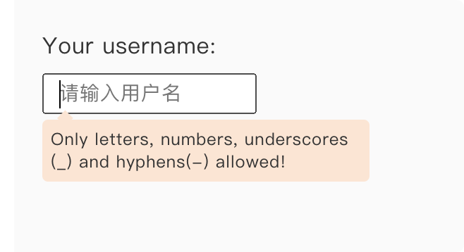
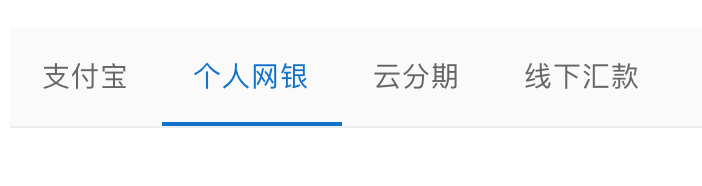
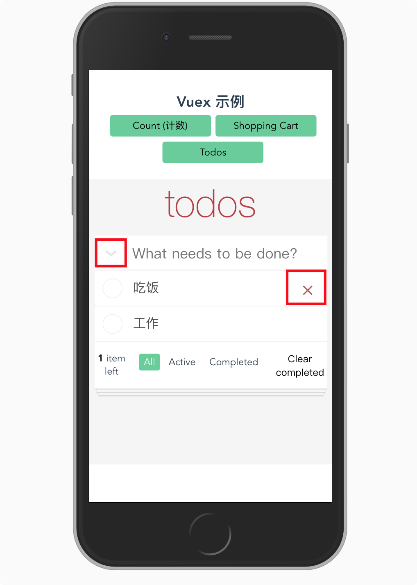

# CSS 伪元素

- 大部分笔记来自《CSS 设计指南 (第 3 版)》 的 `2.7 伪元素`


## Catalog


## New Words
- **pseudo ['sjuːdəʊ] --adj.假的, 冒充的.  --n.伪君子** 
    + pseudo class 伪类
    + Her care for the poor is completely pseudo. 她对穷人的关心完全是假的.


## Content
### 2.7 伪元素
- 顾名思义, 伪元素就是你的文档中若有实无的元素. 以下我们介绍几个最有用的伪元素, 
  其他伪元素请参考 http://www.stylinwithcss.com. 
- **Notice:** 一个冒号(`:`)表示伪类, 两个冒号(`::`)表示 CSS3 新增的伪元素.
  尽管浏览器目前都支持对 CSS 1 和 CSS 2 的伪元素使用一个冒号, 
  但希望你能习惯于用双冒号代替单冒号, 因为这些单冒号的伪元素最终可能都会被淘汰掉.
  更多相关信息, 可以参见这里:  http://www.w3.org/TR/2005/WD-css3-selectors-20051215/#pseudo-elements. 

#### 2.7.1. `::first-letter` 伪元素
- `e::first-letter`. 比如, 以下 CSS 规则:
  ```css
    p::first-letter {font-size:300%;}
  ```
  可以用来创建段落首字符放大的效果.

#### 2.7.2 `::first-line` 伪元素
- `e::first-line`: 可以选中文本段落(一般情况下是段落)的第一行. 例如:
  ```css
    p::first-line { font-variant: small-caps;}
  ```
  上面样式利用 `::first-line` 伪元素把第一行变成了小型大写字母.
  注意啊这个伪元素的长度会随浏览器窗口大小的变化而变化.

#### 2.7.3 `::before` 和 `::after` 伪元素效果
- (1) 以下 2 个伪元素 `e::before`, `e::after`
  可用于在特定元素前面或后面添加特殊内容.
  
  一下标记
  ```html
    <p class="age">30</p>
  ```
  和如下样式
  ```css
    p.age::before { content: "Age: "; }
    p.age::after { content: " years."; }
  ```
  能得到如下结果: Age: 30 years.

  **Notice:** 搜索引擎不会取得伪元素的信息(因为它在标记中并不存在). 因此,
  不要通过伪元素添加你想让搜索引擎索引的重要内容.

  这个例子展示了对 `::before` 和 `::after` 伪元素很基本又很实用的应用.
  后面我还会给大家展示这两个伪元素的其他用法,
  比如在应用它们的元素外面附着一个动态的新元素, 从而得到一种有趣的布局效果. 
- (2) 实际上, 上面 (1) 中的用法并不是 `::before` 和 `::after` 伪元素的常用用法,
  下面我们举几个示例, 说一下它们两个的常用用法.
    + 示例(1): 来自《CSS揭秘》
      
      我们先看效果图:
      
      

      上图中提示框的小箭头就是使用 `::before` 伪元素创建的, 代码如下:
      ```html
        <!DOCTYPE html>
        <html lang="en">
        <head>
            <meta charset="UTF-8">
            <meta name="viewport" content="width=device-width, initial-scale=1.0">
            <meta http-equiv="X-UA-Compatible" content="ie=edge">
            <title>CSS 伪类</title>
            <link rel="stylesheet" href="../../typo.css">
            <style>
                .input-wrapper {
                    width: 300px; min-height: 160px; 
                    background: #fafafa; 
                    margin: 20px; padding: 20px;
                    position: relative;
                    overflow: hidden;
                }
                p { margin-bottom: 5px; }

                .user-input { text-indent: 10px; font-size: 14px;}

                /* - 我们使用 CSS 的 `+`(紧邻同胞选择符), 可以实现当鼠标移动到 input
                 *   的父元素 span 时, 让 span 的下一个同级节点 div.callout-wall
                 *   显示, 这样就不用添加 js 来实现元素的显示和隐藏了.
                 */
                .user-input-parent:hover + .callout-wall { display: block; }

                .callout-wall { position: absolute; top: 85px; display: none; }
                .callout {
                    position: relative; font-size: 12px;
                    width: 220px; padding: 6px;
                    line-height: 16px; border-radius: 4px;
                    margin-top: 2px; background: #fbe5d3;
                }
                .callout::before {
                    content: ''; position: absolute;
                    top: -.4em; left: 1em; 
                    padding: .35em; background: inherit; 
                    border: inherit; border-right: 0; 
                    border-bottom: 0; transform: rotate(45deg);
                }
            </style>
        </head>
        <body>
            <div class="input-wrapper">
                <p>Your username: </p>
                <span class="user-input-parent">
                    <input type="text" class="user-input" placeholder="请输入用户名">
                </span>
                <div class="callout-wall">
                    <p class="callout">
                        Only letters, numbers, underscores (_) and hyphens(-) allowed!
                    </p>
                </div>
            </div>
        </body>
        </html>
      ```
    + 示例(2): 给元素的 class 添加 `::before` 伪元素实现线条展开动画效果:
      此示例来自: `../CSS-示例和集锦/线条从中间向两边展开.html`
      
      效果图如下:
      
       
      
       png 图片无法展示动画, 请直接 copy 代码在页面中查看.

      ```html
        <!DOCTYPE html>
        <html lang="en">
        <head>
            <meta charset="UTF-8">
            <meta name="viewport" content="width=device-width, initial-scale=1.0">
            <meta http-equiv="X-UA-Compatible" content="ie=edge">
            <title>线条从中间向两边展开</title>
            <link rel="stylesheet" href="../typo.css">
            <style>
                .container {
                    border-bottom: 1px solid #ebecec;
                    margin: 20px;
                }
                .tablist {
                    background-color: #fafafa; overflow: hidden;
                    display: flex; justify-content: flex-start;
                    align-items: center;
                }
                li {
                    /* - flex-grow(弹性增长), flex-shrink(弹性收缩),
                        flex-basis(弹性基础) */
                    flex: 0 1 auto; padding: 12px 16px; 
                    display: flex; margin: 0; 
                    color: #666; cursor: pointer;
                    /* - 定义 relative 给伪元素 ::before 使用 */
                    position: relative;
                }
                li.tab:hover { color: #333; }

                /* - 点击 li 线条展开的动画样式 */
                li.tab::before {
                    content: ''; position: absolute;
                    bottom: 0; 
                    /* left: 0; width: 100%; */
                    width: 0; left: 50%;
                    border-bottom: 2px solid #0070cc;
                }
                li.tab.active::before {
                    width: 100%; left: 0;
                    transition: all 0.4s;
                }

                /* - 点击 li 线条, 兄弟节点线条消失的动画 */
                li.disable::before {
                    content: ''; position: absolute;
                    bottom: 0; width: 100%; left: 0;
                    border-bottom: 2px solid #0070cc;
                }
                li.disable.inactive:before {
                    width: 0; left: 50%;
                    transition: all 0.2s;       
                }

                ul.tablist li  p { font-size: 14px; }
                li.tab.active >  p { color: #0070cc; }
            </style>
        </head>
        <body>
            <div class="container">
                <ul class="tablist">
                    <li class="tab"><p>支付宝</p></li>
                    <li class="tab"><p>个人网银</p></li>
                    <li class="tab"><p>云分期</p></li>
                    <li class="tab"><p>线下汇款</p></li>
                </ul>
            </div>

            <script>
                let tabs = document.querySelector('.tablist').querySelectorAll('li');
                const raf = window.requestAnimationFrame;

                tabs[1].classList.add('active');

                // - nums 用来保存我们点击过的 li 的 index. 目的是实现在点击当前的
                //   li 后, 给上次点击的 li 添加线条过渡(transition)消失的伪元素.
                let nums = [];

                Array.from(tabs).map(function(tab, index) {
                    // - 此处保存页面加载时, 默认就添加线条展开过渡效果 li 的 index
                    if(tab.classList.contains('active')) {
                        nums.push(index);
                    }

                    tab.addEventListener('click', function(event){
                        // - 我们会点击很多次 li, 但不能让 nums 数组内保存的 index
                        //   索引无限增长, 所以设置一个长度, 如果大于此长度,
                        //   我们就从前面弹出项, 我们设置只保留 2 项.
                        if (nums.length >= 3) {
                            for (let i = nums.length; i >= 2; i--) {
                                nums.shift();
                            }
                        }
                        nums.push(index);
                        // console.log('nums: ', nums);

                        // - 移除 li 上所有的元素样式
                        for(let i = 0, len = tabs.length; i < len; i++) {
                            let curClassList = tabs[i].classList;
                            if (curClassList.contains('tab')
                                || curClassList.contains('active')
                                || curClassList.contains('disable')
                                || curClassList.contains('inactive')
                            ) {
                                curClassList.remove('tab');
                                curClassList.remove('active');
                                curClassList.remove('disable');
                                curClassList.remove('inactive');
                            }
                        }

                        // - 给当前点击的 li 添加线条展开的过渡(transition)
                        tab.classList.add('tab');
                        raf(function() {
                            tab.classList.add('active');
                        })
                        
                        // - 给上次点击的 li 添加线条消失的过渡
                        if (nums.length > 1) {
                            tabs[nums[nums.length - 2]].classList.add('disable');
                            raf(function() {
                                tabs[nums[nums.length - 2]].classList.add('inactive');
                            })
                        }
                    }, false)
                })
            </script>
        </body>
        </html>
      ```
    + 示例(3): 此示例来自 Vuex 的官方 todos 示例,
      图中红框的部分皆是使用伪元素来实现的, 注意, 虽然 '示例(2)' 中给元素添加的是
      `::before` 伪元素, 而此例中使用的是 `::after`, 但是并没有实质的不同,
      因为不管是 `::before` 还是 `::after` 都要使用绝对定位,
      绝对定位可以相对当前元素, 也可以相对父元素, 看距离元素最近的
      `position:relative` 样式的设置.
      
      

      具体的代码实现见:
      `../../../Vue-learning/Vue-Examples/vuex-example/src/views/todos.vue`


