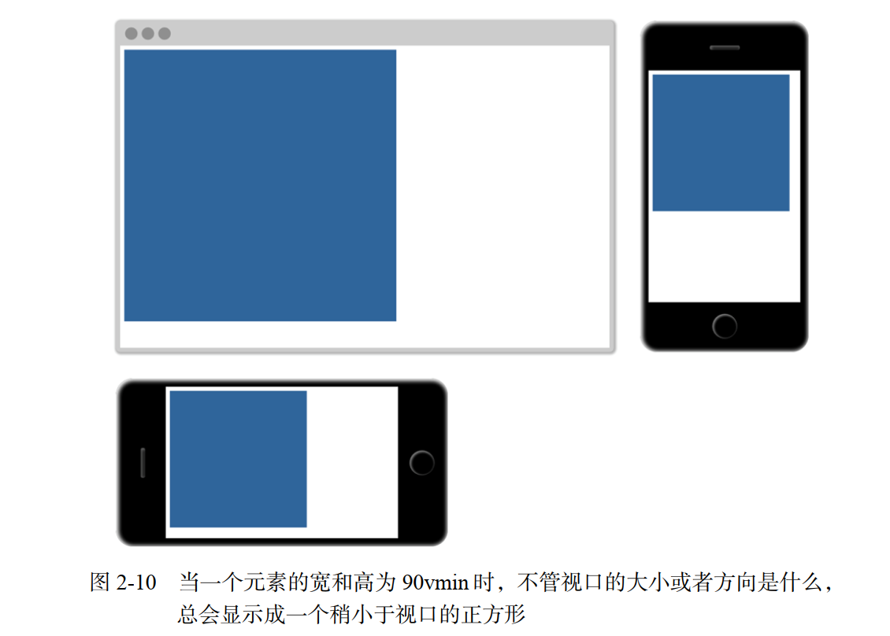
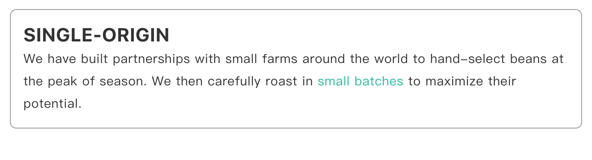

# CSS 相对单位


## Catalog
1. CSS `px` 像素概述
2. CSS 相对单位
    + 2.1 相对单位 `%`
    + 2.2 相对单位 `em`
    + 2.3 相对单位 `rem` 和使用
    + 2.4 视口相对单位 `vw`/`vh`/`vmin`/`vmax`
    + 2.5 相对单位的换算


## New Words
- **unit ['juːnɪt] --n.单元, 单位, 部, 机组, 部件**
    + A unit vector has a magnitude. 单位矢量的大小为1.
    + a unit of measurement.计量单位. 
- **author ['ɔːθə]/['ɔθɚ] --n.作家; 作者. --vt.编写; 创作**
    + CSS brings a late-binding of styles to the web page:
      The content and its styles aren't pulled together until after
      the authoring(vt-ing) of both is complete.
      CSS 为网页带来了样式的后期绑定(late-binding):
      直到内容(content)和样式(styles)两者的创作都完成之后, 它们才会融合在一起.
- **axis ['æksɪs] --n.轴; 坐标轴; 轴线; 中心线.**
    + The earth turns on its axis. 地球自转.


## Content
### 1. CSS `px` 像素概述
- `px` 像素见: `./CSS-像素px详解和布局基础.md`


### 2. CSS 相对单位
- **Notice**: 下面这些相对单位中, `%`/`em`/`rem` 几个都是根据 `px`
  像素而言的, 但 `px` 也不是绝对像素(absolute units),
  `px` 像素的详解请先看上面的: `### 1. CSS px 像素概述`.
  | 相对单位 | 解释 |
  | :---: | :--- |
  | `%` | 百分比|
  | `em` | 相对单位. 相对于父元素的 `font-size` 计算.<br>假如某个 p 元素为 `font-size:12px`,在它内部的 span 标签, 设置 `font-size: 2em`, 那么,  这时候的 span 字体大小为 12*2 = 24px. |
  | `rem` | 相对单位. 相对于根元素 `html` 的 `font-size` 计算.<br>例如 html 为 `font-size: 16px`, 那么其内的 div 设置为 `font-size: 1rem`, div 字体大小就为 16px. |
  | `rpx` | 微信小程序相对单位. 1rpx = 屏幕宽度/750px. 在 750px 的设计稿上, 1rpx = 1px |
  | `vh` | `vh`(viewport height) 视口高度的 1/100 |
  | `vw` | `vw`(viewport weight) 视口宽度的 1/100 |
  | `vmin` | 视口宽, 高中较小一方的 1/100 (IE9 中叫 `vm`, 而不是 `vim`)|
  | `vmax` | 视口宽, 高中较大一方的 1/100 () |

### 2.1 相对单位 `%`(百分比) 
- 除了用 `px` 结合媒体查询实现响应式布局外, 我们也可以通过百分比单位 `%`
  来实现响应式的效果.
  
  比如当浏览器的宽/高度发生变化时, 通过百分比可以使组件的宽/高随着浏览器的变化而变化,
  从而实现响应式的效果.

  为了了解百分比布局, 首先要了解的问题是:

  **CSS 中子元素中的百分比 `%` 到底是谁的百分比?**

  直观的理解, 我们可能会认为子元素的百分比完全相对于**直接父元素**,
  对于子元素的 `height` / `width` 来说, 这确实是正确的, 但是根据 CSS
  的盒模型, 除了这两个属性外, 还有 `padding` / `border` / `margin` 等等属性;
  那么这些属性设置成百分比, 是根据父元素的哪些属性呢? 此外还有 `border-radius` /
  `translate` 等属性中的百分比又相对于什么呢? 我们使用下面的表格来分类
  
  | 属性 | 百分比的相对参考对象 |
  | :------ | :------ |
  | `width`/`height`/ `line-height` 的百分比 | 相对于直接父元素的`width`/`height`|
  | 若子元素绝对定位(`position:absolute`), `top`/`bottom`/`left`/`right` 的百分比 | 相对于设置了 `position:relative` 的长辈元素 |
  |`margin`/`padding` 的百分比 | 无论是垂直方向还是水平方向, 都**相对于直接父元素的 `width`**, 与父元素的 `height` 无关 |
  |`border-radius`/`translate` 的百分比 | 相对于元素自身的宽度. |
  |`background-position` 的百分比 | 需要尺寸差计算. 更多讲解见鑫旭大神的这篇[文章](https://www.zhangxinxu.com/wordpress/2015/03/background-object-position-value-percent/) |

- 下面给出一个参考示例: (请自建文件在浏览器中查看.)
  ```html
    <!doctype html>
    <html lang="en">
    <head>
        <meta charset="UTF-8">
        <meta name="viewport"
            content="width=device-width, user-scalable=no,
                initial-scale=1.0, maximum-scale=1.0, minimum-scale=1.0">
        <meta http-equiv="X-UA-Compatible" content="ie=edge">
        <title>Document</title>
        <link rel="stylesheet" href="../typo.css">
        <style type="text/css">
            .box {
                margin: 6px 0 6px 12px;
                width: 360px;
                height: 320px;
                padding: 0 10px;
                float: left;
                background: lightsalmon;
                overflow: hidden;
            }
            .square {
                width: 50%;
                height: 50%;
                text-align: center;
                line-height: 10;
                border-radius:5%;
                margin-top: 10%;
                margin-left: 10%;
                overflow: hidden;
                float: left;
                background-color: #33cc99;
                border: 1px solid #cccc00;
            }
        </style>
    </head>
    <body>
        <div class="box">
            <p class="square">方块</p>
        </div>

        <script>
            const square = document.querySelector('.square');

            const getCss = function(el, attribute) {
                return window.getComputedStyle(el, false)[attribute];
            }

            console.log("width:", getCss(square, "width"));  // 180px
            console.log("height:", getCss(square, "height"));  // 160px

            console.log("border-radius:", getCss(square, "borderRadius"));  // 5%
            console.log("line-height:", getCss(square, "lineHeight"));  // 160px

            console.log("margin-top:", getCss(square, "marginTop"));  // 36px
            console.log("margin-left:", getCss(square, "marginLeft")); // 36px
        </script>
    </body>
    </html>
  ```
  **Additional Info**: 不知你有没有注意到, 上面 `border-radius` 的输出是
  `5%` 而不是 `px`, 实际上 `border-radius` 可能要比我们知道的复杂,
  我们都知道 `border-radius` 是下面 4 个属性的简写:  
  (tip: (左)上 --> 右(上) --> 下(右) --> (下)左 => `上/右/下/左`)
  ```css
    .box {
        border-top-left-radius: 水平半径 垂直半径;;
        border-top-right-radius: 水平半径 垂直半径;;
        border-bottom-right-radius: 水平半径 垂直半径;;
        border-bottom-left-radius: 水平半径 垂直半径;;
    }
  ```
  如你所见, 这 4 个属性的值却是由 2 个值组成的, 只是我们平时写的是复合值,
  例如: `border-top-left-radius:4px`.
  
  水平半径和垂直半径如下图:

  

  `border-radius` 更详细讲解请见鑫旭大神的这篇文章
  [CSS3 border-radius知多少？](https://www.zhangxinxu.com/wordpress/2015/11/css3-border-radius-tips/?shrink=1)

- 百分比(`%`)单位的缺点:
    + (1) 计算困难.
    + (2) 元素各个属性, 设置百分比的相对对象不确定, 比如 `width`/`height`
      相对于父元素的 `width`/`height`, 而 `margin`/`padding`
      不管垂直还是水平方向都相对父元素的 `width`, `border-radius`
      则是相对于元素自身等等, 造成使用百分比单位容易使布局问题变得复杂.


### 2.2 相对单位 `em`
#### 2.2.1 在网页中给字体设置 `em` 单位
- 一般情况下, 浏览器的默认字体大小是**16px**,
  所有未经调整的浏览器都符合 `1em = 16px`.
  目前网页中默认使用的字体有 14px 和 16px, 下面分别说一下, 网页中的设置:
    + (1) 设置默认字体为 `14px`:
      ```css
        html {
            /* - 默认 16px = 100%, 那么 1px = 6.25%; 10px = 62.5% */
            font-size: 62.5%;
        }
        body {
            /* - 一个字号当然不能等于自己的 1.4 倍, 所以, 这个 font-size
             *   是根据继承(父元素)的字号(font-size)来计算的. 
             *   因为父元素 html 的 font-size 换算为 px 单位后为 10px, 
             *   那么 1.4em = 1.4 x 10 = 14px.
             */
            font-size: 1.4em;
        }
      ```
    + (2) `16px` 为默认字体大小, 不用设置. 下面为一个参考设置(`typo.css`):
      ```css
        /* - 由于浏览器默认字体就是 16px, 所以此处直接写 1em = 16px 即可,
         *   1em = 16px       0.1em = 1.6px      0.25em = 4px
         *   1px = 0.0625em;  10px = 0.625em;    14px = 0.875em
         *   16px = 1em;      18px = 1.125em;    20px = 1.25em
         *   30px = 1.5em     40px = 2.5em       60px = 3.75em
         *   80px = 5em       100px = 6.25em     200px = 12.5em 
         */
        body {
            /* - 300 为 font-weight; 1.8 为 line-height */
            font: 300 1em/1.8 PingFang SC, Lantinghei SC, Microsoft Yahei,
            Hiragino Sans GB, Microsoft Sans Serif, WenQuanYi Micro Hei, sans-serif;
        }
      ```
#### 2.2.2 `em` 的使用
- `em` 是最常见的相对长度单位, 是基于特定的 `font-size`(字号) 进行排版. 在 CSS
  中, 1em 等于当前元素的 `font-size`(字号), 如果当前元素没有设置 `font-size`
  那么当前元素 1em 的大小会根据当前元素**继承**的字号来计算. (`em` 单位的使用,
  总体来说是比 `%`(百分号/比) 容易, 它没有 `%` 那么多相对参考对象.)

  下面举例说明:

  如果某个 p 元素设置 `font-size: 16px`, 它内部的子元素 span,
  会根据其自身有没有设置 `font-size` 属性, 对其使用 `em` 单位的样式产生不同的排版,
  下面分情况讨论:
    + (1) 如果子元素 span 没有设置 `font-size` 就会继承父元素的 `font-size` 值;
      ```css
        p.parent {
            font-size: 16px;
        }
        p span.son{
            padding: 1em;   {1}
        }
      ```
      **`行{1}`:** 这里设置内边距的值为 1em, 浏览器将其乘以字号, 最终渲染为 16px.
      这一点很重要: 浏览器会根据相对单位的值计算出绝对值,
      称作**`计算值(computed value)`**.

    + (2) 如果子元素设置字体了 `font-size`; 那么当前元素内使用了 `em`
      相对单位的其他属性值, 都会根据当前字号的值(转换为 `px` 后)来计算大小.
      例如:
      ```css
        p.parent {
            font-size: 16px;
        }
        p.parent span.son {
            /* - 0.875 x 16 = 14px; */
            font-size: 0.875em;

            /* --- --- --- --- --- --- */

            /* - 因为 0.875em = 14px, 所以 span 转换为 px 后的计算值为 14px. 
             * - 那么接下来的其他属性 (width/height/padding/margin/border...)
             *   都会根据计算值(14px) 来换算对应的 em 大小.
             */
            /* - 1em = 1 x 14px = 14px; */
            padding: 1em;
            width: 10em;
            /* - 2em = 2 x 14px = 28px; */
            line-height: 2em;

        }
      ```
      **Added:** 如果知道字号的像素值, 但是想用 `em` 声明,
      可以用一个简单的公式换算: 用想要的像素大小除以父级(继承)的像素字号. 比如,
      想要一个 10px 的字体, 元素继承的字体是 12px, 则计算结果是 10/12 =
      0.8333em. 如果想要一个 16px 的字体, 父级字号为 12px, 则计算结果是
      16/12 = 1.3333em.

      再给一个《CSS揭秘》第一章的示例: 
      ```vue
        <template>
            <div id="example-121" class="default-div">
                <h2>1.2.1 尽量减少代码重复</h2>
                <button class="bad-example-btn">Yes!</button>
                <button class="good-example-btn">Yes!</button>
            </div>
        </template>
        <style scoped>
            button { margin: 10px; }
            .bad-example-btn {
                padding: 6px 16px;
                border: 1px solid #446d88;
                background: #58a linear-gradient(#77a0bb, #58a);
                border-radius: 4px;  color: white;
                box-shadow: 0 1px 5px gray;
                text-shadow: 0 -1px 1px #335166;
                font-size: 20px; line-height: 30px;
            }
            .good-example-btn {
               /* - 假设父级元素的字体大小是 16px
                * - 125% ==> 16 x 1.25 = 20px;
                */
                font-size: 125%;

                /* - 此处为了查看效果, 更改了样式. */
                /* - 1.5 x 20px = 30px */
                line-height: 1.5;    
                width: 4em;           /* 80px */
                height: 2em;          /* 40px */
                padding: .3em .8em;
                border-radius: .2em; /* 4px */
                border: 1px solid #446d88;
                background: #58a linear-gradient(#77a0bb, #58a);
            }
        </style>
      ```
#### 2.2.3 使用 `em` 的一个问题: 字号收缩问题.
- 当我们在多层嵌套的元素内设置 `em` 单位的字号时, 会产生意想不到的效果.
  要弄清楚每个元素的实际值, 需要查看元素一层一层往上查看级元素的 `font-size` 值.
  当我们在多个 DOM 层级间设置了多个 `em` 单位的 `font-size`, 那计算起来真是灾难.
  
  下面是一个在第一个 ul 上设置了 0.8em 字号的嵌套 ul 列表, 然而内部嵌套的 ul
  文字在逐步缩小! 正是因为 `em` 带来的这一类烦人的问题, 开发者才对 `em` 避而远之.

  示例效果图:
  
  

  代码如下:
  ```css
    .wrapper {
        font-size: 42px; min-width: 320px; min-height: 260px;
        background: #d49499; border-radius: 4px; padding: 20px;
        margin: 20px; float: left; line-height: 100%;
    }
    .wrapper ul {
        margin-left: 30px; font-size: 0.8em; list-style:disc;
    }
  ```
  ```html
    <div class="wrapper">
        <ul class="first-ul">
            <li class="item1">li item:1
                <ul>
                    <li>sub li num:1</li>
                    <ul>
                        <li>sub sub li num:1
                            <ul>
                                <li>sub sub sub li num:1</li>
                                <ul>
                                    <li>sub sub sub sub li num:1</li>
                                </ul>
                            </ul>
                        </li>
                    </ul>
                </ul>
            </li>
        </ul>
    </div>
  ```
  那么如何解决嵌套 ul 字体在逐层缩小的问题提, 只需要在嵌套列表的第二个 ul 里设置
  `font-size: 1em` 即可:
  
  ```css
    .wrapper ul ul {
        font-size: 1em;
    }
  ```
#### 2.2.4 应该在什么情况下使用 `em` 单位?
- 见下面的 `#### 2.3.1 使用 rem 设置字号` 中的内容解答.


### 2.3 相对单位 `rem`
#### 2.3.1 使用 rem 设置字号
- 当浏览器解析 HTML 文档时, 会在内存里将页面的所有元素表示为 DOM(文档对象模型).
  它是一个树结构, 其中每个元素都由一个节点表示. `<html>` 元素是顶级(根)节点.
  它下面是子节点 `<head>` 和 `<body>`. 再下面是逐级嵌套的后代节点. 
  
  在文档中, 根节点是所有其他元素的祖先节点. 根节点有一个伪类选择器(`:root`),
  可以用来选中它自己. 这等价于类型选择器 `html`, 但是 `html`
  的优先级相当于一个类名, 而不是一个标签. 
  
  `rem` 是 **root em** 的缩写. `rem` 是**相对于根元素的单位**.
  不管在文档的什么位置使用 `rem`, 1.2rem 都会有相同的计算值:
  1.2 乘以根元素的字号. 下面 `2-10` 代码, 先指定了根元素的字号, 然后用 `rem`
  定义了无序列表的相对字号. 
  ```css
    /* - :root 伪类等价于类型选择器 html */
    :root {
        /* - 使用浏览器的默认字体 16px */
        font-size: 1em;
    }
    ul {
        font-size: .8rem;
    }
  ```
  在这个例子里, 根元素的字号为浏览器默认的字号 16px. 无序列表的字号设置为 0.8rem,
  计算值为 12.8px. 因为相对根元素, 所以所有字号始终一致, 就算是嵌套列表也一样. 
  
  与 `em` 相比, `rem` 降低了复杂性. 实际上, rem 结合了 px 和 em 的优点,
  既保留了相对单位的优势, 又简单易用. 那是不是应该全用 `rem`, 抛弃其他选择呢?
  答案是否定的. 在 CSS 里, 答案通常是 "看情况". `rem` 只是你工具包中的一种工具.
  掌握 CSS 很重要的一点是学会在适当的场景使用适当的工具. 我一般会用
  **`rem` 设置字号, 用 `px` 设置边框, 用 `em` 设置其他大部分属性, 尤其是内边距,
  外边距和圆角(不过我有时用百分比设置容器宽度)**. 
  
  这样字号是可预测的, 同时还能在其他因素改变元素字号时, 借助 `em` 缩放内外边距.
  用 `px` 定义边框也很好用, 尤其是想要一个好看又精致的线时.
  这些是我在设置各种属性时常用的单位, 但它们仅仅是工具, 在某些情况下, 用其他工具会更好. 

  **提示**: **用 `rem` 设置字号, 用 `px` 设置边框, 用 `em` 设置其他大部分属性.** 

### 2.4 视口相对单位 `vw`/`vh`/`vmin`/`vmax`
- 视口的相对单位是相对于浏览器的视口定义长度的.
    + **Hint**: 视口 -- 浏览器窗口中当前网页的可见区域(不包含滚动条的部分).
      它不包括浏览器的地址栏, 工具栏, 状态栏. 
- |  单位  |  意义  |
  |  :--  |  :---  |
  | `vh`(viewport height) | 视口高度的 1/100 |
  | `vw`(viewport weight) | 视口宽度的 1/100 |
  | `vmin` | 视口宽, 高中较小一方的 1/100 (IE9 中叫 `vm`, 而不是 `vim`)|
  | `vmax` | 视口宽, 高中较大一方的 1/100 () |
    + `1vw` = `window.innerWidth(浏览器可视窗口大小)`数值的 1%.
    +  `1vh` = `window.innerHeight` 值的 1%.
- 比如, 50vw 等于视口宽度的一半,  25vh 等于视口高度的 25%. `vmin`
  取决于视口的宽和高中较小的一方, 这可以保证元素在屏幕方向变化时适应屏幕.
  
  在横屏时: `vmin` 取决于高度; 在竖屏时: `vmin` 则取决于宽度.

  图 2-10 展示了一个正方形元素在不同屏幕尺寸的视口中的样子. 它的宽度和高度都是 90vmin,
  等于宽高的较小边的 90%, 即横屏高度的 90%, 或者竖屏宽度的 90%.

   

  代码清单 2-18 是该元素的 CSS 样式. 它生成了一个大正方形, 不管如何缩放浏览器,
  它都能在视口中显示. 可以在网页里加上 `<div class="square">` 来看效果. 
  代码清单 2-18 用 vmin 定义正方形元素的大小:
  ```css
    .square {
        /* - 因为不管 width 还是 height 都等于最小视图窗口的 90% 所以是正方形*/
        width: 90vmin;
        height: 90vmin;
        background-color: #369;
    }
  ```
#### 2.4.1 使用 `calc()` 和 `vw` 定义字号
- `calc()` 函数可以对两个及其以上的值进行基本运算. 当要结合不同单位的值时, `calc()`
  特别使用. 它支持的运算包括: 加(`+`), 减(`−`), 乘(`×`), 除(`÷`),
  加号和减号两边必须有空白, 因此我建议大家养成在每个操作符前后都加上一个空格的习惯,
  比如 `calc(1em + 10px)`.

  我们来看下面这个使用 `calc()` 动态定义默认字体(html)的示例:
  ```html
    <!doctype html>
    <html lang="en">
        <head>
            <meta charset="UTF-8">
            <meta name="viewport"
                content="width=device-width, user-scalable=no,
                    initial-scale=1.0, maximum-scale=1.0, minimum-scale=1.0">
            <meta http-equiv="X-UA-Compatible" content="ie=edge">
            <title>Document</title>
            <link rel="stylesheet" href="../../../typo.css">
            <style type="text/css">
                :root {
                    /* - 使用 calc() 定义字号: 
                    *     + 0.5em = 0.5 * 16 = 8px, 保证了最小字号;
                    *     + 1vw = 当前视图宽度的 1/100.
                    */
                    font-size: calc(0.5em + 1vw);
                }
                .panel {
                    /* - 注意: 此处的 font 字体单位为 rem */
                    font-size: 1rem;
                    padding: 1em; margin: 1em;
                    border-radius: 0.5em;
                    border: 1px solid #999;
                }
                .panel > h2 {
                    margin-top: 0; font-weight: bold;
                    text-transform: uppercase;
                }
            </style>
        </head>
        <body>
            <div class="panel">
                <h2>Single-origin</h2>
                <div class="panel-body">
                    We have built partnerships with small farms around the
                    world to hand-select beans at the peak of season.
                    We then carefully roast in
                    <a href="/batch-size">small batches</a> to maximize
                    their potential.
                </div>
            </div>
        </body>
    </html>
  ```
  展示效果如下:

   
  
  现在打开网页, 慢慢缩放浏览器, 字体会平滑地缩放. 0.5em 保证了最小字号,
  1vw 则确保了字体会随着视口缩放. 这段代码保证基础字号从 iPhone 6 里的
  11.75px 一直过渡到 1200px 的浏览器窗口里的 20px. 可以按照自己的喜好调整这个值.

### 2.5 相对单位的换算
- 像素(`px`), 厘米(`cm` centimeter), 毫米(`mm` millimeter),
  英寸(`in`, inch), 点(`pt`, point, 印刷术语, 长度为 1/72 inch),
  以及 `pc`(pica, 印刷术语, 长度为 12points). 之间的换算关系.
  
  **1inch = 25.4mm = 2.54cm = 6pc = 72pt = 96px.**
  
  因此 16px = 12pt (16 / 96 * 72). 设计师通常更熟悉点(point)的使用,
  而开发人员更习惯像素.