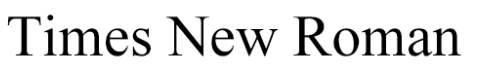
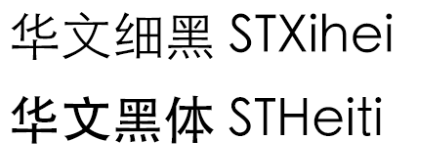
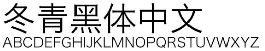
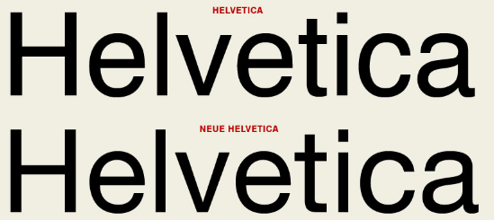
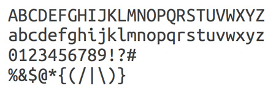
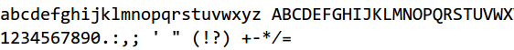
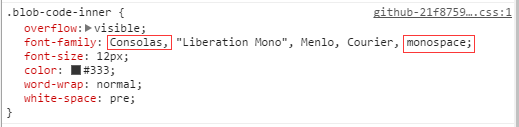

# 排版


## New Words
typography `/taɪ'pɑgrəfi/` -n.排版。

serif `/'sɛrɪf/` -n.衬线字体
- Sans-serif fonts have generally been considered easier to read on the screen. 无衬线字体, 一般认为它更容易在屏幕上阅读.


> 下面的笔记来源：https://github.com/chokcoco/iCSS/issues/6


## ▲ 字体的分类

就 Web 常用的一些字体而言，经常听说的字体类型，大致可以分为这几种：

**(1) `serif`(衬线类)**

**(2) `sans-serif` (无衬线类)**

**(3) `monospace` (等宽体)**

**(4) `cursive` (草书体)**

**(5) `fantasy` (幻想体)**

其实大体上分为**衬线字体**和**无衬线字体**，等宽字体中也有衬线等宽和无衬线等宽字体，这 5 个分类是 `font-family` 的 5 个可用字体系列取值。

也就是说，上述 5 个名字，代表的并非某个特定字体，而是一系列字体，这些通用的名称允许用户代理（通常就是浏览器）从相应集合中选择一款字体。

这也很好解释了，`font-family` 中的 family ，家庭的意思，也就是不单单指一个，而是可以指定多个，上述 5 个英文单词都是 `font-family` 的可用取值，下文还会详细讲到。

下面详细了解一下每类字体。

### (1) serif -- 衬线字体

serif，意为有衬线的字体，衬线的意思是在字符笔画末端有叫做衬线的小细节的额外装饰，而且笔画的粗细会有所不同，这些细节在大写字母中特别明显。

OK，那么有哪些常用字体属于衬线字体呢？

#### 宋体（SimSun）

Windows 下大部分浏览器的默认中文字体，是为适应印刷术而出现的一种汉字字体。笔画有粗细变化，是一种衬线字体，宋体在小字号下的显示效果还可以接受，但是字号一大体验就很差了，所以使用的时候要注意，不建议做标题字体使用。


#### Times New Roman

Mac 平台 Safari 下默认的英文字体，是最常见且广为人知的西文衬线字体之一，众多网页浏览器和文字处理软件都是用它作为默认字体。



### (2) sans-serif -- 无衬线字体

sans 的意思是无，sans-serif 也就是无衬线的意思。专指西文中没有衬线的字体，与汉字字体中的黑体相对应。与衬线字体相反，该类字体通常是机械的和统一线条的，它们往往拥有相同的曲率，笔直的线条，锐利的转角。

中文下，无衬线字体就是黑体，黑体字也就是又称方体或等线体，没有衬线装饰，字形端庄，笔画横平竖直，笔迹全部一样粗细。

看看又有哪些常见的无衬线字体。

#### 微软雅黑（Microsoft Yahei）

大名鼎鼎的微软雅黑相信都不陌生，从 windows Vista 开始，微软提供了这款新的字体，一款无衬线的黑体类字体，显著提高了字体的显示效果。现在这款字体已经成为 windows 浏览器最值得使用的中文字体。


#### 华文黑体（STHeiti）、华文细黑（STXihei）

属于同一字体家族系列，MAC OS X 10.6 之前的简体中文系统界面的默认中文字体，正常粗细就是华文细黑，粗体下则是华文黑体。



#### 黑体-简（Heiti SC）

从 MAC OS X 10.6 开始，黑体-简代替华文黑体用作简体中文系统界面默认字体，苹果生态最常用的字体之一，包括 iPhone、iPad 等设备用的也是这款字体。


#### 冬青黑体（Hiragino Sans GB）

又叫苹果丽黑，Hiragino 是字游工房设计的系列字体名称。是一款清新的专业印刷字体，小字号时足够清晰，Mac OS X 10.6 开始自带有 W3 和 W6 。



#### Helvetica、Helvetica Neue

被广泛用于全世界使用拉丁字母和西里尔字母的国家。Helvetica 是苹果电脑的默认字体，微软常用的Arial 字体也来自于它。



#### Arial

Windows 平台上默认的无衬线西文字体，有多种变体，比例及字重（weight）和 Helvetica 极为相近。


#### Verdana

无衬线字体，优点在于它在小字上仍结构清晰端整、阅读辨识容易。


#### Tahoma

十分常见的无衬线字体，字体结构和 Verdana 很相似，其字元间距较小，而且对 Unicode 字集的支持范围较大。许多不喜欢 Arial 字体的人常常会改用 Tahoma 来代替，除了是因为 Tahoma 很容易取得之外，也是因为 Tahoma 没有一些 Arial 为人诟病的缺点，例如大写“i”与小写“L”难以分辨等。（这里故意反过来写）。


### (3) monospace -- 等宽字体

这系列字体程序员们其实都不陌生。我们用来敲代码的编辑器，字体的选择经常就是一类等宽字体。

等宽字体是指字符宽度相同的电脑字体，常见于 IDE 或者编辑器中，每个字母的宽度相等，通常用于计算机相关书籍中排版代码块。



除了 IDE ，我们看到的技术文章中的代码块中，经常也是使用等宽字体进行排版。

#### Consolas

这是一套等宽的字体，属无衬线字体。这个字体使用了微软的 ClearType 字型平滑技术，主要是设计做为代码的显示字型之用，特别之处是它的“0”字加入了一斜撇，以方便与字母“O”分辨。



> ClearType：由微软在其操作系统中提供的屏幕亚像素微调字体平滑工具，让 Windows 字体更加漂亮。在 Windows XP 平台上，这项技术默认是关闭，到了Windows Vista 才默认为开启。



上图是 Github 代码区块的字体设置，可以看到，默认字体就是 `Consolas` ，紧接着的几个都是其它等宽字体，如果用户的系统中都没有预装这些字体，则会匹配最后一个 `monospace` ，它表示等宽字体系列，会从用户系统中的等宽字体中选取一个展示。

### (4)+(5) fantasy -- 梦幻 和 cuisive -- 草体

fantasy和 cuisive 字体在浏览器中不常用，在各个浏览器中有明显的差异。


## ▲ 中文字体的兼容写法

一些中文字体，例如`font-family: '宋体'`，由于字符编码的问题，少部分浏览器解释这个代码的时候，中文出现乱码，这个时候设定的字体无法正常显示。

所以通常会转化成对应的英文写法或者是对应的 unicode 编码，`font-family:'宋体'` -> `font-family: '\5b8b\4f53'`。

`\5b8b\4f53` 是宋体两个中文字的 unicode 编码表示。类似的写法还有：

- 黑体：` \9ED1\4F53`
- 微软雅黑：`\5FAE\8F6F\96C5\9ED1`
- 华文细黑：`\534E\6587\7EC6\9ED1`
- 华文黑体：`\534E\6587\9ED1\4F53`

> [Unicode编码](https://zh.wikipedia.org/wiki/Unicode)： 人们希望在一套系统里面能够容纳所有字符，Unicode 编码解决传统的字符编码方案的局限性，每个字符占用 2 字节。这样理论上一共最多可以表示2^16（即65536）个字符。基本满足各种语言的使用。


## ▲ 字体定义的细节

其他一些小细节也很重要，譬如定义字体的时候，何时需要在字体两端添加引号？像这样：

```css
p{
    font-family: 'Microsoft YaHei', '黑体-简', '\5b8b\4f53';
}
```

当字体名字中间有空格，中文名字体及 Unicode 字符编码表示的中文字体，为了保证兼容性，都建议在字体两端添加单引号或者双引号。


## ▲ 字体定义顺序

字体定义顺序是一门学问，通常而言，我们定义字体的时候，会定义多个字体或字体系列。举个栗子：

```css
body {
    font-family: tahoma, arial, 'Hiragino Sans GB', '\5b8b\4f53', sans-serif;
}
```

别看短短 5 个字体名，其实其中门道很深。解释一下：

1. 使用 `tahoma` 作为首选的西文字体，小字号下结构清晰端整、阅读辨识容易；
2. 用户电脑未预装 `tohoma`，则选择 `arial` 作为替代的西文字体，覆盖 windows 和 MAC OS；
3. `Hiragino Sans GB` 为冬青黑体，首选的中文字体，保证了 MAC 用户的观看体验；
4. Windows 下没有预装冬青黑体，则使用 `\5b8b\4f53` 宋体为替代的中文字体方案，小字号下有着不错的效果；
5. 最后使用无衬线系列字体 `sans-serif` 结尾，保证旧版本操作系统用户能选中一款电脑预装的无衬线字体，向下兼容。

嗯，其实上面的 `font-family` 就是淘宝首页 `body` 的字体定义，非常的规范，每一个字体的定义都有它的意义。

 

## ▲ 字体书写规则

综上，总结一下，我觉得字体 `font-family` 定义的原则大概遵循：

#### (1) 兼顾中西

中文或者西文（英文）都要考虑到。

#### (2) 西文在前，中文在后

由于大部分中文字体也是带有英文部分的，但是英文部分又不怎么好看，同理英文字体中大多不包含中文。

所以通常会先进行英文字体的声明，选择最优的英文字体，这样不会影响到中文字体的选择，中文字体声明则紧随其次。

#### (3) 兼顾多操作系统

选择字体的时候要考虑多操作系统。例如 MAC OS 下的很多中文字体在 Windows 都没有预装，为了保证 MAC 用户的体验，在定义中文字体的时候，先定义 MAC 用户的中文字体，再定义 Windows 用户的中文字体；

#### (4) 兼顾旧操作系统，以字体族系列 `serif` 和 `sans-serif` 结尾

当使用一些非常新的字体时，要考虑向下兼容，兼顾到一些极旧的操作系统，使用字体族系列 `serif` 和 `sans-serif` 结尾总归是不错的选择。
