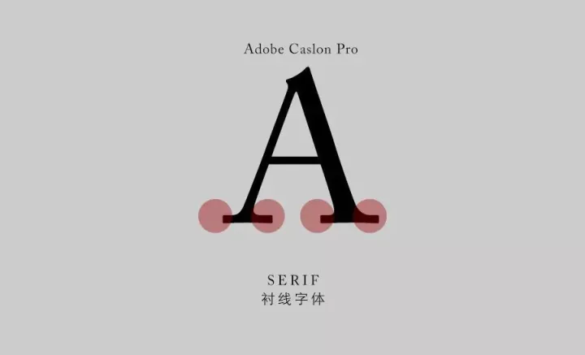
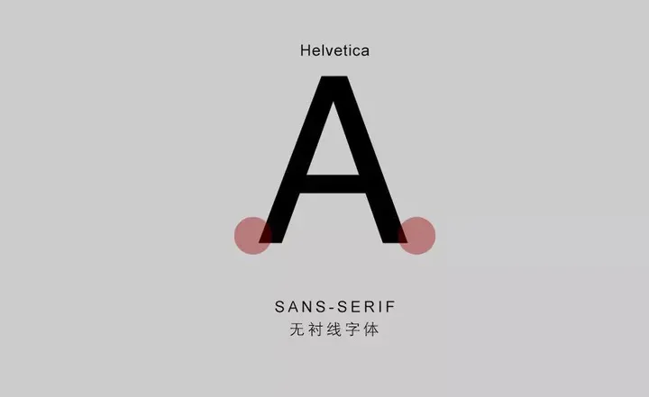
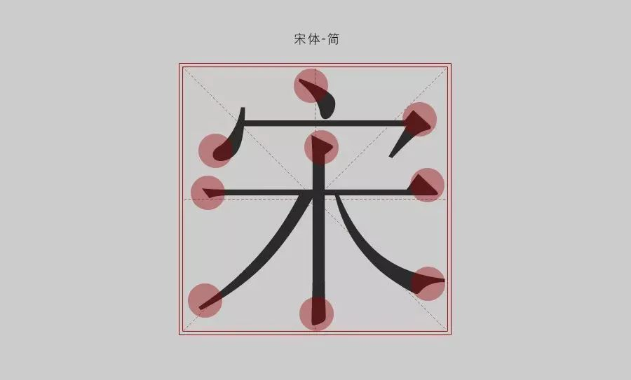
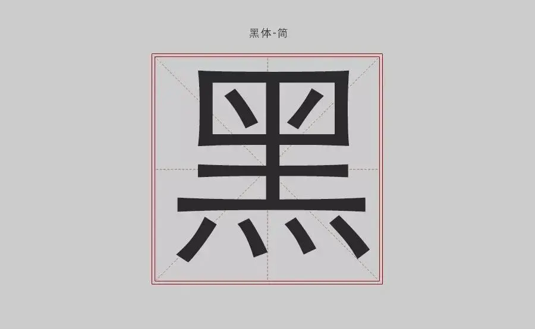
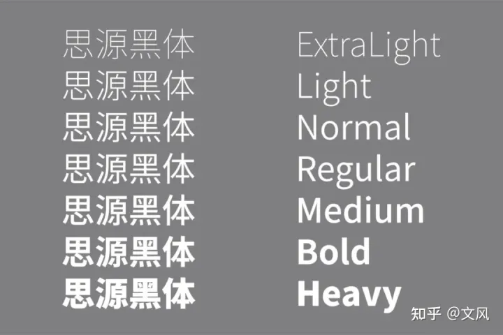
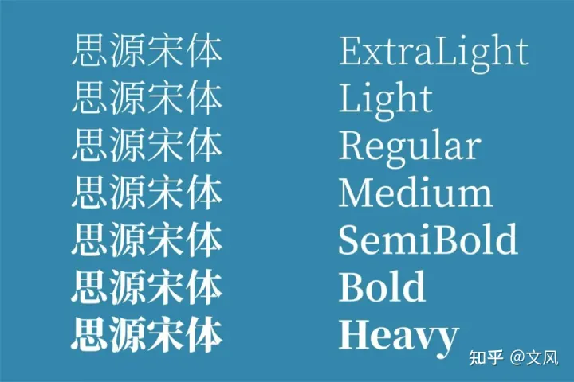

# 字体

*Created: 2023.07.27*

## ▲ 衬线字体 (serif) 和 无衬线字体 (sans serif)

我们平时常见的字体主要分为：衬线字体 (serif) 和 无衬线字体 (sans serif)

- serif `/'sɛrɪf/`  -n. 衬线字体
- sans `/sænz/`  -prep. 无，没有

|           |                       衬线字体 (serif)                       |                    无衬线字体 (san-serif)                    |
| --------- | :----------------------------------------------------------: | :----------------------------------------------------------: |
| 解释      | 衬线又被称为 “字脚”，衬线体（Serif）就是指有边角装饰的字体。  | 无衬线体（Sans-serif）则与衬线体相反，通常是机械和统一粗细的线条，  没有边角的装饰。 |
| 图示 - 英文 |  |  |
| 图示 - 中文 |  |  |
| 区别      |      标题或者小篇幅文本，更偏爱衬线字体来提升短句美感。      | 同等字号下，棱角分明的无衬线体看上去比衬线体更大、结构更清晰，  长文阅读或小屏幕更偏好使用无衬线字体。 |

> 表格笔记来源：https://zhuanlan.zhihu.com/p/201056476

## ▲ 免费且可商用的字体

Tip: 建议优先选择 **思源黑体** 和 **思源宋体**

|             字体              |       中文名        | 下载链接                                                     |                             介绍                             |                           字体效果                           | 备注                                                         |
| :---------------------------: | :-----------------: | ------------------------------------------------------------ | :----------------------------------------------------------: | :----------------------------------------------------------: | ------------------------------------------------------------ |
|        Source han sans        |      思源黑体       | https://github.com/adobe-fonts/source-han-sans/releases/tag/2.004R | 思源字体是由 Adobe 与 Google 共同推出的一款开源字体，  主要有 “思源黑体” 和 “思源宋体”，各 7 种字体粗细，完全支持中文简繁、日韩文（思源黑体 2021 年更新了无限档。下文字体多种字体粗细不再阐述） |  | 字体版本下载说明：https://github.com/adobe-fonts/source-han-sans/blob/master/readme-CN.md |
|       Source han serif        |      思源宋体       | https://github.com/adobe-fonts/source-han-serif/releases/tag/2.001R |                                                              |  |                                                              |
|          source-sans          |                     | https://github.com/adobe-fonts/source-sans/releases/tag/3.052R |                                                              |                                                              |                                                              |
| Noto Sans Simplified Chinese  | Noto 无衬线简体中文 | https://fonts.google.com/noto/specimen/Noto+Sans+SC?subset=chinese-simplified&noto.region=CN&noto.lang=cjy_Hans 点击页面右上角的 "Download Family" 下载即可 | Google Noto`/ˈnoʊtoʊ/` 字体家族中的大部分字体都是免费商用的。Noto 字体家族是由 Google 与 Monotype`/'mɑnə'taɪp/` 共同开发的一套跨平台、跨语言的开源字体，旨在支持全球范围内的各种语言字符集。  以下是几款可以免费商用的 Google Noto 字体：  1. Noto Sans（中文名称：思源黑体）：非常全面的无衬线字体，支持众多语言。  2. Noto Serif（中文名称：思源宋体）：全面的衬线字体，涵盖多种字符集。   3. Noto Sans CJK（中文名称：思源宋体和思源黑体）：针对中日韩三国文字（CJK）的全面字体，包括汉字、日文假名和韩文。   4. Noto Color Emoji：支持彩色表情符号（Emoji）的字体，涵盖了大量的表情符号和图形。 |                                                              |                                                              |
| Noto Serif Simplified Chinese |  Noto 衬线简体中文  | https://fonts.google.com/noto/specimen/Noto+Serif+SC?subset=chinese-simplified&noto.region=CN&noto.lang=cjy_Hans 下载步骤同上 |                                                              |                                                              |                                                              |
|      Noto Sans Hong Kong      |   Noto 无衬线香港   |                                                              |                                                              |                                                              |                                                              |
|     Noto Serif Hong Kong      |    Noto 衬线香港    |                                                              |                                                              |                                                              |                                                              |

### Noto Sans 和 Adobe 在 github 开源的 Source Han Sans 是同一个字体吗？

>  ChatGPT:
>
>  不完全正确。Noto Sans 和 Adobe 在 GitHub 上开源的 Source Han Sans 虽然都是针对中日韩三国文字（CJK）的字体，但它们并不是同一个字体，而是由不同的组织开发和维护的两套不同的 CJK 字体。
>
>  Noto Sans 是由 Google 与 Monotype 合作开发的开源字体家族，旨在支持全球范围内的多种语言字符集。Noto Sans 包含了思源黑体（Noto Sans CJK）等变体，但其本身是一款支持众多语言的全面无衬线字体。
>
>  而 Source Han Sans 是由 Adobe 在 GitHub 上开源的 CJK 字体，又称思源黑体（Source Han Sans）。它是由 Adobe 与 Google、长期以来的 Adobe 合作伙伴以及东亚的专业字体设计师共同开发的。这款字体也旨在提供广泛的 CJK 字符支持，包括中文、日文和韩文。
>
>  尽管两者都支持 CJK 字符，但它们是由不同的组织开发的，采用不同的开源许可证，并可能有不同的设计风格和特点。所以，虽然它们有共同的目标，但 Noto Sans 和 Source Han Sans 是两个不同的 CJK 字体家族。

### 这两个字体 "采用不同的开源许可证"，你能告诉我他们的开源许可证有什么区别吗？

>  ChatGPT: 对的，这两个字体家族使用了不同的开源许可证。以下是它们的许可证区别：
>
> 1. Noto Sans（思源黑体）的开源许可证： Noto Sans 是由 Google 与 Monotype 合作开发的字体，其开源许可证是 Apache License 2.0。Apache License 2.0 是一种宽松的开源许可证，允许用户在遵守一些基本条款的前提下自由地使用、修改和分发这款字体。使用 Noto Sans 的用户通常需要包含原始的许可证和版权声明。
>
> 2. Source Han Sans（思源黑体）的开源许可证： Source Han Sans 是由 Adobe 在 GitHub 上开源的 CJK 字体，其开源许可证是 SIL Open Font License (OFL) 1.1。SIL OFL 是一种专门用于字体的开源许可证，允许用户在自由和开放的条件下使用、修改、分发和重新打包这款字体。同样，使用 Source Han Sans 的用户通常需要包含原始的许可证和版权声明。
>
> 虽然这两种许可证都是开源许可证，但它们在细节和使用条件上有一些不同。因此，在使用这些字体时，务必仔细阅读许可证的内容，确保您满足其规定的条件。如果您有特定的使用场景或需求，最好直接查阅字体的官方网站或许可证文件，以获取确切的许可信息。
> 
>  > 官网授权说明链接：
>  > https://blog.typekit.com/2014/07/15/introducing-source-han-sans/https://github.com/adobe-fonts/source-han-serif/blob/master/LICENSE.txthttps://source.typekit.com/source-han-serifhttp://jikasei.me 其他没详细备注的，也是依据 SIL Open Font License 1.1 授权协议，可以用于任何用途，包括免费商用，可点击链接查询。
>  >
>  > *此段笔记来源：https://zhuanlan.zhihu.com/p/389670173*

> 更多免费商用字体见此文：https://zhuanlan.zhihu.com/p/389670173
