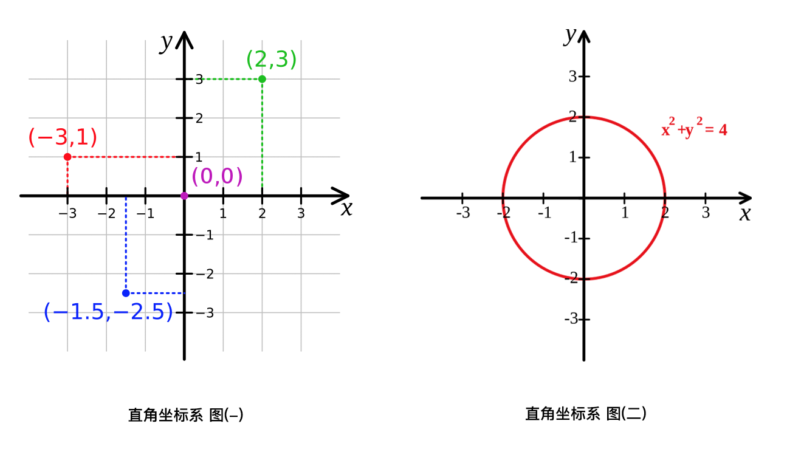
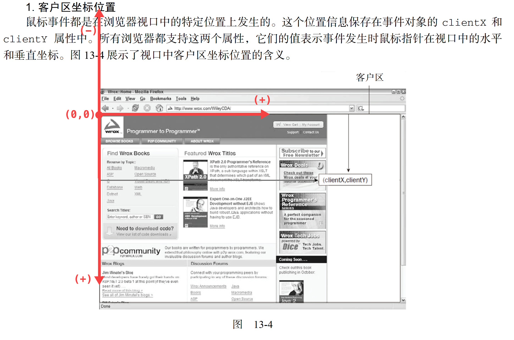
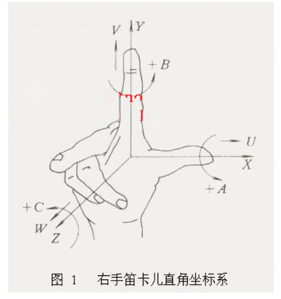
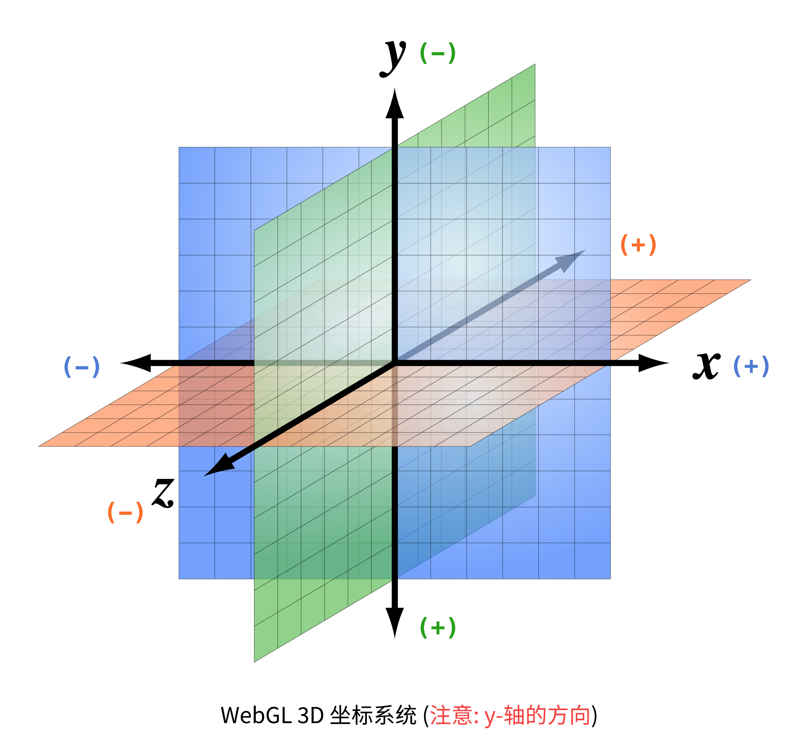

# CSS3 过渡(transiton), 转换(transform)和动画(animation)


## 目录(Table Of Contents)
1. CSS3 transition(过渡)
    + 1.1 transitioin(过渡)介绍
    + 1.2 transition 的 4 个属性值
    + 1.3 transition 使用基本示例
    + 1.4 贝塞尔曲线讲解
        - 1.4.1 贝塞尔曲线简介
        - 1.4.2 使用示例
2. CSS3 transform(转换)
    + 2.1 transform 是什么?
    + 2.2 transform 转变(/变形)的前置知识
        - 2.2.1 直角坐标系(2D/二维坐标系)和三维坐标系(3D)
    + 2.3 通过 transform 来实现 2D 转换
    + 2.4 通过 transform 来实现 3D 转换
3. CSS3 animation(动画)


## 生词(New Words)
- **transition [træn'zɪʃən] --n.过渡; 转换; 变迁**
    + transition animation. 过渡动画
    + a period of transition. 过渡时期
- **duration [djʊ'reɪʃ(ə)n]/[du'reʃən] --n.持续时间; 时长; 期间.**
    + a long[short] duration. 长期[短期]的
    + for the duration of. ...(在)...的期间
    + for a duration of ten minutes. 十分钟的时间
- **cubic ['kjuːbɪk] --adj.立方体的, 立方的**
    + cubic content. 容积; 体积.
    + a cubic equation. 三次方程
    + The volume of this container is 1000 cubic metres.
      这个集装箱的容量是 1000 立方米.
- **volume ['vɒljuːm] --n.体积; 卷; 音量.**
    + the volume of water in a lake. 湖内水的容积.
    + He truned up[down] the volume on the television. 
      他把电视机的音量调大[小]了.
    + Our school has a library of 100,000 volumes.
      我们学校有一所藏书十万册的图书馆
- **bezier  贝塞尔**
- **curve [kɜːv] --n.曲线; 弯曲. --vt.使弯曲. --vi.成曲形. --adj.弯曲的**
    + in a curve(n). 成曲线地
    + a curve in the road(n). 道路的弯曲处.
    + go round[take, turn] a curve. 转弯
- **transform [træns'fɔːm] --vt&vi.转换, 改造, 转变, 改变**
    + How do we transform one type of file to another?
        我们如何将一种文件类型转换为另一种类型？
    + The failure['feɪljə] transformed the young man's character.
        那次失败改变了这个年轻人的性格. 
- **rotate [rə(ʊ)'teɪt]/['rotet] --vi.旋转;循环. --vt.使旋转; 使转动.**
    + The seasons rotate(vi). 四季周而复始.
    + the discovery that the earth rotates(vi). 地球自转的发现.
    + Your can rotate(vt) the wheel with your hand.
      你可以用手转动轮子.
    + This large gear turns the small one to rotate(vt) the cylinder.
      这个大齿轮带动小齿轮使滚动旋转.
- **skew [skjuː] --n.斜交,歪曲. --adj.斜的,歪曲的.**
    + 我们把不同在任何一个平面内的两条直线叫做**异面直线 (skew lines)**
    + The picture is a bit skew(adj). 这幅画有点歪.
- **scale [skeɪl] --n.刻度, 规模, 比例.  --v.攀登**
    + How much does it read on the scale? 刻度显示的是多少？  
- **translate [træns'leɪt] --vt.翻译;转化;解释. --vi.翻译**
    + translate into. 翻译成
    + Can you translate(vt) an English sentence into Japanese?
      你能把把英文句子翻译成日文?
    + How would you translate(vt) his conduct? 你如何解释它的举动呢?
    + I transalted(vt) his silence as a refusal.
      我把它的缄默解释为拒接.
    + I could hardly translate(vt) my thoughts into words.
      我几乎不能把我的想法用言语表达出来.
    + Her novels translate(vi) well. 她的小说容易翻译.
- **perspective [pə'spektɪv] --n.透视, 远景  --adj.透视**
    + a perspective of lakes and hills. 湖山远景
    + You can get a perspective of the whole city from here. 
      从这里你可以看到城市的全景. 
    + We are all different from different perspectives. 
      从不同的方面审视, 我们每个人都是不同的.     
- **coordinate [kəuˈɔ:dineit] --n.<数>坐标  --vt.协调, 配合**
    + 3D Cartesian Coordinate System. 三维直角坐标系


## 内容(Content)
### 1. CSS3 transition(过渡)
#### 1.1 transitioin(过渡)介绍
- CSS3 的 transition(属性) 允许元素的 css 属性值在一定的时间内在不同状态之间平滑过渡
  (补间动画), 经常用来制作动画效果.
    + 补间动画: 自动完成从起始状态到终止状态的过渡. 不用管中间的状态.
    + 帧动画: 通过一帧一帧的画面按照固定顺序和速度播放. 如电影胶片.

#### 1.2 transition 的 4 个属性值
- transition 主要包含下面 4 个属性:
    + (1) `transition-property (过渡属性)`: 应用过渡效果的 css 属性名
    + (2) `transition-duration (过渡持续时间)`: 添加过渡持续的时间
    + (3) `transition-timing-function (过渡时间函数)`: 在过渡期间,
      过渡效果的速率变化曲线, 默认值是 `ease`. 取值范围如下:
        - (a) `linear`:  匀速(cubic-bezier(0.00, 0.0, 1.0, 1.0))
        - (b) `ease`:   匀加速-匀减速 (cubic-bezier(0.25, 0.1, 0.25, 1))
        - (c) `ease-in`:  匀加速 (cubic-bezier(0.42, 0, 1, 1))
        - (d) `ease-out`: 匀减速 (cubic-bezier(0, 0, 0.58, 1))
        - (e) `ease-in-out`: 加速-减速 (cubic-bezier(0.42, 0, 0.58, 1))
    + (4) `transition-delay (延迟过渡)`: 规定过渡效果何时开始
      (即:多长时间后执行过渡), 默认是 0.
- CSS3 为上面 4 个属性提供了一个复合属性 `transition`, 目的是简化书写:
    + `transition`: property duration timing-function delay;
- Hint: `transition` 也可以接受 `transform` 属性, `transform` 如
  `width/height/opacity/...` 一样是属性, 定义元素的 "旋转", "缩放",
  "移动", "倾斜". (`transform` 下面会详细讲解)

#### 1.3 transition 使用基本示例
- 示例 (1): 向宽度, 高度和转换(transform)添加过渡效果:
  ```css
    div {
        transition: width 2s, height 2s, transform 2s;
        /* 带有浏览器前缀的兼容写法省略 ... */
    }
  ```
- 示例 (2): 在一个示例中使用所有过渡属性:
  ```css
    div {
        transition: width 1s linear 2s;
        /*
         * - 简写属性等于下面的分开写法
         *   transition-property: width;
         *   transition-duration: 1s;
         *   transition-timing-function: linear;
         *   transition-delay: 2s;
         */
    }
  ```
- 示例 (3):
  ```css
    .box{
        width: 100px; 
        height: 100px;
        border-radius: 6px;
        margin: 100px auto;
        background:lightcoral;
        opacity: .4; 
        transition: .6s;

    }
    .box:hover{
        height: 260px;
        width: 260px;
        opacity: 1;
        /* - 缩写顺序为:
         *   transition-property,
         *   transition-duration,
         *   transition-timing-function,
         *   transition-delay;
         */
        transition: width .6s linear,
                    height .6s linear,
                    opacity .6s linear;
    }
  ```
  ```html
    <div class="box"></div>
  ```
- 示例 (4):
  ```css
     .box {
        width: 200px;
        height: 200px;
        background-color: #66cc99;
        border-radius: 20px;
        margin: 50px auto;
        font-size: 32px;
        text-align: center;
        line-height:200px;
        /* - transition(过渡) 效果要监控整个的动画的完成,
         *   所以是添加在默认样式上的, 如果添加在 .box:hover 上,
         *   你就会发现, 鼠标在元素上悬停时逆时针旋转效果是有的,
         *   但你移开鼠标之后, 过渡效果便会立即消失, 因为 hover
         *   伪类被移除,其内部的所有属性也被移除. 
         */
        transition: all 2s;
        }
        .box:hover {
            /* - 鼠标悬停时让元素逆时针旋转 405 deg */
            transform: rotate(-405deg);
        }
  ```
  

#### 1.4 贝塞尔曲线讲解
- 1.4.1 贝塞尔曲线简介
  
    + 贝塞尔曲线于 1962 年, 由法国工程师`皮埃尔·贝济埃(Pierre Bézier)`所广泛发表,
      他运用贝塞尔曲线来为汽车的主体进行设计.
      
      贝塞尔曲线主要用于二维图形应用程序中的数学曲线, 曲线由起始点,
      终止点(也称锚点)和控制点组成, 通过调整控制点,
  通过一定方式绘制的贝塞尔曲线形状会发生变化. 后面会具体介绍绘制的方法.
    
      在计算机图形学中贝赛尔曲线的运用很广泛, 例如 Photoshop 中的钢笔效果, Flash5
      的贝塞尔曲线工具, 在软件 GUI 开发中一般也会提供对应的方法来实现贝赛尔曲线,
      我们熟知的 CSS 动画(animation)/过渡(transition)
  时间函数也是通过贝塞尔曲线(三阶贝塞尔曲线)获取的.
    
      在 `1.2 过渡属性` 的 `transition-timing-function(过渡时间函数)`
      属性中这个 `cubic-bezier` 就是 **三阶贝塞尔曲线**,
      主要是为 `transition`, `animation` 生成速度曲线的函数, 规定是:
      `cubic-bezier(<x1>, <y1>, <x2>, <y2>)`.
    
  
  我们可以从下图中简要理解一下 `cubic-bezier`:
  
      
        
      
  
  (Tip: Input percentage(输入百分比);  Output percentage(输出百分比))
  
      从上图我我们需要知道的是 `cubic-bezier` 的取值范围:
        + (1) P0: 默认值(0, 0)
        + (2) P1: 动态取值(x1, y1)
        + (3) P2: 动态取值(x2, y2)
    + (4) P3: 默认值(1, 1)
    
      我们需要关注的是 P1 和 P2 两点的取值, 而其中 `X 轴` 的取值范围是 0 到 1,
      当取值超出范围时 `cubic-bezier` 将失效; `Y 轴` 的取值没有规定,
      当然也不要过大. (Added:《CSS揭秘》作者写了一个在线调试贝塞尔曲线的网站
      : [cubic-bezier.com](cubic-bezier.com))
    + 关于贝塞尔曲线的更多讲解可以参考
      [此文](https://juejin.im/post/5b854e1451882542fe28a53d)
  
- 1.4.2 使用示例
    + 测试示例:
      ```html
        <!DOCTYPE html>
        <html lang="zh-cn">
        <head>
            <meta charset="UTF-8">
            <title>Document</title>
            <style>
                .transform {
                    width: 50px;
                    height: 50px;
                    background-color: #ed3;
                    -webkit-transition:  all 2s;
                            transition:  all 2s;
                }
                .transform:hover {
                    /* - transform (转换) 下面会讲 */
                    -webkit-transform:  translateX(100px);
                            transform:  translateX(100px);
                }
            </style>
        </head>
        <body>
            <div class="transform"></div>
        </body>
        </html>
      ```
      我们可以在浏览器中看到, 当鼠标移到元素上时, 元素开始向右移动, 开始比较慢, 
  之后则比较快, 移开时按原曲线回到原点. 
    
      你也可以更该贝塞尔曲线的值, 例如:
      `transition:  all 2s cubic-bezier(.17, .86, .73, .14);`
      自行在浏览器中查看运行效果.


### 2. CSS3 transform(转换)
- 参考文章有:
    + [CSS3动画详解（图文教程）](https://www.cnblogs.com/qianguyihao/p/8435182.html)
    + [3D坐标系统](http://materliu.github.io/Programming-3D-Applications-With-HTML5-and-WebGL/Chapter1-Introduction/3D-Coordinate-Systems.html)
    + [学会使用CSS3 transform 变形](https://juejin.im/post/5d0fe233e51d4550bf1ae888#heading-17)
#### 2.1 transform 是什么?
- transform(转换)是 CSS3 中具有颠覆性的一个特性, 可以实现元素的
  `位移(translate)`, `旋转(rotate)`, `倾斜(skew)`, `缩放(scale)`,
  甚至支持矩阵方式.

  转换(transform) 可以单独使用, 但更多是配合 过渡(transition) 和
  动画(animation) 一起使用.

  transform 的属性包括: `rotate()`/`skew()`/`scale()`/`translate()`

  在 CSS3 中, 通过 transform(转换) 来实现 2D 转换 或 3D 转换.

#### 2.2 transform (转换/变形)的前置知识
##### 2.2.1 直角坐标系(2D/二维坐标系)和三维坐标系(3D)
- **笛卡尔坐标系(直角坐标系))**
    + [笛卡尔坐标系](https://www.wikiwand.com/zh/%E7%AC%9B%E5%8D%A1%E5%B0%94%E5%9D%90%E6%A0%87%E7%B3%BB#/%E4%B8%89%E7%B6%AD%E7%A9%BA%E9%96%93)
      (Cartesian coordinates system, 也称直角坐标系) 在数学中是一种
      [正交坐标系](https://www.wikiwand.com/zh/%E6%AD%A3%E4%BA%A4%E5%BA%A7%E6%A8%99%E7%B3%BB),
      由法国数学家
      [勒内·笛卡尔](https://www.wikiwand.com/zh/%E5%8B%92%E5%86%85%C2%B7%E7%AC%9B%E5%8D%A1%E5%B0%94)
      引入而有此名.
      二维的直角坐标系是由两条相互垂直, 相交于原点的
      [数线](https://www.wikiwand.com/zh/%E6%95%B8%E7%B7%9A)
      构成的. 在平面内, 任何一点的坐标是根据数轴上对应的点的坐标设定的. 在平面内,
      任何一点与坐标的对应关系, 类似于数轴上点与坐标的对应关系. 
    
      直角坐标系也是我们学习初等数学时使用的坐标系.

      

      在 JavaScript 中我们获取鼠标的 `客户区坐标位置 (clientX, clientY)`,
      `页面坐标位置(pageX, pageY)` 都是根据直角坐标系来表述相对应的概念,
      但在浏览器中, **坐标轴的原点 `(0, 0)` 是在浏览器视口的左上角**,
      而且 **Y 轴的正/负朝向和数学的直角坐标系统是相反的**, 如下图:

      
    
      (Hint: 老铁们, 截图有没有很眼熟?:) 你想的没错, 就是来自 "红宝石书"
      的 `13.4.3 鼠标与滚轮事件`)
- **三维坐标系统**:
    + 直角坐标系也可以推广至三维空间与高维空间(higher dimension).
      在原本的二维直角标系, 再添加一个垂直于 x-轴 和 y-轴 的坐标轴,
      称为 **z-轴**.假若, 这三个坐标轴满足
      [右手定则](https://zh.wikipedia.org/wiki/%E5%8F%B3%E6%89%8B%E5%AE%9A%E5%89%87)
      则可得到三维的直角坐标系统; 这 z-轴与 x-轴, y-轴相互交于原点.
      在三维空间的任何一点 P, 可以利用直角坐标(x, y, z) 来表达其位置.
      
      用图表示右手定则, 如下所示:

      

- **WebGL 三维图形渲染技术**
    + 在个人计算机上使用最广泛的两种三维图形渲染技术是 Direct3D 和 OpenGL,
      Direct3D 是微软 DirectX 技术的一部分, 是一套由微软控制的编程接口,
      主要用户是 Windows 平台. 而 OpenGL 由于其开放性和免费性,
      在多个平台被广泛的引用.

      WebGL 根植于 OpenGL, 它实际上从 OpenGL 的一个特殊的版本 OpenGL ES
      中派生来的. WebGL 内嵌在浏览器中, 你不必安装插件和库就可以使用它,
      而且它是基于浏览器的, 你可以在多个平台上运行 WebGL 程序.

      基于 WebGL 开发 3D 图形图像, 首先 3D 图形的绘制必须在一个 3D 坐标系统中,
      此处的 3D 坐标系统也即是 "3 维坐标系统", 即在 2D 坐标系统(笛卡尔坐标)
      的基础上多了一个 Z 轴用来表述深度,
      比如说一个物体在绘制时在屏幕之内或之外多远距离. 用图标表示如下:
      
      

    


#### 2.3 通过 transform 实现 2D 转换
- transform 2D 转换属性讲解:
    + (1) `transform: translate(X, Y)` 位移
        - *参数*: 相对与当前位置向 水平(`X`) 或 垂直(`Y`) 方向移动, 正值向 "右下",
          负值向 "左上". 如果只写一个值, 则表示水平移动. 也可将 X/Y 轴分开写, 例如:
          `translateX()` / `translateY()`
        - *参数取值*: 为**百分比**, 相对于自身移动. 默认中心点就是盒模型的中心点.
          (Tip: 对于网页中的 DOM 元素,初始坐标系却在当前屏幕的左上角)
    + (2) `transform: scale(x, y)` 缩放
        - *参数*: `X` 水平方向的缩放倍数; `Y` 垂直方向的缩放倍数.
          如果只写一个值就是等比例缩放.
        - *参数取值*: 大于 **1** 放大, 小于 **1** 缩小. 不能为百分比.
          例如: `transform: scale(2, 0.5);`.
    + (3) `transform: rotate(角度)` 旋转
        - *参数*: 表示旋转角度, 单位是 `deg`; 正值--顺时针旋转,
          负值--逆时针旋转.
          示例见上面: `1.3 transition 使用基本示例` --> `示例(4)`
        - rotate 旋转时, 默认是以盒子的正中心为坐标原点的.
          如果想**改变元素旋转的坐标原点**, 可以用 `transform-origin` 属性. 格式如下:
          `transform-origin: 水平坐标 垂直坐标`.

          例如: `transform-origin: 50px 50px;` /
          `transform-origin: center bottom;`
          
          示例见: `./过渡转化动画-Demos/transform-origin.html`
    + (4) `transform: skew(角度)` 倾斜
      
        - 参数: 和 (3) 中的参数一致. 

#### 2.4 通过 transform 实现 3D 转换

### 3. CSS3 animation(动画)

