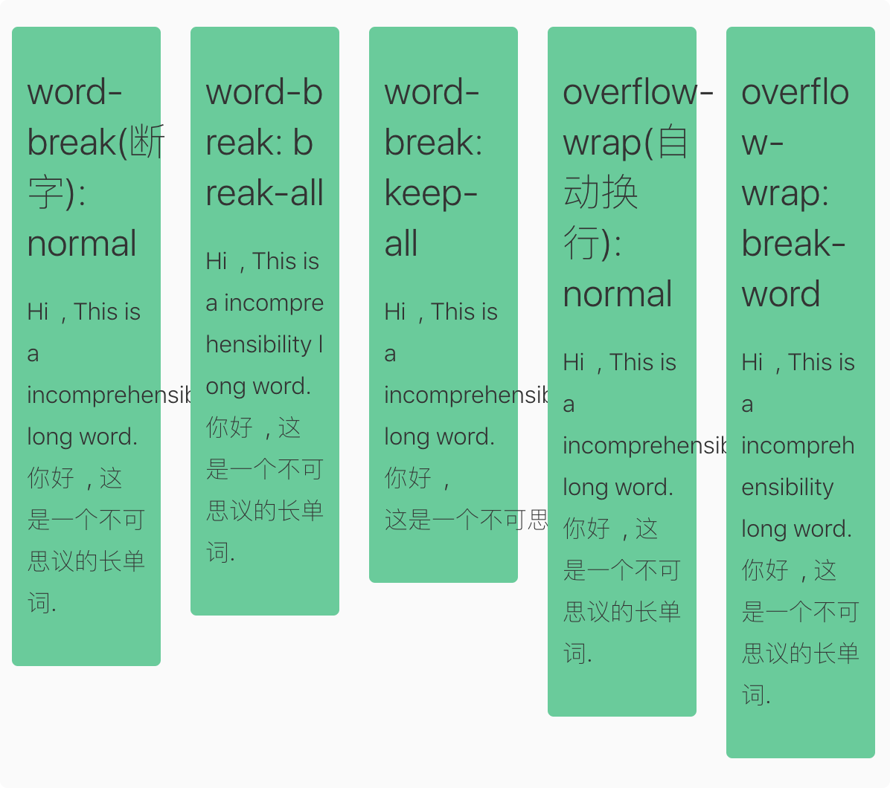

# CSS grocery(CSS 杂货店)

> [待学文章列表](https://github.com/chokcoco/iCSS)

- 备份本仓库在本地计算机的相对路径: `File:///Users/WANG/Github-clone/`

- [CSS 参考手册 - 在线](https://css.doyoe.com/)


## Table Of Content
0. HTML 知识
1. css 的 `box-sizing` 属性
2. box-shadow 属性:
3. CSS 单位和使用
4. css 强制换行和超出隐藏
5. 表格清除格与格之前的间距的样式
6. 响应式网页的头部:
7. 各种平台样式兼容问题
8. Flex(弹性)布局语法
9. CSS3 过渡(transition), 转换(transform), 动画(animation)讲解


## New Words
- **compatible [kəm'pætɪb(ə)l] --adj.兼容, 相容的**
     + Their marriage came to end because they were simply not compatible 
       with each other. 他俩简直无法和睦相处, 所以就离婚了. 
     + Driving a car at a speed compatible with safety. 以兼顾安全的速度驾驶车. 
- **incompatible [ɪnkəm'pætɪb(ə)l] --adj.不相容, 合不来的**
     + His plan is incompatible with my intent.  他的计划与我的意图不相符. 
     + Long hours are simply incompatible with family life.
        长时间的工作与家庭生活格格不入. 
- **wrap [ræp] --v.包裹, 包**
    + word wrap 自动换行
    + line wrap  --n.自动换行
    + He wrapped his favourite books in paper.
      他把自己最喜欢的书用纸抱起来. 
- **collapse [kə'læps] --v.倒塌, 崩溃  --n.倒闭, 破产**
    + Numerous houses collapsed in the earthquake. 无数的房屋因地震而倒塌. 
    + Help Help! That boy just collapsed! 快救救他呀哪个男孩晕倒了！
    + He won't be the last one who collapses. 他不会是第一个崩溃的人. 
    + He collapsed on the way to school. 他上学路上晕倒了. 
    + the collapse of plans. 计划失败
    + the collapse of modern society. 现在社会的崩溃. 
- **preserve [prɪ'zɝv] --vt.保留, 保存; 维持; 禁猎. n.保护区; 禁猎区.**
    + preserve(vt) historical places. 保存史迹.
    + preserve(vt) one's health. 保持健康
    + preserve(vt) order. 维持秩序.
    + preserve food. 保藏食物.
- **incomprehensibility [in,kɔm-prihensə'biləti] --n.不可理解, 不可思议**


## Content

### 0. HTML 知识
- 见当前仓库: [CSS-grocery/HTML-Knowledge.md](File:///Users/WANG/Github-clone/CSS-grocery/HTML-Knowledge.md)

### 1. css 的 `box-sizing` 属性
- `box-sizing`(盒子大小) 属性, 包含 2 个值:
    + `content-box`(内容盒子): 是默认值. 如果元素为 100px,
      那么这个元素的内容就会有 100px, 任何 `border` 和 `padding` 都会增加到元素宽度的外围.
    + `border-box`(边框盒子): 告诉浏览器去理解你设置的 `border` 和 `padding`,
      即这两个属性不计在默认设置的 `width` 之内.
      ```css
        /* - apply a natural box layout model to all elements, 
         *   but allowing components to change */
        html {
            box-sizing: border-box;
        }
        html.borderbox *, html.borderbox *:before, html.borderbox *:after {
            -moz-box-sizing: border-box;
            -webkit-box-sizing: border-box;
            box-sizing: border-box;
        }
      ```
- 示例见: `./《CSS 揭秘》/2nd chapter 背景与边框/2-0 box-sizing.html`

### 2. `box-shadow` 属性:
- ```css
    .box {
        /* - 横向阴影1px, 纵向阴影1px, 模糊半径3px, 阴影展开半径2px, 颜色值. */
        box-shadow: 1px 1px 3px 2px #cfcecf;
        box-shadow: 0 .05em .25em rgba(0, 0, 0, .5);
    }
  ```

### 3 CSS 单位和使用
- 常见 CSS 单位和解释
  | 单位   | 解释 |
  | ----  | ---- |
  | `%`   | 百分比|
  | `px`  | 像素. 计算机屏幕上的一个点为 1px. |
  | `em`  | 相对单位. 相对于父元素计算, 假如某个 p 元素为 `font-size:12px`,在它内部的 span 标签, 设置 `font-size: 2em`, 那么,  这时候的 span 字体大小为 12*2 = 24px. |
  | `rem` | 相对单位.  相对于根元素 html 的 `font-size`. 例如 html 为 `font-size: 12px`, 那么其内的 div 设置为 `font-size: 2rem`, div 字体大小就为 24px. |
  | `rpx` | 微信小程序相对单位. 1rpx = 屏幕宽度/750px. 在 750px 的设计稿上, 1rpx = 1px |
  | `pt`  | 略 |
  | `ex`  | 略 |
- 一般情况下, 浏览器的默认字体大小是**16px**, 所有未经调整的浏览器都符合
  `1em = 16px`.
  
  目前(2020 年), 我用 MacOS 下的 Chrome 查看 "虎嗅", "Vue 官网",
  "WikiWand" 网站时, 发现默认的字体大小都是 16px, 也就是说他们并没有修改默认字体,
  但仍然有很多网站的默认字体是 14px, 所以网站中究竟设置多大字体,
  还是根据设计师的要求来. 接下来我们分别说一下这两种尺寸的使用:
    + (1) 设置默认字体是 14px. 为了在写代码时方便, 我们可以在 CSS 中这样设置:
      ```css
        html {
            /* - 默认 16px = 100%, 那么 1px = 6.25%;
             *   62.5% 就是 10px */
            font-size: 62.5%;
        }
        body {
            /* - 当前 em 相对单位是相对于父元素 html 来的, 由于 html 中
             *   font-size = 10px  所以当前 1em = 10px, 
             *   1.4em = 14px. 这样就给 body 初始化了 14px 的字体. */
            font-size: 1.4em;
        }
      ```
    + (2) 设置默认字体是 16px:
      ```css
        /* - 由于浏览器默认字体就是 16px, 所以此处直接写 1em = 16px 即可,
         *   1em = 16px ==> 1.6px = 0.1em ==> 0.25em = 4px
         *   1px = 0.0625em
         *   10px = 0.625em
         *   14px = 0.875em
         *   16px = 1em 
         *   18px = 1.125em
         *   20px = 1.25em
         *   30px = 0.875em
         *   40px = 2.5em
         *   60px = 3.75em
         *   80px = 5em
         *   100px = 6.25em
         *   200px = 12.5em 
         */
        body {
            /* - 300 为 font-weight; 1.8 为 line-height */
            font: 300 1em/1.8 PingFang SC, Lantinghei SC, Microsoft Yahei,
            Hiragino Sans GB, Microsoft Sans Serif, WenQuanYi Micro Hei, sans-serif;
        }
      ```

### 4. css 强制换行和超出隐藏
- [参考文章](https://juejin.im/post/5b8905456fb9a01a105966b4)
- (1) `white-space(空白空间): normal / nowrap / pre / pre-wrap / pre-line.`
  这个属性是**用来控制空白字符显示的**, 同时还能控制是否自动换行. 它有 5 个值: 
    + (1) `normal`(默认值): 只有空格换行, 单词不换行.
    + (2) `nowrap`: 永不换行
    + (3) `pre`: 它其实是 `preserve` 的缩写. 即空格(`&nbsp;`)和换行(`<br/>`)
      全部被保留.
    + (4) `pre-wrap`: 它其实是 `preserve` + `wrap`, 即保留空格和换行符,
      且可以自动换行. (Tip: 从下图可以看出, 这种展示效果可能是你在网页中最不想看到的.)
    + (5) `pre-line`: 它其实是 `preserve new line` + `wrap`. 即合并空格,
      但是换行符可以发挥作用.
      ./CSS-示例和集锦/white-space_word-break_word-wrap/white-space-demo.html
    + 测试文件见当前仓库: 
        <a href="./CSS-示例和集锦/white-space_word-break_word-wrap/white-space-demo.html">
            ./示例和集锦/white-space_word-break_word-wrap/white-space-demo.html
        </a>
      ```html
        <!-- 默认样式如下 -->
        <div class="white-space-normal">
            <h3>white-space: normal</h3>
            <p>
                Hi&nbsp;&nbsp;,
                This is a incomprehensibility long word.
                <br/>
                你好&nbsp;&nbsp;,
                这是一个不可思议的长单词.
            </p>
        </div>   
      ```
    + 样式效果如下:
      
    + 添加一个表格作为总结:  
      | 属性值 | 换行符 | 空格 | 自动换行 | `<br/>`, `&nbsp;` |
      |:------|:------|:------|:------|:------|
      |`normal`  | $\times$ | $\times$ (合并) | $\surd$| $\surd$ |
      |`nowrap`  | $\times$ | $\times$ (合并) | $\surd$| $\surd$ |
      |`pre`     | $\surd$ | $\surd$ | $\surd$| $\surd$ |
      |`pre-wrap`| $\surd$ | $\surd$ | $\surd$| $\surd$ |
      |`pre-line`| $\surd$ | $\times$ (合并) | $\surd$| $\surd$ |
- (2) `word-break: normal / break-all / keep-all;` ( word break (断字):
  这个属性是控制单词如何被拆分换行的.) 它有三个值:
    + (2.1) `normal`:  不拆分单词, 但是空格会换行.
    + (2.2) `break-all`(打破一切): **所有单词碰到边界一律拆分换行.**
      不管你是 `incomprehensibility` 这样一行都显示不下的单词, 还是
      `long` 这样很短的单词, 只要碰到边界, 都会被强制拆分换行.
      所以使用 `word-break: break-all` 时要慎重.
    + (2.3) `keep-all`(保留全部): **所有单词一律不拆分换行**. 注意,
      这里的 "单词" 包括连续的中文字符(还有日文, 韩文等),
      或者可以理解为**只有空格可以触发自动换行**.
    + 测试文件见:  
      <a href="./CSS-示例和集锦/white-space_word-break_word-wrap/word-break_overflow-wrap.html">
            ./示例和集锦/white-space_word-break_word-wrap/word-break_overflow-wrap.html
        </a>
    + 样式效果如下: 
      
- (3) `overflow-wrap(溢出包裹): normal / break-word`.
   `word-wrap(自动换行)` 又叫 `overflow-wrap`: 这个属性是
  **控制长度超过一行的单词如何被拆分换行**, 实际上是作为 `word-break` 的互补,
  它有 2 个值: 
    + (3.1) `normal`: 不拆分单词
    + (3.2) `break-word`: **只有当一个单词一整行都显示不下时才会拆分换行该单词**.
      (Hint: 网页中完美的解决换行的方法.)
    + Tip: `word-wrap` 属性原本属于微软的一个私有属性, 在 CSS3 
      现在的文本规范草案中已经被重命名为 `overflow-wrap`. `word-wrap`
      现在被当作 `overflow-wrap` 的别名. 稳定的 Chrome 版本支持这种新语法.
- 使用 <br/>
  ```css
    /* 强制文本换行 */
    .textwrap, .textwrap td, .textwrap th {
        word-wrap: break-word;
        word-break: break-all;
    }
  ```

### 5. 去掉表格(Table cell)的边距并让其边重合
- ```css
    table {
        border-collapse: collapse;
        border-spacing: 0;
    }
  ```

### 6. 响应式网页的头部:
- ```html
    <!doctype html>
    <html lang="en">
    <head>
        <meta name="viewport" content="width=device-width,
                user-scalabel=no, initial-scale=1.0,
                maximum-scale=1.0, minimum-scale=1.0">
        <meta http-equive="X-UA-Compatible" content="ie=edge">
        <title>Document</title>
    </head>
    <body>

    </body>
    </html>
  ```
    + `viewport`: 视口;
    + `width = device-width`: 网页宽度默认等于屏幕宽度;
    + `initial-scale=1`: 原始缩放比例为 1.0, 即网页初始大小占屏幕面积的 100%,
    + `maximum-scale`: 允许用户缩放到的最大比例,
    + `user-scalable`: 允许用户是否可以手动缩放.

### 7. 各种平台样式兼容问题
- 忽略将页面中的数字识别为电话号码, 忽略 android 平台中对邮箱地址的识别
  ```html
    <meta content="telephone=no, email=no" name="format-detection">
  ```
- 去除 Chrome `input` 和 `textarea` 的默认边框, 以及点击时的聚焦边框:
  ```css
    input, button, select, textarea{ outline: none; }
    input:focus, input:active, textarea:focus, textarea:active,{
        outline:none;
    }
  ```
- 解决 ios 端 `button` 圆角和渐变的问题
  ```css
    input[type=button], input[type=submit], input[type=file], button {
        cursor: pointer;
        -webkit-appearance: none;
    }
  ```
- 解决 ios 端点击按钮会出现暗色背景的问题
  ```css
    input{
        /* 去除系统默认的样式 */
        -webkit-appearance:none;
        /* 点击高亮的颜色 */
        -webkit-tap-highlight-color: rgba(0, 0, 0, 0);
    }
  ```
- 去除 chrome 下 `textarea` 可拖动放大的问题:
  ```css
    textarea{ resize: none; }
  ```

### 8. Flex(弹性)布局语法
- 见当前仓库: [CSS-grocery/布局_Flex-Grid/Flexbox-布局/README-弹性布局语法.MD](File:///Users/WANG/Github-clone/CSS-grocery/布局_Flex-Grid/Flexbox-布局/README-弹性布局语法.MD)

### 9. CSS3 过渡(transition), 转换(transform), 动画(animation)讲解
- 见当前仓库: [CSS3-过渡-转换-动画/transition-transform-animation.md](File:///Users/WANG/Github-clone/CSS-grocery/CSS3-过渡-转换-动画/transition-transform-animation.md)


### 9. `list-style`
- ```css
    .list-item {
        /* - MDN: 将这个元素的外部显示类型变为 block 盒，并将内部显示类型变为多个
         *   list-item inline 盒.
         * - 上面 MDN 说的大致意思就是: 把 li 编程 block, 其内部元素显示为
         *   display: inline.
         */
        display: list-item;
        /* - list-style: list-style-type list-style-position list-style-image*/
        list-style: disc outside none;
    }
  ```


### JavaScript 动画和 CSS 动画该如果抉择
- 根据 Google Developer, 渲染线程分为 主线程(main thread)和
  合成线程(compositor thread). 如果 CSS 动画只是改变 transforms 和 opacity,
  这时整个 CSS 动画得以在 合成线程 完成（而JS动画则会在 主线程 执行,
  然后触发合成线程进行下一步操作）, 在 JS 执行一些昂贵的任务时, 主线程繁忙,
  CSS 动画由于使用了合成线程可以保持流畅
  
  在许多情况下, 也可以由合成线程来处理 transforms 和 opacity 属性值的更改. 
  
  对于帧速表现不好的低版本浏览器, CSS3可以做到自然降级, 而JS则需要撰写额外代码. 
  
  CSS动画有天然事件支持(TransitionEnd、AnimationEnd, 但是它们都需要针对浏览器加前缀),
  JS则需要自己写事件. 
  
  如果有任何动画触发绘画, 布局或两者, 则需要 “主线程” 才能完成工作. 
  这对于基于 CSS 和 JavaScript 的动画都是如此, 布局或绘制的开销可能会使与 CSS 或
  JavaScript 执行相关的任何工作相形见绌, 这使得问题没有实际意义. 
  
  CSS3有兼容性问题, 而JS大多时候没有兼容性问题.
- 总结
  
  如果动画只是简单的状态切换, 不需要中间过程控制, 在这种情况下, css 动画是优选方案.
  它可以让你将动画逻辑放在样式文件里面, 而不会让你的页面充斥 Javascript 库.
  然而如果你在设计很复杂的富客户端界面或者在开发一个有着复杂 UI 状态的 APP.
  那么你应该使用 js 动画, 这样你的动画可以保持高效, 并且你的工作流也更可控.
  所以, 在实现一些小的交互动效的时候, 就多考虑考虑 CSS 动画. 对于一些复杂控制的动画,
  使用 javascript 比较可靠. 

