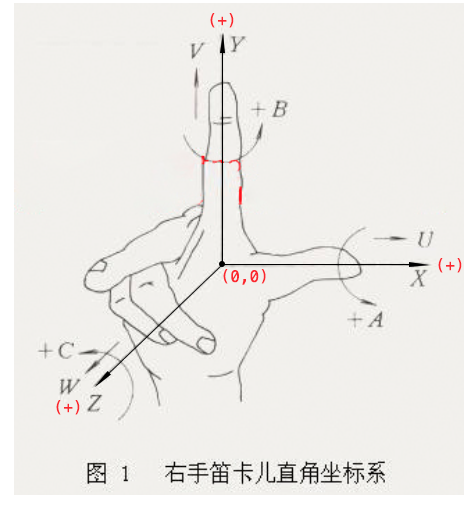
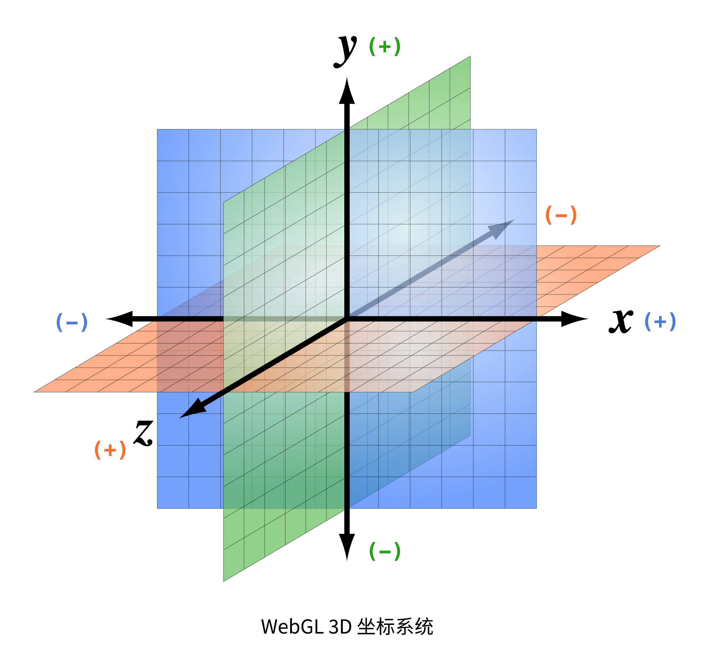

# WebGL 学习

- > [WebGL Fundamentals](https://github.com/gfxfundamentals/webgl-fundamentals)
- > [Programming-3D-Applications-With-HTML5-and-WebGL](http://materliu.github.io/Programming-3D-Applications-With-HTML5-and-WebGL)

## Table Of Contents
1. WebGL 是什么?
2. 

## New Words
- **fundamental [fʌndə'ment(ə)l] --adj.基本的, 根本的, 重要的.**
  **--n.[常 ~s] 基本, 根本, 基础**
    + a fundamental(adj) principle 基本原则
    + the fundamental(adj) cause of his success. 他成功的主要原因. 
    + Fresh air is fundamental(adj) to good health.
      新鲜空气是身体健康之必需.    
    + training fundamentals(n). 基础训练

## Content
### 1. WebGL 是什么?
- 在个人计算机上使用最广泛的两种三维图形渲染技术是 Direct3D 和 OpenGL,Direct3D
  是微软 DirectX 技术的一部分, 是一套由微软控制的编程接口,主要用户是 Windows 平台.
  而 OpenGL 由于其开放性和免费性,在多个平台被广泛的引用.

  WebGL 根植于 OpenGL, 它实际上从 OpenGL 的一个特殊的版本 OpenGL ES中派生来的.
  WebGL 内嵌在浏览器中, 你不必安装插件和库就可以使用它, 而且它是基于浏览器的,
  你可以在多个平台上运行 WebGL 程序.

### 2. 
- **笛卡尔坐标系(直角坐标系)**
    + [笛卡尔坐标系](https://www.wikiwand.com/zh/%E7%AC%9B%E5%8D%A1%E5%B0%94%E5%9D%90%E6%A0%87%E7%B3%BB#/%E4%B8%89%E7%B6%AD%E7%A9%BA%E9%96%93)
      (Cartesian coordinates system, 也称直角坐标系) 在数学中是一种
      [正交坐标系](https://www.wikiwand.com/zh/%E6%AD%A3%E4%BA%A4%E5%BA%A7%E6%A8%99%E7%B3%BB),
      由法国数学家
      [勒内·笛卡尔](https://www.wikiwand.com/zh/%E5%8B%92%E5%86%85%C2%B7%E7%AC%9B%E5%8D%A1%E5%B0%94)
      引入而有此名.
      二维的直角坐标系是由两条相互垂直, 相交于原点的
      [数线](https://www.wikiwand.com/zh/%E6%95%B8%E7%B7%9A)
      构成的. 在平面内, 任何一点的坐标是根据数轴上对应的点的坐标设定的. 在平面内,
      任何一点与坐标的对应关系, 类似于数轴上点与坐标的对应关系. 
    
      直角坐标系也是我们学习初等数学时使用的坐标系. 
    
      

- **三维坐标系统(数学)**:
    + 直角坐标系也可以推广至三维空间与高维空间(higher dimension).
      在原本的二维直角标系, 再添加一个垂直于 x-轴 和 y-轴 的坐标轴,
      称为 **z-轴**.假若, 这三个坐标轴满足
      [右手定则](https://zh.wikipedia.org/wiki/%E5%8F%B3%E6%89%8B%E5%AE%9A%E5%89%87)
      则可得到三维的直角坐标系统; 这 z-轴与 x-轴, y-轴相互交于原点.
      在三维空间的任何一点 P, 可以利用直角坐标(x, y, z) 来表达其位置.
      
      用图表示右手定则, 如下所示:

      

- **WebGL 3D 坐标系统**
  基于 WebGL 开发 3D 图形图像, 首先 3D 图形的绘制必须在一个 3D 坐标系统中,
  此处的 3D 坐标系统也即是 "3 维坐标系统",
  即在 2D 坐标系统(笛卡尔坐标)的基础上多了一个 Z 轴用来表述深度.
  比如说一个物体在绘制后看起来离屏幕的距离. 3D 坐标系如下图所示:

  

- https://blog.teamtreehouse.com/3d-in-the-browser-webgl-versus-css-3d-transforms