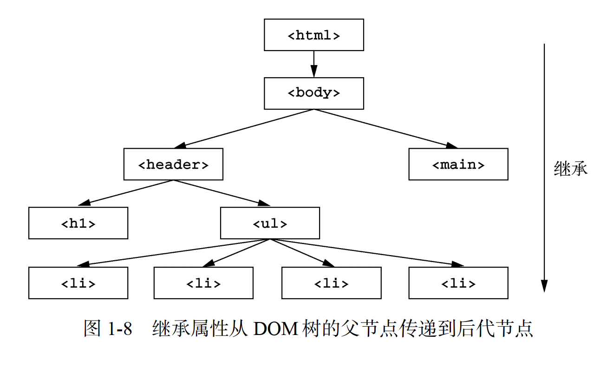
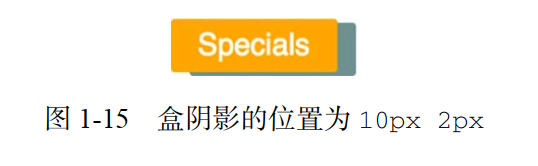
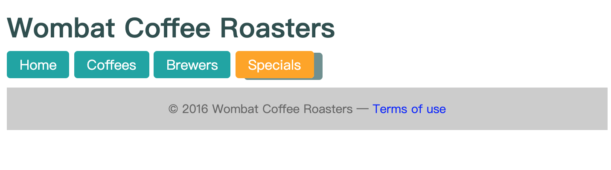

# 第 1 章 -- 层叠, 优先级和继承


## Catalog
- 1.1 层叠
    + 1.1.1 样式表的来源
    + 1.1.2 理解优先级
    + 1.1.3 源码顺序
    + 1.1.4 两条经验法则
- 1.2 继承
- 1.3 特殊值
    + 1.3.1 使用 `inherit` 关键字
    + 1.3.2 使用 `initial` 关键字
- 1.4 简写属性
    + 1.4.1 简写属性会默默覆盖其他样式
    + 1.4.2 理解简写值的顺序
- 1.5 总结


## New Words
- **cliff [klɪf] --n.悬崖; 峭壁**
    + I could see the beaches and the cliffs. 我能看到海滩和峭壁了.


## Content
### 1.1 层叠
- 本章将首先介绍 CSS 里的 C(代表 `cascade`, 层叠). 我将先讲解它的原理, 
  然后展示一些例子. 接着将介绍与层叠相关的话题: 继承. 
  之后将介绍简写属性以及对它们的常见误解. 
- **CSS 术语解释**
    + 以下是 CSS 中的一行. 它被称作一个**声明**. 该声明由一个**属性**(color)
      和一个**值**(black)组成. 
      ```css
        color: black;
      ```
      不要将 CSS 属性(property) 跟 HTML 属性/特性(attribute)混淆.
      比如在 `<a href="/">` 元素里,  href 就是 a 标签的一个 HTML 属性. 
      包含在大括号内的一组声明被称作一个声明块. 声明块前面有一个选择器
      (如下面的body). 
      ```css
        body {
            color: black;
            font-family: Helvetica;
        }
      ```
      选择器和声明块一起组成了规则集(ruleset). 一个规则集也简称一个规则, 
      不过我发现很少有人说单数形式的规则(rule), 通常会用复数形式(rules), 
      用来指一系列样式的集合. 最后, **@规则(at-rules)**是指用 "@"
      符号开头的语法. 比如 `@import` 规则或者 `@media` 查询.
#### 1.1.1 样式表的来源
- 你添加到网页里的样式表并不是浏览器唯一使用的样式表, 还有其他类型或来源的样式表. 
  你的样式表属于**作者样式表**, 除此之外还有用户代理样式表, 即浏览器默认样式.
  用户代理样式表优先级低, 你的样式会覆盖它们. 
- (1) 用户代理样式表
    + 浏览器应用了用户代理样式后才会应用你的样式表, 即作者样式表. 
      你指定的声明会覆盖用户代理样式表里的样式. 如果你在 HTML 里面链接了多个样式表, 
      那么它们的来源都相同, 即作者. 
      
      用户代理样式表因为设置了用户普遍需要的样式, 所以不会做一些完全超出预期的事情. 
      当你不喜欢默认样式时, 可以在自己的样式表里设置别的值. 
- (2) `!important` 声明.
    + 样式来源规则有一个例外: 标记为**重要(important)**的声明.  如下所示,
      在声明的后面、分号的前面加上``!important`, 该声明就会被标记为重要的声明. 
      ```css
        color: red !important;
      ```
      标记了 `!important` 的声明会被当作更高优先级的来源, 
      因此总体的优先级按照由高到低排列如下所示:
        - (1) 作者的 `!important`
        - (2) 作者
        - (3) 用户代理

      层叠独立地解决了网页中每个元素的样式属性的冲突. 例如, 如果给段落设置加粗的字体,
      用户代理的上下外边距样式仍然会生效(除非被明确覆盖). 处理过渡和动画时,
      还会再提到样式来源的概念, 因为它们会引入更多的来源. `!important` 注释是
      CSS 的一个有趣而怪异的特性, 稍后会再解释.
#### 1.1.2 理解优先级
- 如果无法用来源解决冲突声明, 浏览器会尝试检查它们的**优先级**. 理解优先级很重要. 
  不理解样式的来源照样可以写 CSS, 因为 99% 的网站样式是来自同样的源.
  但是如果不理解优先级, 就会被坑得很惨. 不幸的是, 很少有人提及这个概念. 
  
  浏览器将优先级分为两部分: **HTML 的行内样式** 和 **选择器的样式**.

- (1) 行内样式
  
  如果用 HTML 的 `style` 属性写样式, 这个声明只会作用于当前元素. 实际上行内元素属于
  "带作用域的" 声明, 它会覆盖任何来自 **样式表** 或者 **`<style>`标签** 的样式.
  行内样式没有选择器. 因为它们直接作用于所在的元素. 

- (2) 选择器优先级
  
  优先级的第二部分由选择器决定. 比如,
  有两个类名的选择器比只有一个类名的选择器优先级更高. 如果一个声明将背景色设置为橘黄色,
  但另一个更高优先级的声明将其设置为蓝绿色, 浏览器就会将蓝绿色应用到元素上.

  不同类型的选择器有不同的优先级. 比如, `ID 选择器`比 `类选择器`优先级更高. 
  实际上, `ID` 选择器的优先级比拥有任意多个类的选择器都高. 同理, 
  类选择器的优先级比 `标签选择器`(也称**类型选择器**)更高. 优先级的准确规则如下. 
    + (1) 如果选择器的 ID 数量更多, 则它会胜出(即它更明确). 
    + (2) 如果 ID 数量一致, 那么拥有最多类的选择器胜出. 
    + (3) 如果以上两次比较都一致, 那么拥有最多标签名的选择器胜出. 
  
  例如下面代码清单 1-6. 它们是按照优先级**由低到高**的顺序排列的. 
  ```css
    html body header h1 {           /* {1} - 4 个标签 */
        color: blue;
    }
    body header.page-header h1 {    /* {2} - 3 个标签和 1 个类 */
        color: orange;
    }
    .page-header .title {           /* {3} - 2 个类 */
        color: green;
    }
    #page-title {                   /* {4} - 1 个ID */
        color: red;
    }
  ```
  **说明:** 伪类选择器(如`:hover`)和属性选择器(如`[type="input"]`)
  与一个类选择器的优先级相同. 通用选择器(`*`)和组合器(`>`、`+`、`~`)
  对优先级没有影响.
- (3) 优先级标记
  
  一个常用的表示优先级的方式是用数值形式来标记, 通常用逗号隔开每个数. 比如:
  "1, 2, 2" 表示选择器由 1 个 ID、 2 个类、 2 个标签组成.
  优先级最高的 ID 列为第一位, 紧接着是类, 最后是标签. 

- (4) 关于优先级的思考
  
  + 略.

#### 1.1.3 源码顺序
- 层叠的第三步, 也是最后一步, 是源码顺序. 如果两个声明的来源和优先级相同, 
  其中一个声明在样式表中出现较晚, 或者位于页面较晚引入的样式表中, 则该声明胜出.
  也就是说, 可以通过控制源码顺序, 来给特殊链接添加样式. 
  如果两个冲突选择器的优先级相同, 则出现得较晚的那个胜出. 
#### 1.1.4 两条经验法则
- (1) 在选择器中不要使用 ID. 就算只用一个 ID, 也会大幅提升优先级. 
  当需要覆盖这个选择器时, 通常找不到另一个有意义的 ID, 于是就会复制原来的选择器, 
  然后加上另一个类, 让它区别于想要覆盖的选择器. 
- (2) 不要使用 `!important`. 它比 ID 更难覆盖, 一旦用了它, 想要覆盖原先的声明,
  就需要再加上一个 `!important`, 而且依然要处理优先级的问题. 
  
  这两条规则是很好的建议, 但不必固守它们, 因为也有例外.
  不要为了赢得优先级竞赛而习惯性地使用这两个方法. 

  过去几年涌现了一些实践方法, 能够帮助我们管理选择器优先级. 
  第 9 章将详细介绍这些方法, 包括如何处理优先级, 以及在哪里可以放心使用
  `!important`. 现在你已经掌握了层叠的原理, 接下来将介绍继承. 

### 1.2 继承
- 还有最后一种给元素添加样式的方式: **继承**. 经常有人会把层叠跟继承混淆.
  如果一个元素的某个属性没有层叠值, 则可能会继承某个祖先元素的值.
  比如通常会给 `<body>`元素加上 `font-family`, 里面的所有祖先元素都会继承这个字体,
  就不必给页面的每个元素明确指定字体了. 图 1-8 展示了继承是如何顺着 DOM 树向下传递的.
  
  

  但不是所有的属性都能被继承. 默认情况下, 只有特定的一些属性能被继承, 
  通常是我们希望被继承的那些. 它们主要是跟文本相关的属性:
    + `color`
    + `font`
    + `font-family`
    + `font-size`
    + `font-weight`
    + `font-variant`
    + `font-style`
    + `line-height`
    + `letter-spacing`
    + `text-align`
    + `text-indent`
    + `text-transform`
    + `white-space`
    + `word-spacing`
  
  还有一些其他的属性也可以被继承, 比如列表属性:
    + `list-style`
    + `list-style-type`
    + `list-style-position`
    + `list-style-image`
  
  表格的边框属性:
    + `border-collapse`
    + `border-spacing`
  
  也能被继承. 注意, 这些属性控制的是表格的边框行为, 
  而不是常用于指定非表格元素边框的属性. (恐怕没人希望将一个 `<div>`
  的边框传递到每一个后代元素.) 以上为不完全枚举, 但是已经很详尽了.

  **I added:** 要注意表单元素并不继承父级 `font`:
    `button` / `input` / `select` / `textarea`.  

### 1.3 特殊值
- 有两个特殊值可以赋给任意属性, 用于控制层叠: `inherit` 和 `initial`.
  我们来看看这两个特殊值.
#### 1.3.1 使用 `inherit` 关键字
- 有时, 我们想用继承代替一个层叠值. 这时候可以用 `inherit` 关键字. 
  可以用它来覆盖另一个值, 这样该元素就会继承其父元素的值. 
#### 1.3.2 使用 `initial` 关键字
- 如果你想撤销某个元素的样式, 可以用 `initial` 关键字. 每个 CSS
  属性都有初始值(默认)值. 如果将 `initial` 赋值给某个属性, 就会将其重置为默认值,
  这种操作相当于硬复位了该值. 

  在大多数浏览器中, 黑色是 `color` 属性的初始值, 所以 `color: initial`
  等价于 `color: black`.

  如果想删除一个元素的边框, 设置 `border: initial` 即可.
  如果想让一个元素恢复到默认宽度, 设置 `width: initial` 即可.

  你可能已经习惯了使用 `auto` 来实现这种重置效果. 实际上, 用 `width: auto`
  是一样的, 因为 width 的默认值就是 `auto`. 

  但是要注意, `auto` 不是所有属性的默认值, 对很多属性来说甚至不是合法的值.
  比如: ~~`border-width: auto`~~ 和 ~~`padding: auto`~~ 是非法的,
  因此不会生效. 可以花点时间研究一下这些属性的初始值, 不过使用 `initial` 更简单. 
  
  **说明**: 声明 `display: initial` 等价于 `display: inline`.
  不管应用于哪种类型的元素, 它都不会等于 `display: block`. 这是因为 `initial`
  重置为属性的初始值, 而不是元素的初始值. `inline` 才是 `display` 属性的初始值. 


### 1.4 简写属性
#### 1.4.1 简写属性会默默覆盖其他样式
- 略
#### 1.4.2 理解简写值的顺序
- (1) 上、右、下、左
  当遇到像 `margin`、`padding` 这样的属性,
  还有为元素的四条边分别指定值的边框属性时, 开发者容易弄错这些简写属性的顺序.
  这些属性的值是按顺时针方向, 从上边开始的. 
  记住顺序能少犯错误. 它的记忆口诀是:
  top(上)、right(右)、bottom(下)、left(左).

  代码清单 1-9 指定元素每个方向的内边距:
  ```css
    .nav a {
        color: white;
        background-color: #13a4a4;
        padding: 10px 15px 0 5px;   /* - 顺序为: 上, 右, 下, 左. */
        border-radius; 2px;
        text-decoration: none;
    }
  ```
  对很多开发人员而言, 比较难的是指定三个值时. 记住, 这种情况指定了上、右、下的值.
  因为没有指定左边的值, 所以它会取与右边相等的值. 第二个值就会作用到左边和右边.
  因此 `padding: 10px 15px 0` 是设置左右内边距为 15px, 上内边距为 10px,
  下内边距为 0.
- (2) 水平, 垂直
  `(1)` 只适用于分别给盒子设置四个方向的值的属性. 还有一些属性只支持最多指定两个值, 
  这些属性包括 `background-position`、 `box-shadow`、
  `text-shadow`(虽然严格来讲它们并不是简写属性). 这些属性值的顺序跟 `padding`
  这种四值属性的顺序刚好相反. 比如: `padding: 1em 2em`
  先指定了垂直方向的上/下属性值, 然后才是水平方向的右/左属性值, 
  而 `background-position: 25% 75%` 则先指定水平方向的右/左属性值, 
  然后才是垂直方向的上/下属性值. 
  
  虽然看起来顺序相反的定义违背了直觉, 原因却很简单: 这两个值代表了一个**笛卡儿网格**.
  笛卡儿网格的测量值一般是按照 x, y(水平, 垂直)的顺序来的. 
  比如, 如图 1-15 所示, 要给元素加上一个阴影, 就要先指定 x(水平)值. 

  **I added:** 有关笛卡尔坐标知识见:
  `../../CSS-知识集合/CSS3-过渡-转换-动画/transition-transform-animation.md`

  

  代码如下:
  ```css
    .nav .featured {
        background-color: orange;
        box-shadow: 10px 2px #6f9090;
    }
  ```
  第一个(较大的)值指定了水平方向的偏移量, 第二个(较小的)值指定了垂直方向的偏移量. 

### 1.5 总结
- 关于本章的一个网页简单头部的示例见: `./1.1-一个简单的网页头部.html`.
  
  为了方便查看, 此处备份代码:
  ```html
    <!DOCTYPE html>
    <html lang="en">
    <head>
        <meta charset="UTF-8">
        <meta name="viewport" content="width=device-width, initial-scale=1.0">
        <title>1.1 一个简单的网页头部</title>
        <style>
            body { font-family: sans-serif; }
            a:link { color: blue; text-decoration: none; }
            a:visited { color: purple; }
            a:hover { text-decoration: underline; }
            a:active { color: red; }
            h1 { color: #2f4f4f; margin-bottom: 10px; font-weight: bold; }
            .nav { margin-top: 10px; list-style: none; padding-left: 0; }
            .nav li { display: inline-block; }
            .nav a {
                color: white;
                background-color: #13a4a4;
                padding: 5px 15px;
                border-radius: 4px;
                text-decoration: none;
            }
            .nav .featured {
                background-color: orange;
                box-shadow: 10px 2px #6f9090;
            }
            .footer {
                color: #666;
                background-color: #ccc;
                padding: 15px 0;
                text-align: center;
                font-size: 14px;
            }
        </style>
    </head>
    <body>
        <header class="page-header">
            <h1 id="page-title" class="title">Wombat Coffee Roasters</h1>
            <nav>
                <ul id="main-nav" class="nav">
                    <li><a href="/">Home</a></li>
                    <li><a href="/coffees">Coffees</a></li>
                    <li><a href="/brewers">Brewers</a></li>
                    <li><a href="/specials" class="featured">Specials</a></li>
                </ul>
            </nav>
        </header>
        <footer class="footer">
            &copy; 2016 Wombat Coffee Roasters &mdash;
            <a href="/terms-of-use">Terms of use</a>
        </footer>
    </body>
    </html>
  ```
  展示效果如下:
  
  
