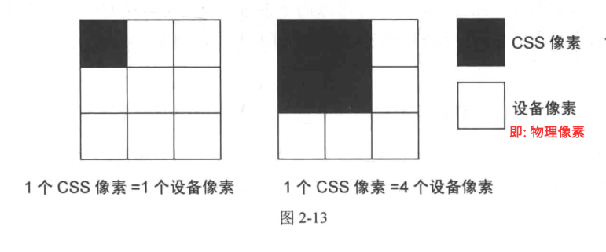
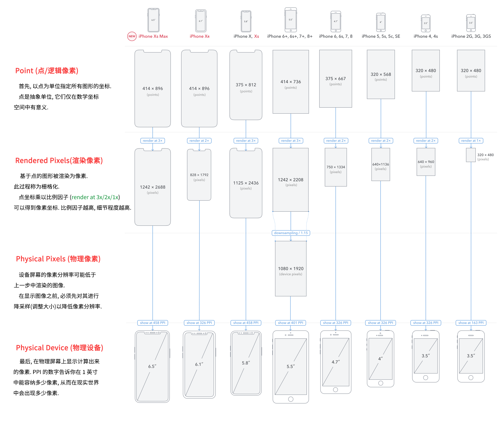

# 第 2 章 -- 响应式中要面对的问题

## 本站目录 (Catalog)
- 2.1 像素密度
- 2.2 CSS 像素
- 2.3 视口
    + 2.3.1 桌面浏览器的视口
    + 2.3.2 移动设备浏览器的视口
    + 2.3.3 设备宽度

## 生词 (New Words)
- **density ['densɪtɪ] --n.密度, 浓度**
    + population density. 人口密度
    + a population density of 50 per square kilometer.  
      每平方公里 50 人的人口密度
- **coordinate [kəuˈɔ:dineit] --n.<数>坐标  --vt.协调, 配合**
    + It defines how all the lengths and coordinates used inside the SVG
            should be scaled to fit the total space available. 
        它定义了如何缩放 SVG 内部使用的所有长度和坐标以适应可用的总空间. 
    + It defines the origin of the SVG coordinate system, the point 
      where x=0 and y=0.  它定义了 SVG 坐标系的原点,  即 x=0 和 y=0 的点. 
    + Polar coordinates 极坐标
- **specify ['spesɪfaɪ] --vt.指定, 列举**
    + explicitly specifies 明确指定
- **abstract ['æbstrækt] --n.抽象, 摘要, 文摘.  --v.提取  --adj.抽象的**
    + an abstract concept. 抽象概念. 
    + Your words are so abstract to me. 你的话对我来说太抽象了. 
    + Well, it can get really abstract. 这东西太抽象了. 
- **mathematic [ˌmæθə'mætɪk] = mathematical --adj.数学的, 精确的**
    + mathematic model 数学模型
    + Mathematic Programming 数学规划
- **make sense --有意义; 讲得通; 言之有理**
    + It all started to make sense. 这一切都开始变得有意义.
    + Points are abstract units, they only make sense in this
      mathematical coordinate space.  
      点是抽象单位, 它们仅在数学坐标空间中有意义.
- **multiply ['mʌltɪplaɪ] --vt & vi.乘**
    + We all know how to multiply by then. 我们都知道怎样乘以10.
    + I asked you to multiply fourteen by nineteen. 我要你将 14 乘以 19. 
- **factor ['fæktɚ]{US} --n.因子; 因素; 要素; 系数**
    + a factor of happiness. 幸福的因素.
    + Luck was a factor in his success. 幸运是他成功的一个因素.
    + a common factor. 公因子, 公因数
    + the factor of safety. 安全因数.
- **thus [ðʌs] --adv.从而; 因此; 这样**
    + thus and so. (美)这样
    + thus and thus. 如此这般
    + Thus they judged that he was guilty. 因此他们判断他有罪.
    + Thus much is certain. (至少)这些是确实的.
1. Point(点 / 逻辑像素: point / device point / device pixel):
- At the beginning, coordinates of all drawings are specified in points.
  (首先, 以点为单位指定所有图形的坐标.)
- Points are abstract units, they only make sense in this mathematical
  coordinate space.
  (点是抽象单位, 它们仅在数学坐标空间中有意义.)

2. Rendered Pixels(渲染像素)
- Point-based drawings are rendered into pixels. This process is known
  as rasterization.
  (基于点的图形被渲染为像素. 此过程称为栅格化.)
    + 栅格化(Rasterisation): 栅格化是将 `矢量图形` 格式表示的图像转换成 `位图`
      以用于显示器或者打印机输出的过程. 总体上来说, 格栅化这个术语可以用于任何将
      `矢量图形` 转换成 `位图` 的过程.
- Point coordinates are multiplied by scale factor to get pixel
  coordinates. Higher scale factors result in higher level of detail.
  (点坐标乘以比例因子(`render at 3x/2x/1x`)可以得到像素坐标. 比例因子越高,
  细节程度越高.)

3. Physical Pixels(物理像素)
- The device screen may have lower pixel resolution than the image
  rendered in previous step.
  (设备屏幕的像素分辨率可能低于上一步中渲染的图像.)
- Before the image can be displayed, it must be downsampled(resized)
  to lower pixel resolution.
  (在显示图像之前, 必须先对其进行降采样(调整大小)以降低像素分辨率.)

4. Physical Device (物理设备)
- Finally, computed pixels are displayed on the physical screen.
  (最后, 在物理屏幕上显示计算出来的像素.)
- The PPI number tells you how many pixels fit into one inch and
  thus how large the pixels appear in the real world.
  (PPI 的数字告诉你在 1 英寸中能容纳多少像素, 从而在现实世界中会出现多少像素.)


## Added Content
- [文章来源](https://www.zhihu.com/question/313971223/answer/628236155)
  
### 1. 本文观点
- (1) 不建议修改 `viewport`(视口大小) 致使 viewport width 不等于
  `device-width` 的方案(因为这会导致一些 bug). 即:
  ```html
    <!doctype html>
    <html lang="en">
    <head>
        <meta charset="UTF-8">
        <meta name="viewport"
            content="width=device-with, user-scalable=no, initial-scale=1.0,
            maximum-scale=1.0, minimum-scale=1.0">
        <meta http-equiv="X-UA-Compatible" content="id=edge">
        <title>Document</title>
    </head>
    </html>
  ```
- (2) 不建议读者使用**以 `rem` 或者小程序 `rpx` 来实现等比缩放**为主的布局手段,
  而使用**面向逻辑像素 `px`**为主, **面向等比缩放的 `vx` 和 `vh`
  (vw/vh/vmax/vmin)** 为辅助的布局单位, 搭配一些 `flex` 等布局手段.
- (3) 本文建议读者一般遵循: 同样观看距离下,
  大屏看的更多而非看的更大的设计实践来进行布局.

### 2. CSS 中的 `px` 到底是什么?
- 答: 实际上 `px` 是 `viewport(视口大小) 像素` (也可叫: `CSS 像素`).
  (注: 这个 `viewport 像素` 就是咱们在 js 中说的 `可视窗口` 即
  `window.innerWidth`/`window.innerHeight` 中看到的显示像素.
  `CSS 像素` 这个称呼来自《高性能响应式Web开发实战》, 因为觉得叫 `CSS 像素`
  更容易理解, 此处添加进来, 你可选择你自己喜欢的称呼.)

  那 `viewport 像素` 又是什么呢? A: `viewport 像素` 它本质是
  `DIP(Device Independent Pixels)`, 中文意思是**设备无关像素**,
  它其实是浏览器内部对 `逻辑像素`(下图二) 进行再处理的结果,
  简单来理解就是调整 `逻辑像素` 的缩放来达到适合设备的一个中间层.

  `CSS 像素` 默认与系统分辨率下像素大小相等. 在标清设备中, 一个 `CSS 像素`
  应该是与一个 `物理像素`(下图二) 大小相等. (Hint: 请看下面第 2 张图中的
  iPhone 2G/3G/3GS 的 `逻辑像素` 和 `渲染像素`/`物理像素` 是一样的) 但是,
  在高清设备(e.g. Retina 显示屏)或者用户缩放的过程中, 一个 `CSS 像素`
  也可以大于或等于多个`物理像素`, 如图 2-13 所示:

  

  我们不用关心在不同设备上一个 `CSS 像素` 会匹配多少个 `物理像素`,
  浏览器会根据 `DPR (device point ratio / device pixel ratio)`[即:
  `渲染像素` 与 `逻辑像素` 的比.] 为我们适配:
    + 我们拿下图的 iPhone Xs Max 来作计算一下 `dpr` --> $1242 \div 414 = 3$
      我们所说的 **三倍屏, 3X** 意思就是 `3dpr`. 
  
  

- **`逻辑像素/点 (device point / device pixel / points)`**:
- **`渲染像素 (Rendered Pixels)`**: 是系统基于 逻辑像素 进行对应倍增 (1x, 2x 或 3x) 而得到的结果. 
- **`物理像素 (Physical Pixels)` / `设备像素(Device Pixel)`**: 


## 本章内容 (Content)
### 2.1 像素密度 (PPI: Pixel Per Inch)
- 在这里我们只谈论 PPI 作为设备屏幕特征的情况.
- `PPI (Pixel Per Inch)` 直译为 `像素每英寸"`; 也可以直译为 `像素密度` (在维基百科中,
  PPI 这个名词也是归属于 Pixel density). 表达的是某个量在指定面积内的密集情况.
- 你是否想过上面一直在谈论的像素究竟指的是什么? “呃, 像素不就是在书写样式时使用的
  单位`px`吗?” 其实不尽然。我们姑且把这一类像素称为`CSS像素`,留作下一节讨论。
  在谈论它们之前，我们先看看另一类像素 -- `设备像素`。
- 设备像素在英文中对应为 device pixel 或 physical pixel,所以也可译为`物理像素`。
  无论是早期的CRT显示器还是如今的 LCD 显示器，现实的原理都是通过将一系列的矩形小点排列成
  一个大的矩形，让不同的小点呈现不同的颜色，最终来组成一幅完整的图像。例如，图2-3 所示
  就是 LCD 显示器上一个 4x4 个设备像素排列成的矩阵。  
    
- 图 2-3 中的每一个“点”(dot) 就是设备像素。在LCD显示器中，每一个设备像素又是由 3 个
  分别显示红绿蓝的子像素(subpixel)组成. LCD显示器的显示功能是通过调整每一个设备像素的
  子像素明暗来实现的，具体原理如图 2-4 所示(略)。
- **像素密度中所指的像素是设备像素**，鉴于设备像素亦可称为物理点，所以 PPI 也可以称为
  `DPI`(dots per inch, 每英寸点数)。但请注意这样的等价只有在描述显示设备的特征时才成立。
  在其他行业的上下文中两者含义并不同。
- 设备像素密度的计算方式正如它英文定义的一样所见即所得: 使用对角线上的设备像素值, 除以对角线
  的长度(英寸), 即为像素密度. 图 2-5 为 iPhone 5 对应的计算像素密度的图解.  
  
- 在高清设备中, 为了解决设备像素过小的问题, `系统分辨率`下每个像素会等于多少个设备像素, 
  而这个比值称为 `设备像素比 (Device Pixel Ratio, DPR)`.
- 从另一个方面来说，iPhone 3GS 和 iPhone 4 都保持了相同的系统分辨率一 480x320，但是
  iPhone 4 的设备像素达到 960*640，每一个系统分辨率下的像素由 2 个设备像素组成。这样就能
  容纳更多的细节。
- 请再次注意，放大素材的前提是被放大的素材最好有足够的尺寸和像素，否则多余的像素只能由
  系统计算出来而导致看上去模糊。这也是高清设备常常被诟病的地方。
  
### 2.2 CSS 像素

  
### 2.3 视口
- 2.3.1 桌面浏览器的视口
- 2.3.2 移动设备浏览器的视口
- 2.3.3 设备宽度
    + 我们只要告诉浏览器:"无论什么设备, 什么样的握持方式, 请按照系统分辨率宽度渲染."
      我们可以将 width 的值设置为 device-width. 例如:
      `<meta content="width=device-width, initial-scale=1.0">`  
      我们把获取具体系统分辨率宽度这个任务就给浏览器了, 就由浏览器具体情况具体执行.