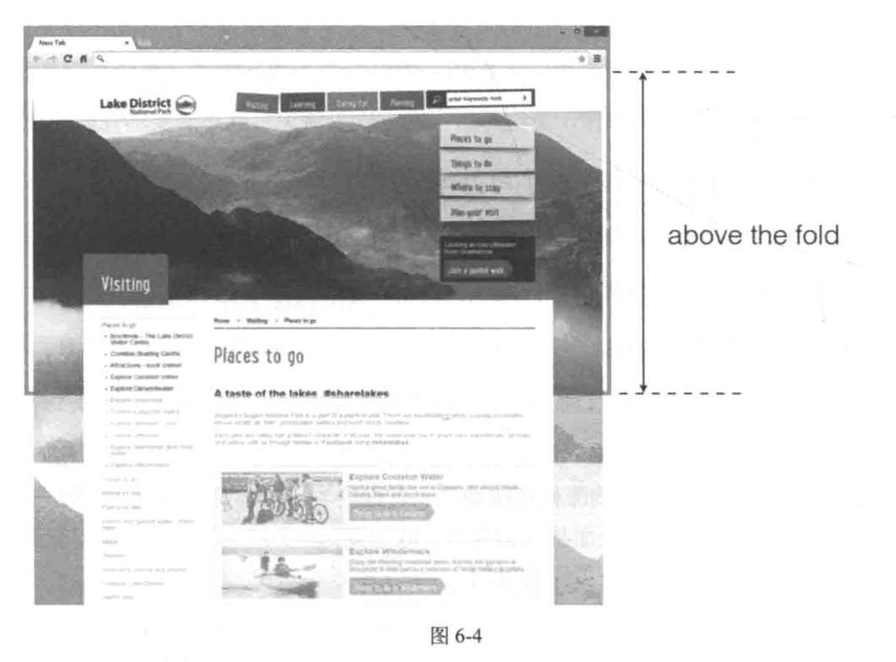
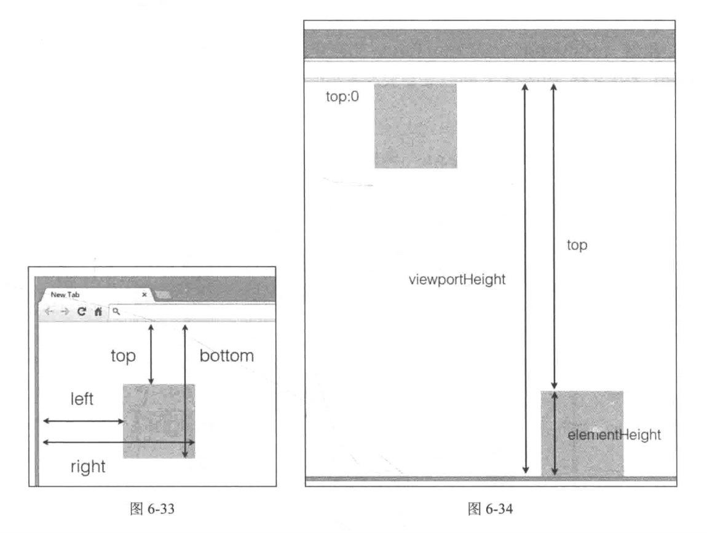

# 第 6 章 -- 脚本与性能: 入门篇

## 目录 (Catalog)
- 6.1 为何要选择脚本 
- 6.2 为何要谈性能
- 6.3 如何衡量性能
    + 6.3.1 页面加载时间
    + 6.3.2 速度指数--加载时间并非万能
    + 6.3.3 帧数
    + 6.3.4 工具与测试
- 6.4 传统脚本的性能优化指南
    + 6.4.1 懒加载初级版本
    + 6.4.2 优化点1: 滚动事件的回调函数
    + 6.4.2 优化点2: 重绘与回流
    + 6.4.3 优化点3: 选择器
- 6.5 小结

## 生词 (New Words)

## 内容 (Content)
### 6.1 为何要选择脚本 

### 6.2 为何要谈性能

### 6.3 如何衡量性能
#### 6.3.1 页面加载时间
- 1. 减少 HTTP 请求
    + 假如页面中有 10 个 HTTP 请求，那么把请求数减少至 5 个会是一个不错的优化方案。
      不要误会，这里的意思不是彻底删除其中的 5 个请求，而是请求之间合并将请求数降低至 5个.
      不要以为请求资源只分为测览器发送和服务器返回两个步骤。事实上。只是在“请求”这一步骤里,
      浏览器就需要完成非常多的工作，如域名跳转 DNS 査找、TCP 链接初始化、从缓存中査询等.
      现代浏览器为开发者提供了一个 Liming 接口（window. Performance），
      能够精确地提供每一个资源在浏览器中的每一步骤的开始时间与结束时间，如图 6-1 所示。
        - 即: 在浏览器的控制台中输入 `window.performance.getEntries()[0]` 便可查看.
- 2. 媒体查询中图片加载情况
    + 即: 就是查询条件未生效时样式中的图片加载情况. 如果在媒体查询中有和图片相关的操作,
      请选择恰当的方式以避免引起不必要的性能问题.
#### 6.3.2 速度指数--加载时间并非万能
- 通常将页面首屏加载并呈现在 浏览器视口(viewport) 中的内容称为 "滚动之上"
  (above the scroll1 或者 above the fold), 如图 6-4 所示。那么很明显，
  更快地加载滚动之上对吸引用户更加有利，甚至无需考虑整张页面的加载速度。
  
- 从这些方面可以看出, 加载时间并非是万能的, 它无法用来衡量网页加载时的用户体验.
  此时需要引入另一个指数 -- **速度指数 (speed index)**. 那么, 什么是速度指数?
- 下面的内容见书本
#### 6.3.3 帧数
#### 6.3.4 工具与测试
- DomContentLoaded 表示 DOM 元素加载完毕. load 事件表示所有资源都加载完毕.

### 6.4 传统脚本的性能优化指南
#### 6.4.1 懒加载初级版本
- 图片懒加载是指图片元素滚动进入浏览器的可视区域后再进行加载. 这是为了节省宽带资源和
  提高页面加载速度. 懒加载分为 3 个步骤.
    + (1) 获取页面上需要懒加载的图片元素.
    + (2) 在页面滚动时反复检查图片元素是否滚动进入浏览器的可视区域内.
    + (3) 一旦发现图片元素滚动进入可视区域, 加载图片.
- 在开始之前, 需要知道如何判断元素在可视区域内. 可以利用 `getBoundingClientRect`
  方法. 元素的 getBoundingClientRect 方法用于获取元素相对于视口左上方的位移,
  如图 6-33 所示.
- 很明显, 只需要通过判断元素距视口上方的距离, 就能知道元素是否在视口内, 
  只要元素在下面两个临界点之间即可, 如图 6-34 所示.
- 可见当元素处于临界点时, 它距视口顶部距离恰好为视口高度减去元素高度: max-top =
  viewportHeight - elementHeight. 这并不意味着只有当距顶部距离小于这个 max-top
  才出发加载图片, 这样的话元素已经进入视野内, 会让用户看到图片从无到有的显现过程,
  降低用户体验. 图片元素应该在即将滚动进入可视区域就进行加载, 也就是 max-top =
  viewportHeight 时.
  
#### 6.4.2 优化点1: 滚动事件的回调函数
#### 6.4.2 优化点2: 重绘与回流
#### 6.4.3 优化点3: 选择器

### 6.5 小结
