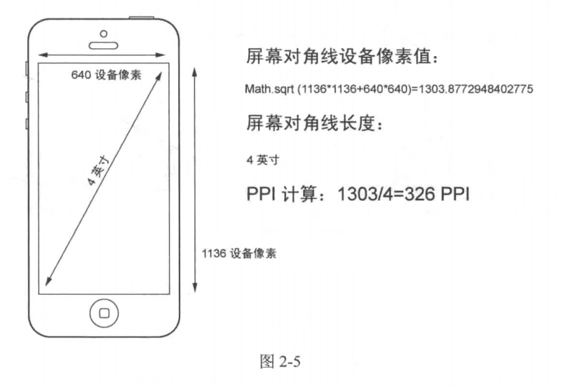
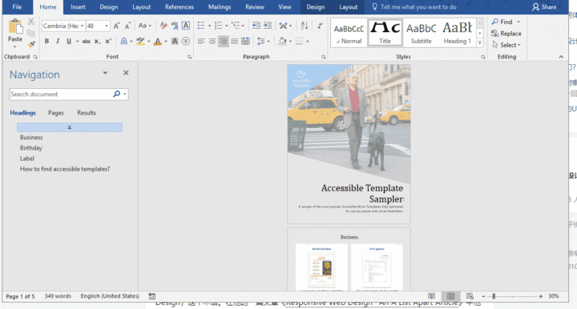

# CSS 像素 px 详解和布局基础


## Catalog
1. `CSS 像素` / `逻辑像素` / `渲染像素` / `物理像素` 都是指什么?
    + 1.1 `逻辑像素(logic point/device point/device pixel) / 点(points)`:
    + 1.2 `渲染像素 (Rendered Pixels)`:
    + 1.3 `物理像素 (Physical Pixels)` / `设备像素(Device Pixel)`: 
2. CSS 中的 `px` 到底是什么?
3. `PPI (pixel per inch)` 像素密度
4. 面向 `逻辑像素` 开发的基本流程
5. 关于 `px` 的一些疑问
6. 什么是 "响应式" 和 "自适应" 布局?


## New Words
- **density ['densɪtɪ] --n.密度, 浓度**
    + population density. 人口密度
    + a population density of 50 per square kilometer.  
      每平方公里 50 人的人口密度
- **coordinate [kəuˈɔ:dineit] --n.<数>坐标  --vt.协调, 配合**
    + It defines how all the lengths and coordinates used inside the SVG
            should be scaled to fit the total space available. 
        它定义了如何缩放 SVG 内部使用的所有长度和坐标以适应可用的总空间. 
    + It defines the origin of the SVG coordinate system, the point 
      where x=0 and y=0.  它定义了 SVG 坐标系的原点,  即 x=0 和 y=0 的点. 
    + Polar coordinates 极坐标
- **specify ['spesɪfaɪ] --vt.指定, 列举**
    + explicitly specifies 明确指定
- **abstract ['æbstrækt] --n.抽象, 摘要, 文摘.  --v.提取  --adj.抽象的**
    + an abstract concept. 抽象概念. 
    + Your words are so abstract to me. 你的话对我来说太抽象了. 
    + Well, it can get really abstract. 这东西太抽象了. 
- **mathematic [ˌmæθə'mætɪk] = mathematical --adj.数学的, 精确的**
    + mathematic model 数学模型
    + Mathematic Programming 数学规划
- **make sense --有意义; 讲得通; 言之有理**
    + It all started to make sense. 这一切都开始变得有意义.
    + Points are abstract units, they only make sense in this
      mathematical coordinate space.  
      点是抽象单位, 它们仅在数学坐标空间中有意义.
- **multiply ['mʌltɪplaɪ] --vt & vi.乘**
    + We all know how to multiply by then. 我们都知道怎样乘以10.
    + I asked you to multiply fourteen by nineteen. 我要你将 14 乘以 19. 
- **factor ['fæktɚ]{US} --n.因子; 因素; 要素; 系数**
    + a factor of happiness. 幸福的因素.
    + Luck was a factor in his success. 幸运是他成功的一个因素.
    + a common factor. 公因子, 公因数
    + the factor of safety. 安全因数.
- **thus [ðʌs] --adv.从而; 因此; 这样**
    + thus and so. (美)这样
    + thus and thus. 如此这般
    + Thus they judged that he was guilty. 因此他们判断他有罪.
    + Thus much is certain. (至少)这些是确实的.
- **responsive [rɪ'spɒnsɪv] --adj.响应的; 应答的.**
    + Responsive layout. 响应式设计
    + He is always responsive to my requests.
      对于我的要求他总是作出积极的应答.
    + I've had no responsive to my letter. 我还没有回信.


## Content
- 参考文章:
    + (1) [知乎: 为什么很多web项目还是使用 px, 而不是 rem?](https://www.zhihu.com/question/313971223/answer/628236155)
      中 `猫5号` 的回答.
    + (2) 《高性能响应式Web开发实战》中第二章中的内容
    + (2) 
  
- **本文观点:**
  
  (1) 不建议修改`viewport`(视口大小),
  致使`viewport`的`width`不等于`device-width`的方案(会导致 bug).
  
  (2) 不建议读者使用 **以`rem`或者小程序`rpx`来实现等比缩放**为主的布局手段,
  而使用**面向逻辑像素`px`**为主,**面向等比缩放的`vw`和`vh`(vw/vh/vmax/vmin)**
  为辅助的布局单位,搭配一些`flex`等布局手段.
  
  (3) 本文遵循: 不同尺寸的屏幕(手机 / 平板 / 笔记本), 同等观看距离下,
  大屏看的更多而非看的更大的设计实践来进行布局.

### 1. `CSS 像素` / `逻辑像素` / `渲染像素` / `物理像素` 都是指什么?
- 我们从下图开始说起, 请先看图 2-1:
  
  
  
  上图 2-1 是部分 iPhone 设备的 `逻辑像素`, `渲染像素`, `物理像素` 的指标,
  看了应该清晰这 3 这之间的关系了.
#### 1.1 `逻辑像素(logic point / device point / device pixel)` / `点(points)`:
- 从图 2-1 左侧的描述可以看出 `逻辑像素` 的定义:
  **根据数学坐标空间中的抽象 `点(point)` 为单位来指定所有图形的坐标.**
- 那么为什么会有逻辑像素的引入? 简单来说, 就是为了消除不同屏幕观看距离和不同 `PPI`
  之间的差异, 衍生出来的一个虚拟的尺寸. 是一个抽象的概念, 这个单位就是 ios
  开发的 `px`, 安卓开发的 `dp`. 对于 PC (Win 8+ / linux / Mac)
  由各自系统或者对应软件 (比如 WebView 内部) 提供的图像界面处理引擎处理进行缩放.
  
  + `PPI` 见下面的 [3. PPI (pixel per inch) 像素密度]()
  
  在 Windows 上, 可以通过 *显示设置* 缩放比例来调整部分应用的逻辑像素. 对于 Linux,
可以通过 x 和 wayland 的缩放比例来调整.
  
  但是, 这个 `逻辑像素` 是一个纯软件的方案, 如果部分软件不遵循开发规则,
  或者使用老旧的 API, 就可能出现 `逻辑像素` 不合理, 导致缩放问题.
  例如 Win10 中部分旧的软件在高分屏的设备下会导致界面偏小. 
  这即是因为他们使用的是 `渲染像素` 而不是 `逻辑像素`
  
  常见设备(手机 / 平板 / 笔记本)的 `逻辑像素`:
    + (1) 手机: 在 3xx ~ 4xx (短边)之间. (tip: 请观察上图)
    + (2) 平板: 10 寸平板 7xx ~ 8xx (短边)
    + (3) 笔记本: 13 寸 1280points (长边)
  + (4) 24 显示屏: 1920 points (长边)
  
  如果在网页中设置 `width=device-width`, 无论是否是高分屏,
  在浏览器中得到的 `screen.width` 仍然符合上述的尺寸.

#### 1.2 `渲染像素 (Rendered Pixels)`:
- `渲染像素` 是系统基于 `逻辑像素` 进行对应倍增 (1x, 2x 或 3x) 而得到的结果. 

#### 1.3 `物理像素 (Physical Pixels)` / `设备像素(Device Pixel)`: 


### 2. CSS 中的 `px` 到底是什么?
- 实际上 `px` 是 `viewport(视口大小) 像素` (也称: `CSS 像素`).
    + 注: `viewport 像素` 如果对应到 js 中, 说的就是 `可视窗口` 即
      `window.innerWidth`/`window.innerHeight` 中看到的显示像素.
      `CSS 像素` 这个称呼来自《高性能响应式Web开发实战》, 因为觉得叫 `CSS 像素`
      更容易理解, 此处添加进来, 你可选择你自己喜欢的称呼.)
- 那 `viewport 像素` 又是什么呢?
  
  答: `viewport 像素` 它本质是 `DIP(Device Independent Pixels)`,
  中文意思是**设备无关像素**, **它其实是浏览器内部对 `逻辑像素`(图 2-1)
  进行再处理的结果**, 简单理解就是调整 `逻辑像素` 的缩放来达到适合设备的一个中间层.

- `CSS 像素` 默认与系统分辨率下像素大小相等. 在标清设备中, 一个 `CSS 像素`
  应该是与一个 `物理像素`(图) 大小相等. 
    + Tip: 看上图 2-1 中的 iPhone 2G/3G/3GS 的 `逻辑像素`(320 x 480 points) 和
      `渲染像素`/`物理像素`(320 x 480 pixels) 是一样的.
  
  但是, 在高清设备(如: Retina 显示屏)或者用户缩放的过程中, 一个 `CSS 像素`
  也可以大于或等于多个`物理像素`, 如下图 2-13 所示:
  
  

  例如: 文章头部的图 2-1 iPhone Xs Max 的 `物理像素`(1242 x 2688 pixels) 是 
  `逻辑像素`(414 x 896 points) 的 3 倍 (3dpr).

  我们不用关心在不同设备上一个 `CSS 像素` 会匹配多少个 `物理像素`,
  浏览器会根据 `DPR (device point(/pixel) ratio)` 即 `渲染像素` 与
  `逻辑像素` 的比, 为我们适配:
    + 我们仍拿图 2-1 的 iPhone Xs Max 来作计算一下 `dpr` -->
      $1242 \div 414 = 3$ 即我们所说的 **三倍屏, 3X** 意思就是 `3dpr`. 

- 对于 PC `viewport` 是不生效的, 所以在 PC 上 `px` 其实就是 `逻辑像素` (Chrome).
  但是逻辑像素是与软件实现相关的(见上面: [1.1 逻辑像素]()), 所以可能会出一些问题.
  比如在 Windows 上, 一些国内的马甲浏览器, `viewport` 内部没有适配系统的缩放等级,
  导致渲染的内容过小.


### 3. `PPI (pixel per inch)` 像素密度
- `PPI (pixel per inch)` 直译为 "像素每英寸"; 不过更常叫 **`像素密度`**.
  表达的是某个量在指定面积内的密度情况. 在作为设备屏幕特征时, `PPI`
  指的是屏幕每英寸的**`物理像素`**, 更高的 `PPI` 意味着屏幕的清晰度更佳.

  `物理像素`/`设备像素` 暂时先统称为 `设备像素`. 无论是早期的 CRT
  显示器还是如今的 LCD 显示器, 实现的原理都是通过将一系列的矩形小点排列成一个大的矩形,
  让不同的小点呈现不同的颜色, 最终来组成一幅完整的图像.
  如下图 2-3 所示就是 LCD 显示器上一个 4 x 4 个设备像素排列成的矩阵.

  

  图 2-3 中的每一个 **"点(dot)"** 就是`设备像素`. 在 LCD 显示器中,
  每一个`设备像素`又是由 3 个分别显示红绿蓝的子像素(subpixel)组成.
  LCD 显示器的显示功能是通过调整每一个设备像素的子像素明暗来实现的.
  
  `像素密度` 中所指的像素是 `设备像素`, 鉴于`设备像素`亦可称为`物理点`,
  所以 `PPI` 也可以称为`DPI(dots per inch, 每英寸点数)`.
  但请注意这样的等价只有在描述显示设备的特征时才成立.
  在其他行业的上下文中两者含义并不同. 
  
- 设备`像素密度`的计算方式正如它英文定义的一样所见即所得:
  使用屏幕对角线(直角三角形的两个直角边)上的设备像素值,
  除以对角线的长度(英寸), 即为`像素密度`. 下图为 iPhone 5
  对应的计算像素密度的图解.  
  
  

  在高清设备中, 为了解决设备像素过小的问题, 浏览器会根据 `DPR`
  (`渲染像素` 与 `逻辑像素` 的比) 自动为我们适配.
    + 例如, iPhone 3GS 和 iPhone 4 都保持了相同的 `逻辑像素` 分辨率 480 x 320
      points, 但是 iPhone 4 的 `设备像素` 达到 960 x 640 pixels, 每一个
      `逻辑像素` 下的像素由 2 个 `设备像素` 组成. 这样就能容纳更多的细节. 
    + Notice: 我们在网页中经常会放大素材, 但请注意放大的前提是,
      被放大的素材最好有足够的尺寸和像素,
      否则多余的像素只能由系统计算出来而导致看上去模糊.
      这也是高清设备常常被诟病的地方. 
- 我们所说的**高分辨率屏幕**, 其实就是指 `PPI` 大于同类设备的屏幕. 比如:
    + 对于桌面设备大于 96ppi;
    + 移动设备大于 160ppi;
    + 苹果的视网膜屏幕, 就是指在一定观看距离内超出人类的辨认能力的屏幕.
      比如:
        - 桌面设备大于 192ppi;
        - 移动设备大于 326ppi.
- 对于移动设备, 一般说 `PPI` 以 160ppi 为一个档次, 也就是假设一个 160ppi,
  2 x 3寸的屏幕, 物理像素应该是 320 x 480pixels. 同理 320ppi 同样尺寸的屏幕,
  物理像素就是 640 x 960 pixels.

  由于它们尺寸一致, 假设它们观看距离一致, 那么消除掉 `PPI` 的影响, 它们的
  `逻辑像素` 是一直的, 也就是说

  **`逻辑像素` = `物理像素` $\times$ 160 $\div$ ppi**,
  
  得出的结果都是 320 x 480.

  当然, 由于生产标准不一致, 不可能做到绝对的 160ppi 作为标准, 所以 ppi
  的等级划分是动态的.


### 4. 面向 `逻辑像素` 开发的基本流程
$\quad$ Tip: 请先看完 [2. CSS 中的 px 到底是什么?]().
- (1) 在 `head` 中设置 `width=device-with` 的 `viewport`.
- (2) 在 CSS 中使用 `px`.
- (3) 在适当的场景使用 flex 布局, 或者配合 `vw` 进行自适应.
- (4) 在**跨设备类型的时候** (PC $\Longleftrightarrow$ 手机
  $\Longleftrightarrow$ 平板) 使用媒体查询.
- (5) 在跨设备类型, 如果交互差异很大的情况下, 考虑分开项目开发.
  
  那么 `viewport` `width=device-width` 是什么意思? 其实就是让 `viewport`
  的尺寸等于 **`逻辑像素`** 的尺寸.
  ```html
    <meta name="viewport"
        content="width=device-with, user-scalable=no, initial-scale=1.0,
        maximum-scale=1.0, minimum-scale=1.0">
  ```

### 5. 关于 `px` 的一些疑问
- 那有朋友问, 不同设备的 `物理像素 / 设备像素` 是不一样的啊, 我怎么实现不同
  `物理像素` 的布局, 如果设计师给一张设计图, 怎么将它转为 CSS 里的 `px`?
  
  首先, 你要读懂设计师给你设计图的意图, 在国内, 设计师给的手机设计图一般是 750px,
  注意这里的 px, 并不是我们现在说的 `逻辑像素` 的 px,
  而是 `物理像素` 750px, 因为设计师大部分情况下是根据 iPhone6
  或者同等设备来进行设计的, 那么要知道 iPhone6 的 `逻辑像素` 其实是 375points,
  因为 `dpr` 是 2 (即: 图 2-1 中的 `render at 2x`), 那么拿到手的设计稿,
  转换为 `逻辑像素` 就得除以 2, 我们叫这种设计图为 **两倍图**.

  同理, 如果设计er给你的是 1125px (375 + 375 + 375) 大小, 那么我们就得除以 3,
  即 **三倍图**.
- 如果设计团队有使用墨刀或者蓝湖, 你可以在两者里面设置你的查看尺寸,
  得到我们需要的 `逻辑像素`.

- 如果设计师不用蓝湖等工具, 给你的也并不是 375 的倍数怎么办? 我先说办法,
  原因你们自己琢磨:
    + 最简单的办法, 计算出设计师给的设计图的物理宽度 w, 除以一个数 x,
      如果得出来的商在 360 ~ 414 之间, 那么 dpr 就是 x, 也就是 x 倍图.
- 那么可能你又会问, 不同设备的 `逻辑像素` 也不一样啊?

  对, 不一样, 但问题是为什么我们要将它们弄成一样? 其实, 不一样, 才是合理的.
  
  那么不一样的情况, 怎么布局? 那就要靠技术手段: flex, 流式布局(标准文档流), vw 等.

- 为什么不建议使用 `rem` 来实现响应式布局?
    + 一句话概括就是, `rem` 是等比缩放的解决方案; 它违背了, 在不同的设备,
      同样观看距离下, 大屏应该看到更多内容, 而非大屏看到更大内容的设计实践.

### 6. 什么是 "响应式" 和 "自适应" 布局?
- 我们先来看 "响应式布局":

  先上一张 gif 图来看一下, 

   


---------
---------
---------


### 图 2-1 中英文对照
1. Point(点 / 逻辑像素: point / device point / device pixel):
- At the beginning, coordinates of all drawings are specified in points.
  (首先, 以点为单位指定所有图形的坐标.)
- Points are abstract units, they only make sense in this mathematical
  coordinate space.
  (点是抽象单位, 它们仅在数学坐标空间中有意义.)

2. Rendered Pixels(渲染像素)
- Point-based drawings are rendered into pixels. This process is known
  as rasterization.
  (基于点的图形被渲染为像素. 此过程称为栅格化.)
    + 栅格化(Rasterisation): 栅格化是将 `矢量图形` 格式表示的图像转换成 `位图`
      以用于显示器或者打印机输出的过程. 总体上来说, 格栅化这个术语可以用于任何将
      `矢量图形` 转换成 `位图` 的过程.
- Point coordinates are multiplied by scale factor to get pixel
  coordinates. Higher scale factors result in higher level of detail.
  (点坐标乘以比例因子(`render at 3x/2x/1x`)可以得到像素坐标. 比例因子越高,
  细节程度越高.)

3. Physical Pixels(物理像素)
- The device screen may have lower pixel resolution than the image
  rendered in previous step.
  (设备屏幕的像素分辨率可能低于上一步中渲染的图像.)
- Before the image can be displayed, it must be downsampled(resized)
  to lower pixel resolution.
  (在显示图像之前, 必须先对其进行降采样(调整大小)以降低像素分辨率.)

4. Physical Device (物理设备)
- Finally, computed pixels are displayed on the physical screen.
  (最后, 在物理屏幕上显示计算出来的像素.)
- The PPI number tells you how many pixels fit into one inch and
  thus how large the pixels appear in the real world.
  (PPI 的数字告诉你在 1 英寸中能容纳多少像素, 从而在现实世界中会出现多少像素.)