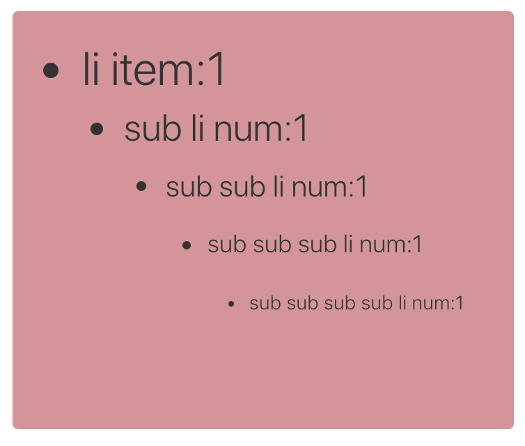

# CSS 相对单位


## Catalog
1. CSS `px` 像素概述
2. CSS 相对单位


## New Words
- **unit ['juːnɪt] --n.单元, 单位, 部, 机组, 部件**
    + A unit vector has a magnitude. 单位矢量的大小为1.
    + a unit of measurement.计量单位. 
- **author ['ɔːθə]/['ɔθɚ] --n.作家; 作者. --vt.编写; 创作**
    + CSS brings a late-binding of styles to the web page:
      The content and its styles aren't pulled together until after
      the authoring(vt-ing) of both is complete.
      CSS 为网页带来了样式的后期绑定(late-binding):
      直到内容(content)和样式(styles)两者的创作都完成之后, 它们才会融合在一起.
- **axis ['æksɪs] --n.轴; 坐标轴; 轴线; 中心线.**
    + The earth turns on its axis. 地球自转.


## Content
### 1. CSS `px` 像素概述
- `px` 像素见: `./css-像素px详解和布局基础.md`

### 2. CSS 相对单位
- **Warning**: 下面这些所有的相对单位(relative units) 都是根据 `px` 像素而言的, 
  但 `px` 也不是绝对像素(absolute units), `px` 像素的详解见上面
  `### 1. CSS px 像素概述`.
  | 相对单位 | 解释 |
  | :---: | :--- |
  | `%` | 百分比|
  | `em` | 相对单位. 相对于父元素的 `font-size` 计算.<br>假如某个 p 元素为 `font-size:12px`,在它内部的 span 标签, 设置 `font-size: 2em`, 那么,  这时候的 span 字体大小为 12*2 = 24px. |
  | `rem` | 相对单位. 相对于根元素 `html` 的 `font-size` 计算.<br>例如 html 为 `font-size: 16px`, 那么其内的 div 设置为 `font-size: 1rem`, div 字体大小就为 16px. |
  | `rpx` | 微信小程序相对单位. 1rpx = 屏幕宽度/750px. 在 750px 的设计稿上, 1rpx = 1px |
  | `vw` | 相对于浏览器可视窗口的宽度, 视口宽度是 100vm.<br>`1vw(viewport width)` = `window.innerWidth(浏览器窗口大小/可视窗口大小)` 数值的 1% |
  | `vh` | 相对于浏览器可视窗口的高度, 视口高度是 100vh.<br>`1vh(viewport height)` = `window.innerHeight` 值的 1%  |
  | `vmin`| vw 和 vh 中的较小值 |
  | `vmax`| vw 和 vh 中的较大值 |


#### 3.0 单位之间的换算关系
- 像素(`px`), 厘米(`cm` centimeter), 毫米(`mm` millimeter),
  英寸(`in`, inch), 点(`pt`, point, 印刷术语, 长度为 1/72 inch),
  以及 `pc`(pica, 印刷术语, 长度为 12points). 之间的换算关系.
  
  **1inch = 25.4mm = 2.54cm = 6pc = 72pt = 96px.**
  
  因此 16px = 12pt (16 / 96 * 72). 设计师通常更熟悉点(point)的使用,
  而开发人员更习惯像素.


#### 3.1 `%` 百分比 
- 除了用 `px` 结合媒体查询实现响应式布局外, 我们也可以通过百分比单位 `%`
  来实现响应式的效果.
  
  比如当浏览器的宽/高度发生变化时, 通过百分比可以使组件的宽/高随着浏览器的变化而变化,
  从而实现响应式的效果.

  为了了解百分比布局, 首先要了解的问题是:

  **CSS 中子元素中的百分比 `%` 到底是谁的百分比?**

  直观的理解, 我们可能会认为子元素的百分比完全相对于**直接父元素**,
  对于子元素的 `height` / `width` 来说, 这确实是正确的, 但是根据 CSS
  的盒模型, 除了这两个属性外, 还有 `padding` / `border` / `margin` 等等属性;
  那么这些属性设置成百分比, 是根据父元素的哪些属性呢? 此外还有 `border-radius` /
  `translate` 等属性中的百分比又相对于什么呢? 我们使用下面的表格来分类
  
  | 属性 | 百分比的相对参考对象 |
  | :------ | :------ |
  | `width`/`height`/ `line-height` 的百分比 | 相对于直接父元素的`width`/`height`|
  | 若子元素绝对定位(`position:absolute`), `top`/`bottom`/`left`/`right` 的百分比 | 相对于设置了 `position:relative` 的长辈元素 |
  |`margin`/`padding` 的百分比 | 无论是垂直方向还是水平方向, 都**相对于直接父元素的 `width`**, 与父元素的 `height` 无关 |
  |`border-radius`/`translate` 的百分比 | 相对于元素自身的宽度. |
  |`background-position` 的百分比 | 需要尺寸差计算. 更多讲解见鑫旭大神的这篇[文章](https://www.zhangxinxu.com/wordpress/2015/03/background-object-position-value-percent/) |

- 下面给出一个参考示例: (请自建文件在浏览器中查看.)
  ```html
    <!doctype html>
    <html lang="en">
    <head>
        <meta charset="UTF-8">
        <meta name="viewport"
            content="width=device-width, user-scalable=no,
                initial-scale=1.0, maximum-scale=1.0, minimum-scale=1.0">
        <meta http-equiv="X-UA-Compatible" content="ie=edge">
        <title>Document</title>
        <link rel="stylesheet" href="../typo.css">
        <style type="text/css">
            .box {
                margin: 6px 0 6px 12px;
                width: 360px;
                height: 320px;
                padding: 0 10px;
                float: left;
                background: lightsalmon;
                overflow: hidden;
            }
            .square {
                width: 50%;
                height: 50%;
                text-align: center;
                line-height: 10;
                border-radius:5%;
                margin-top: 10%;
                margin-left: 10%;
                overflow: hidden;
                float: left;
                background-color: #33cc99;
                border: 1px solid #cccc00;
            }
        </style>
    </head>
    <body>
        <div class="box">
            <p class="square">方块</p>
        </div>

        <script>
            const square = document.querySelector('.square');

            const getCss = function(el, attribute) {
                return window.getComputedStyle(el, false)[attribute];
            }

            console.log("width:", getCss(square, "width"));  // 180px
            console.log("height:", getCss(square, "height"));  // 160px

            console.log("border-radius:", getCss(square, "borderRadius"));  // 5%
            console.log("line-height:", getCss(square, "lineHeight"));  // 160px

            console.log("margin-top:", getCss(square, "marginTop"));  // 36px
            console.log("margin-left:", getCss(square, "marginLeft")); // 36px
        </script>
    </body>
    </html>
  ```
  **Additional Info**: 不知你有没有注意到, 上面 `border-radius` 的输出是
  `5%` 而不是 `px`, 实际上 `border-radius` 可能要比我们知道的复杂,
  我们都知道 `border-radius` 是下面 4 个属性的简写:  
  (tip: (左)上 --> 右(上) --> 下(右) --> (下)左 => `上/右/下/左`)
  ```css
    .box {
        border-top-left-radius: 水平半径 垂直半径;;
        border-top-right-radius: 水平半径 垂直半径;;
        border-bottom-right-radius: 水平半径 垂直半径;;
        border-bottom-left-radius: 水平半径 垂直半径;;
    }
  ```
  如你所见, 这 4 个属性的值却是由 2 个值组成的, 只是我们平时写的是复合值,
  例如: `border-top-left-radius:4px`.
  
  水平半径和垂直半径如下图:

  

  `border-radius` 更详细讲解请见鑫旭大神的这篇文章
  [CSS3 border-radius知多少？](https://www.zhangxinxu.com/wordpress/2015/11/css3-border-radius-tips/?shrink=1)

- 百分比(`%`)单位的缺点:
    + (1) 计算困难.
    + (2) 元素各个属性, 设置百分比的相对对象不确定, 比如 `width`/`height`
      相对于父元素的 `width`/`height`, 而 `margin`/`padding`
      不管垂直还是水平方向都相对父元素的 `width`, `border-radius`
      则是相对于元素自身等等, 造成使用百分比单位容易使布局问题变得复杂.


#### 3.2  单位 `em`
##### (1) 在网页中给字体设置 `em` 单位
- 一般情况下, 浏览器的默认字体大小是**16px**, 所有未经调整的浏览器都符合
  `1em = 16px`.
  目前已有很多网站使用浏览器的默认字体大小, 但仍有很多网站改为 14px,
  所以网站中设置多大字体, 还是根据设计师的要求来吧. 下面说一下通用设置:
    + (1) 设置默认字体为 `14px`:
      ```css
        html {
            /* - 默认 16px = 100%, 那么 1px = 6.25%; 10px = 62.5% */
            font-size: 62.5%;
        }
        body {
            /* - 当前 em 相对单位是相对于父元素 html 来的, 由于 html 中
             *   font-size = 10px  所以当前 1em = 10px, 
             *   1.4em = 14px. 这样就给 body 初始化了 14px 的字体. */
            font-size: 1.4em;
        }
      ```
    + (2) `16px` 为默认字体大小, 不用设置. 下面为一个参考设置(`typo.css`):
      ```css
        /* - 由于浏览器默认字体就是 16px, 所以此处直接写 1em = 16px 即可,
         *   1em = 16px       0.1em = 1.6px      0.25em = 4px
         *   1px = 0.0625em;  10px = 0.625em;    14px = 0.875em
         *   16px = 1em;      18px = 1.125em;    20px = 1.25em
         *   30px = 1.5em     40px = 2.5em       60px = 3.75em
         *   80px = 5em       100px = 6.25em     200px = 12.5em 
         */
        body {
            /* - 300 为 font-weight; 1.8 为 line-height */
            font: 300 1em/1.8 PingFang SC, Lantinghei SC, Microsoft Yahei,
            Hiragino Sans GB, Microsoft Sans Serif, WenQuanYi Micro Hei, sans-serif;
        }
      ```
##### (2) `em` 值相对元素
- `em` 单位的使用, 总体来说是比 `%`(百分号) 容易, 它没有 `%` 那么多相对参考对象.

  子元素的 `em` 值相对于父元素的 `font-size` 来计算.
  如果某个 p 元素设置 `font-size: 12px`, 在它内部的 span 标签, 根据有没有设置
  `font-size` 分为 2 种情况:
    + (1) 如果子元素 span 没有设置 `font-size` 就会继承父元素的 `font-size` 值;
      此种情况是最容易理解的, 此时子元素可设置的所有属性, 都是根据父元素的
      `12px` 为基础来进行计算的, 包括 `width`/ `height` / `line-height` /
      `padding` / `margin` / ......
    + (3) 如果子元素设置字体大小为 `font-size: 1.3em`
      (因为父元素的 1em = 12px 所以 1px = 1 $\div$ 12 = 0.083em;
      1.3em = 16px), 到此时, 浏览器已经计算出当前 span 的字号大小为 16px,
      那么接下来在 span 内部的其他属性值都会根据这个 16px = 1em 再去计算其他值,
      是的, 你没有看错, 所有的其他值: `width`/ `height` / `line-height` /
      `padding` / `margin` / `border-radius` / `border` / ......

      此处给一个《CSS揭秘》第一章的示例: 
      ```vue
        <template>
            <div id="example-121" class="default-div">
                <h2>1.2.1 尽量减少代码重复</h2>
                <button class="bad-example-btn">Yes!</button>
                <button class="good-example-btn">Yes!</button>
            </div>
        </template>
        <style scoped>
            button {
                margin: 10px;
            }
            .bad-example-btn {
                padding: 6px 16px;
                border: 1px solid #446d88;
                background: #58a linear-gradient(#77a0bb, #58a);
                border-radius: 4px;
                box-shadow: 0 1px 5px gray;
                color: white;
                text-shadow: 0 -1px 1px #335166;
                font-size: 20px;
                line-height: 30px;
            }
            .good-example-btn {
                /* - 假设父级元素的字体大小是 16px
                *   1em = 16px ==> 1.6px = 0.1em ==> 0.25em = 4px
                *   1px = 0.0625em
                *   10px = 0.625em
                *   20px = 1.25em,
                *   30px = 1.875em
                *
                * - 当前 font-size 根据父元素 16px 换打算后 20px = 125% = 1.25em.
                *   那么从此刻开始, 请牢记下面 class 的 width / height /
                *   border-radius / padding / margin / border-radius ......
                *   都会根据 1em = 20px 来计算, 此时
                *   1px = 0.05em  2px = 0.1em   3px = 0.15em
                *   4px = 0.2em   5px = 0.25em  6px = 0.3em
                *   10px = 0.5em  20px = 1em    30px = 1.5em
                */
                font-size: 125%;
                /* - 此处为了查看效果, 更改了样式. */
                line-height: 1.5;     /* 30px */
                width: 4em;           /* 80px */
                height: 2em;          /* 40px */
                padding: .3em .8em;
                border-radius: .2em; /* 4px */
                border: 1px solid #446d88;
                background: #58a linear-gradient(#77a0bb, #58a);
            }
        </style>
      ```
##### (3) 使用 `em` 单位的另一个问题: 字号收缩问题.
- 当我们在多层嵌套的元素内设置 `em` 单位的字号时, 会产生意想不到的效果.
  要弄清楚每个元素的实际值, 需要查看元素一层一层往上查看级元素的 `font-size` 值.
  当我们在多个 DOM 层级间设置了多个 `em` 单位的 `font-size`, 那计算起来真是灾难.
  
  下面是一个在第一个 ul 上设置了 0.8em 字号的嵌套 ul 列表, 然而内部嵌套的 ul
  文字在逐步缩小! 正是因为 `em` 带来的这一类烦人的问题, 开发者才对 `em` 避而远之.

  示例效果图:
  
  

  代码如下:
  ```css
    .wrapper {
        font-size: 42px;
        min-width: 320px;
        min-height: 260px;
        background: #d49499;
        border-radius: 4px;
        padding: 20px;
        margin: 20px;
        float: left;
        line-height: 100%;
    }
    .wrapper ul {
        margin-left: 30px;
        font-size: 0.8em;
        list-style:disc;
    }
  ```
  ```html
    <div class="wrapper">
        <ul class="first-ul">
            <li class="item1">li item:1
                <ul>
                    <li>sub li num:1</li>
                    <ul>
                        <li>sub sub li num:1
                            <ul>
                                <li>sub sub sub li num:1</li>
                                <ul>
                                    <li>sub sub sub sub li num:1</li>
                                </ul>
                            </ul>
                        </li>
                    </ul>
                </ul>
            </li>
        </ul>
    </div>
  ```
  那么如何解决嵌套 ul 字体在逐层缩小的问题提, 只需要在嵌套列表的第二个 ul 里设置
  `font-size: 1em` 即可:
  
  ```css
    .wrapper ul ul {
        font-size: 1em;
    }
  ```
##### (4) 应该在什么情况下使用 `em` 单位?
- 总体上来说, 我们在网页中用到的一般是 14px ~ 26px 之间的字体,
  那么在几种固定尺寸的字体之间来设置 `em` 单位的字体, 不是太复杂的事情,
  `em` 在自适应的页面中, 比如:
    - 液晶显示屏 $\iff$ 笔记本;
    - 笔记本 $\iff$ 平板
    - 移动 Mobile
  
  都是合适的布局单位, 对于一个页面要适应所有屏幕的情况, 我们只能使用 @media(媒体查询),
  再配合 `px` / `em` / `vh/vw` 根据不同需求具体对待.


#### 3.3 `rem` 

#### 3.4 `vw`/`vh`/`vmin`/`vmax` 
- (1) `vw`, `vh`, `vmax`, `vmin` 的含义:
    + `vw`: 相对于浏览器可视窗口的宽度, 视口宽度是 100vm.
        - `1vw(viewport width)` =
          `window.innerWidth(浏览器窗口大小/可视窗口大小)` 数值的 1%.
    + `vh` 相对于浏览器可视窗口的高度, 视口高度是 100vh.
        - `1vh(viewport height)` = `window.innerHeight` 值的 1%.
    + `vmin`: vw 和 vh 中的较小值.
    + `vmax`: vw 和 vh 中的较大值.
- (2) `vw`, `vh` 与 `%` 百分比的区别:
    + `%` 一般情况下相对于父元素的大小设定比率, `vw`, `vh` 是相对于视口的大小.
    + `vw`, `vh` 优势在于能够直接获取高度, 而用 `%` 在没有设置 `body`
      高度的情况下, 是无法正确获得可视区域的高度的.
- (3) `vmin`, `vmax` 的用处.
    + 做移动页面开发时, 如果使用 `vw`, `vh` 设置字体大小(比如 5vw),
      在竖屏和横屏状态下显示的字体大小是不一样的. 
      
      由于 `vmin` 和 `vmax` 是当前较小的 `vw` 和 `vh` 和当前较大的 `vw`
      和 `vh`. 这里就可以用到 `vmin` 和 `vmax`. 使得文字大小在横竖屏下保持一致。