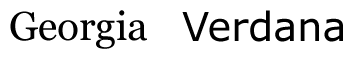
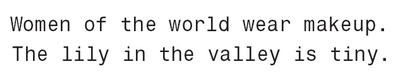

# 排版

## Table Of COntents
1. [Typo.css](https://github.com/sofish/Typo.css)
  中文网页重设与排版: 一致化浏览器排版效果, 构建最适合中文阅读的网页排版.
2. CSS 中的字体类型 

## New Words
- **serif ['sɛrɪf] --n.[印]衬线**
    + Sans-serif fonts have generally been considered easier to read
      on the screen.
      无衬线字体, 一般认为它更容易在屏幕上阅读.

## Content

### 1. Typo.css 中文网页重设与排版
- Typo.css 当前目录: `./typo.css-master/README.md`

### 2. CSS 中的字体类型
- 计算机中的字体按照种类来分, 有 5 种通用字体:
    + (1) `serif`(衬线类): 
        - 比较常见的衬线字体有: `Fira Code` / `Georgia`.
          子母末段带有装饰线条的就是 `serif`, 反之就是 `sans-serif`.

          

          上图中左边的就是衬线类字体 `Georgia`, 右边的就是无衬线类字体 `Verdana`.
          
          一般来说, `serif` 比较庄重, `sans-serif` 相对活泼. 因为 `serif`
          带有衬线, 在小字号下, 不如 `sans-serif` 清晰, 所以 `serif`
          字体可以用作标题, `sans-serif` 字体可以用作正文. 
    + (2) `sans-serif` (无衬线类)
        - 比较常见的无衬线字体有: `Verdana` / `Menlo` / `Helvetica`
    + (3) `monospace` (等宽体): 这种字体每个字母的宽度相等,
      一般用来模拟命令行输入和打字机效果, 现在多用于展示程序源码.
      
      
    + (4) `cursive` (草书体)
    + (5) `fantasy` (幻想体)
    

### 3.
